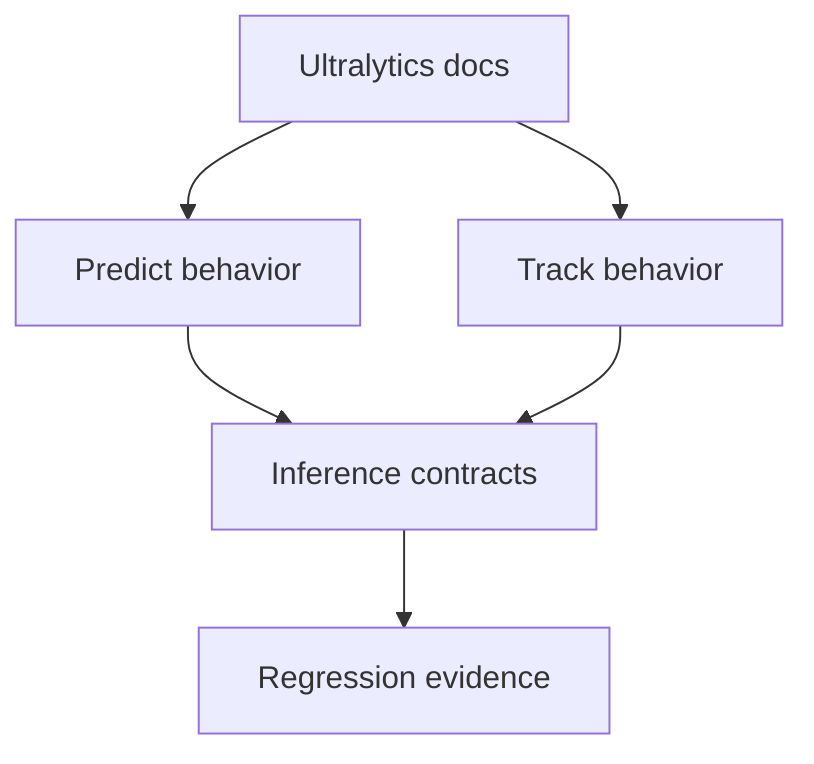

# Ultralytics Reference

## Related Documents

- [evidence pack](evidence-pack.md)
- [research](../research.md)
- [runtime scenario contract](../contracts/runtime-scenario-contract.md)
- [regression evidence contract](../contracts/regression-evidence-contract.md)

## Reference Flow

This diagram shows the authority chain for inference and tracking validation. Official Ultralytics documentation defines expected prediction and tracking behavior where local implementation uses Ultralytics-compatible model paths, and those expectations feed contract and regression evidence.

## Primary References

- Ultralytics docs home: `https://docs.ultralytics.com/`
- Predict mode: `https://docs.ultralytics.com/modes/predict/`
- Track mode: `https://docs.ultralytics.com/modes/track/`

## Usage

Implementation and validation tasks must use the Predict and Track references when verifying model invocation, video or stream inputs, tracking continuity, and result semantics for Ultralytics-backed paths.
