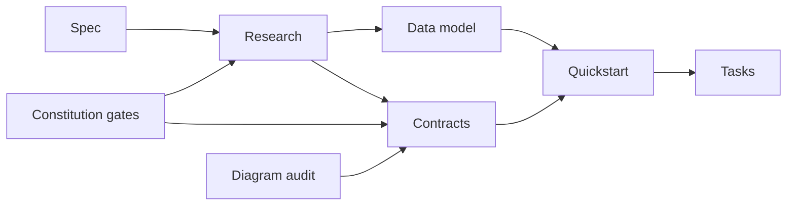

# Implementation Plan: Modular Design and Low Coupling Hardening

**Branch**: `006-modular-low-coupling` | **Date**: 2026-05-08 | **Spec**: [spec.md](spec.md)
**Input**: Feature specification from `/specs/006-modular-low-coupling/spec.md`

## Summary

Apply full modular restructuring to the delivered exam monitoring system without changing user-visible behavior. The implementation will use a hybrid boundary model: domain capabilities own behavior and data, while live-stream and offline-video runtime paths define shared contracts across those capabilities. The plan also treats documentation diagram debt as feature scope: existing and incoming documentation must gain Mermaid diagrams that explain code structure, system interaction, and cross-module interaction.

## Related Documents

- [spec.md](spec.md)
- [research.md](research.md)
- [data-model.md](data-model.md)
- [quickstart.md](quickstart.md)
- [contracts/module-boundary-contract.md](contracts/module-boundary-contract.md)
- [contracts/runtime-scenario-contract.md](contracts/runtime-scenario-contract.md)
- [contracts/regression-evidence-contract.md](contracts/regression-evidence-contract.md)
- [contracts/coupling-risk-contract.md](contracts/coupling-risk-contract.md)
- [contracts/documentation-diagram-contract.md](contracts/documentation-diagram-contract.md)

## Plan Flow

This flowchart shows how the planning artifacts turn the clarified feature into implementation-ready work.



The flow starts with the clarified spec, then resolves decisions in research. The data model and contracts define how module boundaries, coupling risks, runtime scenarios, evidence packs, and documentation diagram coverage will be represented. The diagram audit feeds the contracts because missing diagrams are part of the feature scope, not optional cleanup.

## Technical Context

**Language/Version**: Python 3.11-3.12 (backend), TypeScript 5.9 (frontend)  
**Primary Dependencies**: Django 5.1, Django REST Framework, Django Channels, Celery, Redis, PostgreSQL, Pydantic v2, Ultralytics 8.3, ONNX/ONNXRuntime/OpenVINO, React 19, Vite 7, Zustand, Axios  
**Storage**: PostgreSQL for business data, Redis for channels/cache/background coordination, filesystem model repository and dev/test raw media datasets  
**Testing**: pytest, pytest-django, pytest-cov, pytest-asyncio, Vitest, Testing Library, Playwright  
**Target Platform**: Development/test workstations may use Docker; production Linux uses native services and must not require Docker  
**Project Type**: Full-stack web application with backend services, real-time video workflows, model inference, and frontend dashboard  
**Performance Goals**: Preserve current user-visible behavior; no more than 10% regression in live-stream frame/result propagation, offline processing throughput, dashboard navigation, or health/export workflows unless explicitly approved as a separate feature  
**Constraints**: Full delivered baseline is protected; all major modules must move to hybrid boundaries; high-risk coupling must be removed; medium/low-risk temporary coupling requires owner, expiry, removal plan, and regression coverage; affected modules require 100% line and branch coverage or time-boxed exception  
**Scale/Scope**: Full delivered baseline including live monitoring, offline video, auth, exams, rooms/cameras, sessions, anomalies, exports, health, settings, dashboard navigation, backend apps, frontend surfaces, background jobs, documentation, and deployment/runtime boundaries  
**Runtime Scenarios**: Live stream and offline video processing are mandatory regression scenarios; non-video dashboard workflows are included in the baseline  
**Inference/Tracking Reference**: Official Ultralytics docs are the authority for prediction/tracking behavior; use Predict and Track docs when validating inference/tracking contracts  
**Deployment Topology**: Docker is allowed only for development/test infrastructure; production Linux uses native process supervision, native service dependencies, and filesystem model repositories

## Constitution Check

*GATE: Must pass before Phase 0 research. Re-check after Phase 1 design.*

### Pre-Design Gate Review

- **Supreme Directive Gate**: PASS. This plan creates linked Spec Kit artifacts and requires implementation to commit every logical change with affected docs, Mermaid diagrams, explanations, and cross-links.
- **Test-in-Loop Gate**: PASS. Tests must be written before implementation tasks, including unit, integration, and system tests for affected boundaries and the full delivered baseline.
- **100% Real-Data Test Gate**: PASS. Affected modules require 100% line and branch coverage or documented time-boxed exceptions. Inference/tracking/video/overlay tests must use real model weights and real raw media.
- **Live/Offline Scenario Gate**: PASS. Live stream and offline video are mandatory runtime scenarios, with non-video dashboard regression included in the full baseline.
- **System Hardening Gate**: PASS. Contracts cover frontend-backend, backend-inference, Docker dev/test, native Linux production, module boundaries, coupling risks, evidence packs, and documentation diagrams.
- **Ultralytics Authority Gate**: PASS. Inference/tracking contract decisions reference official Ultralytics Predict and Track documentation as primary authority.
- **Diagram Completeness Gate**: PASS. Existing and incoming documentation diagram debt is explicit scope, with a diagram coverage contract and evidence-pack requirement.

## Project Structure

### Documentation (this feature)

```text
specs/006-modular-low-coupling/
|-- plan.md
|-- research.md
|-- data-model.md
|-- quickstart.md
|-- contracts/
|   |-- module-boundary-contract.md
|   |-- runtime-scenario-contract.md
|   |-- regression-evidence-contract.md
|   |-- coupling-risk-contract.md
|   `-- documentation-diagram-contract.md
`-- tasks.md              # Generated later by /speckit-tasks
```

### Source Code (repository root)

```text
backend/
|-- apps/
|   |-- accounts/
|   |-- anomalies/
|   |-- audit/
|   |-- cameras/
|   |-- detections/
|   |-- exams/
|   |-- exports/
|   |-- health/
|   |-- pipeline/
|   |-- recordings/
|   |-- sessions/
|   |-- tracking/
|   `-- video_analysis/
|-- core/
|-- config/
`-- tests/
    |-- unit/
    |-- integration/
    |-- contract/
    `-- system/

frontend/
|-- src/
|   |-- api/
|   |-- components/
|   |-- hooks/
|   |-- pages/
|   |-- stores/
|   |-- styles/
|   `-- types/
`-- tests/
    |-- unit/
    |-- integration/
    `-- e2e/

infra/
`-- systemd/

scripts/
`-- ci/

docs/
|-- architecture/
|-- backend/
|-- frontend/
|-- scripts/
|-- ARCHITECTURE.md
`-- INDEX.md
```

**Structure Decision**: Keep the existing monorepo and Django app layout. The restructuring boundary is logical and contractual first, then code is moved only where needed to enforce hybrid boundaries without changing user-visible behavior. Documentation under `docs/`, including `docs/architecture/`, `docs/backend/`, `docs/frontend/`, `docs/scripts/`, root/module READMEs, and feature docs, is in scope for diagram audit and updates.

## Phase Plan

### Phase 0 - Research

1. Decide hybrid boundary ownership and dependency direction.
2. Decide regression baseline and evidence-pack mechanics.
3. Decide coupling-risk severity and exception policy.
4. Decide documentation diagram coverage rules for existing and incoming docs.
5. Decide live/offline runtime contract boundaries and frontend-backend/backend-inference validation points.

Output: [research.md](research.md)

### Phase 1 - Design and Contracts

1. Define data model entities and lifecycle states for module boundaries, coupling risks, runtime scenarios, refactor exceptions, evidence packs, and diagram coverage records.
2. Define contracts for module boundaries, runtime scenarios, regression evidence, coupling risks, and documentation diagrams.
3. Define a quickstart workflow for validating the plan before tasks are generated.
4. Update agent context to point to this plan.

Outputs: [data-model.md](data-model.md), [contracts/](contracts/), [quickstart.md](quickstart.md), updated [AGENTS.md](../../AGENTS.md)

### Phase 2 - Task Planning (next command)

Translate this plan into dependency-ordered implementation tasks with explicit Test-in-Loop checkpoints, full baseline regression slices, diagram audit tasks, and evidence-pack deliverables.

## Post-Design Constitution Re-Check

- **Supreme Directive Gate**: PASS. All generated artifacts are cross-linked and include Mermaid diagrams plus explanations. Implementation must keep docs and commits paired with code changes.
- **Test-in-Loop Gate**: PASS. Contracts and quickstart require test-first delivery and full baseline regression evidence.
- **100% Real-Data Test Gate**: PASS. Runtime scenario and evidence contracts require real model weights and real raw media for inference/tracking/video validation.
- **Live/Offline Scenario Gate**: PASS. Runtime scenario contract requires both live-stream and offline-video flows.
- **System Hardening Gate**: PASS. Boundary, risk, evidence, deployment, and documentation contracts are explicit.
- **Ultralytics Authority Gate**: PASS. Research and runtime contracts identify official Ultralytics Predict and Track docs as authoritative for prediction/tracking behavior.
- **Diagram Completeness Gate**: PASS. Documentation diagram contract requires code, system interaction, and cross-interaction diagrams for existing and incoming docs.

## Complexity Tracking

| Violation | Why Needed | Simpler Alternative Rejected Because |
|-----------|------------|-------------------------------------|
| Full modular restructuring across all major modules | Clarified feature scope requires all major modules to move to the hybrid boundary model in this feature | A targeted refactor would leave major coupling risks outside the selected scope |
| Documentation diagram audit for existing docs | User explicitly added missing code, system interaction, and cross-interaction diagrams to the plan scope | Updating only incoming docs would leave current documentation unable to explain the restructured system |
| Coverage exception: frontend global coverage below 100% and below configured 80% threshold | Existing suite reports 62.99% statements, 54.96% branches, 64.4% functions, 64.14% lines on 202 passing tests | Blocking final signoff on new tests alone would not raise historical app coverage to 100%; owner Frontend, expiry 2026-06-30, removal plan add targeted API/hook/page tests, rationale recorded in final coverage evidence |
| Coverage exception: backend broad coverage blocked by local DB/model environment | Broad backend suites hit PostgreSQL test DB contention, missing TensorRT Python module, and missing raw video assets | Requiring 100% backend coverage in this local run would conflate environment setup with modular contract validation; owner Backend, expiry 2026-06-30, removal plan run isolated CI DB plus TensorRT/raw media lane |
