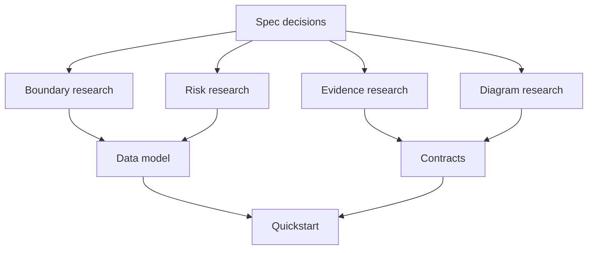

# Research: Modular Design and Low Coupling Hardening

## Related Documents

- [spec.md](spec.md)
- [plan.md](plan.md)
- [data-model.md](data-model.md)
- [quickstart.md](quickstart.md)
- [contracts/module-boundary-contract.md](contracts/module-boundary-contract.md)
- [contracts/runtime-scenario-contract.md](contracts/runtime-scenario-contract.md)
- [contracts/regression-evidence-contract.md](contracts/regression-evidence-contract.md)
- [contracts/coupling-risk-contract.md](contracts/coupling-risk-contract.md)
- [contracts/documentation-diagram-contract.md](contracts/documentation-diagram-contract.md)

## Research Flow

This flowchart shows how research decisions feed the design artifacts.

The diagram shows that research does not produce implementation code. It resolves the decisions that shape the data model, contracts, and quickstart. Boundary and risk decisions define what must be refactored. Evidence and diagram decisions define how completion will be proven.

## Decision: Hybrid Boundary Model

Use hybrid boundaries: domain capabilities own behavior and data, while live-stream and offline-video runtime paths define shared contracts across capabilities.

**Rationale**: The backend already has domain-oriented Django apps such as accounts, cameras, sessions, detections, tracking, anomalies, exports, health, pipeline, and video_analysis. A purely layered model would keep feature work spread across many technical layers. A pure runtime-path model would duplicate common behavior between live and offline flows. Hybrid boundaries preserve domain ownership while making live/offline interactions explicit.

**Alternatives considered**:
- Layer boundaries: rejected because user workflows cut across UI, API, services, storage, and inference layers.
- Runtime-only boundaries: rejected because live and offline paths share model, inference, tracking, overlay, and evidence concepts.
- Documentation-only boundaries: rejected because the clarified scope requires full modular restructuring.

## Decision: Full Delivered Baseline Protection

Protect the full delivered system baseline: live monitoring, offline video, auth, exams, rooms/cameras, sessions, anomalies, exports, health, settings, and dashboard navigation.

**Rationale**: The feature goal is to improve modularity without breaking functionality. A narrow inference-only baseline would miss regressions in adjacent workflows that share auth, cameras, sessions, health, exports, or dashboard state.

**Alternatives considered**:
- Video/inference-only baseline: rejected because it does not cover the clarified baseline.
- Backend-only baseline: rejected because frontend workflows and user-visible state are part of delivered functionality.

## Decision: Risk-Ranked Coupling Policy

Remove high-risk coupling in this feature. Permit medium-risk and low-risk temporary coupling only when it has owner, expiry, removal plan, and regression coverage.

**Rationale**: Full restructuring must not become a source of avoidable breakage. The risk policy lets the team remove coupling that threatens correctness or change isolation now, while controlling temporary exceptions that are safer to phase out after evidence exists.

**Alternatives considered**:
- No temporary coupling: rejected because it could force risky changes before baseline evidence is complete.
- Stability-first exceptions for any coupling: rejected because it weakens the full restructuring objective.

## Decision: Documentation Diagram Coverage Is Feature Scope

Audit and update existing and incoming documentation for Mermaid diagrams that explain code structure, system interaction, and cross-module interaction.

**Rationale**: The current docs tree has broad source-file documentation, but the user identified missing diagrams as a planning requirement. The constitution also requires diagrams with detailed explanations and cross-links. Treating diagram debt as scope ensures restructured boundaries are explainable, reviewable, and testable.

**Alternatives considered**:
- Update diagrams only for newly touched files: rejected because existing docs may misrepresent the current architecture.
- Defer diagram updates to a polish phase: rejected because diagrams are required evidence for boundary correctness.

## Decision: Evidence Pack Completion Gate

Require a full evidence pack before completion: before/after workflow baseline, automated regression tests, real-data live/offline results, coverage report, reviewer sign-off, and diagram coverage sign-off.

**Rationale**: The change is broad and behavior-preserving. Completion must be proven by repeatable evidence rather than code review alone.

**Alternatives considered**:
- Automated tests only: rejected because diagrams, risk exceptions, and reviewer traceability are core scope.
- Review checklist only: rejected because it does not prove runtime behavior.

## Decision: Ultralytics Authority for Prediction and Tracking

Use official Ultralytics documentation as the primary reference for prediction and tracking behavior in inference-related contracts.

**Rationale**: The constitution names Ultralytics docs as the authority. The official docs describe prediction on images/videos/streams and object tracking across video, webcam, and RTSP-like sources. The implementation plan must preserve compatibility with those concepts where direct Ultralytics behavior is used.

**Alternatives considered**:
- Treat existing local code as the only authority: rejected because it can preserve accidental behavior.
- Use third-party tutorials: rejected because the constitution requires official docs as the primary reference.

References:
- Ultralytics Docs home: https://docs.ultralytics.com/
- Predict mode: https://docs.ultralytics.com/modes/predict/
- Track mode: https://docs.ultralytics.com/modes/track/
