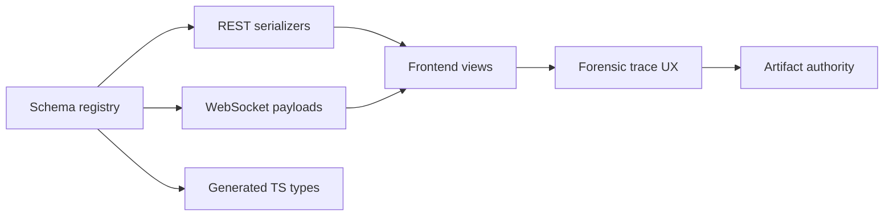

# Contract: API, WebSocket, Artifact, And Forensic Governance

**Feature**: [Production Behavioral Intelligence Maturity Closure](../spec.md)  
**Plan**: [../plan.md](../plan.md)

## Purpose

This contract defines schema governance for REST, WebSocket, event, telemetry, artifact, and forensic trace payloads. It exists because behavioral debugging requires a stable end-to-end evidence chain across backend persistence, frontend rendering, artifacts, and benchmark context.

## Governance Flow



The flow makes the registry the source of truth. REST, WebSocket, and TypeScript contracts must not evolve independently.

## Schema Registry Contract

Every public payload schema must include:

- `schema_id`.
- `schema_kind`.
- `version`.
- Compatibility status.
- JSON schema.
- Activation status.

Schema kinds:

- `rest`.
- `websocket`.
- `runtime_event`.
- `telemetry`.
- `artifact`.
- `forensic_trace`.
- `temporal_sequence`.

## Serializer Contract

Public serializers must:

- Use explicit fields.
- Avoid broad field exposure.
- Exclude secrets and raw PII.
- Preserve null/zero/unavailable semantics.
- Include schema version when payload is externally consumed.

## WebSocket Contract

Every WebSocket payload must include:

```json
{
  "schema_version": "runtime.telemetry.v1",
  "event_id": "uuid",
  "session_id": "session-uuid",
  "camera_id": "camera-uuid",
  "event_type": "runtime_update",
  "timestamp_ms": 1710000000123,
  "payload": {}
}
```

Client behavior:

- Validate schema version.
- Use one managed socket per runtime channel.
- Remove stale listeners on reconnect.
- Apply exponential reconnect with ceiling.
- Never fabricate missing telemetry values.

## Artifact Authority Contract

Authority order:

1. DB artifact metadata.
2. Filesystem payload and digest.
3. Cache projection.

Rules:

- Cache cannot be authority.
- Stale cache must be invalidated or marked stale.
- Missing filesystem payload with existing DB metadata is an integrity failure.
- Artifact retrieval must publish latency and error metrics.

## Forensic Trace Contract

Trace flow:

```text
event
-> track identity
-> lifecycle
-> pose stream
-> behavior feature
-> anomaly primitive
-> artifact
-> benchmark/profile context
```

Forensic trace response must include:

- Event identity and timestamp.
- Canonical track identity and local aliases.
- Lifecycle state at event time.
- Pose stream reference and stream version.
- Feature window and ontology version.
- Anomaly primitive score and threshold.
- Artifact authority record.
- Benchmark/profile context.
- Missing links with reason.

Access policy:

- Any authenticated production dashboard user may view forensic traces and raw temporal sequences, per clarification.
- Access must still be authenticated and audited.
- Any authenticated production dashboard user may soft-purge or archive raw temporal sequence records they can view.
- Physical deletion of raw temporal sequence records is not supported during maturity closure.
- Soft-purge/archive actions must emit audit evidence with actor, action, scope, reason, timestamp, tombstone identity, recovery reference, and evidence impact.

## API Performance Contract

Performance reports must include:

- REST endpoint latency.
- Serialization overhead.
- Artifact retrieval overhead.
- WebSocket throughput.
- Frontend render latency for forensic trace views.

## Failure Semantics

| Failure | Required Behavior |
|---------|-------------------|
| Schema mismatch | Reject payload or show compatibility failure. |
| WebSocket disconnect | Governed reconnect without duplicate listeners. |
| Artifact stale | Display stale state and source. |
| Trace link missing | Display unavailable reason, not fabricated continuity. |
| Serializer leakage | Blocking contract test failure. |

## Evidence Requirements

Reviewers must inspect:

- `api_ws_registry.json`.
- `serializer_hardening_report.md`.
- `ws_version_compat_report.md`.
- `artifact_source_policy.md`.
- `forensic_trace_e2e_report.md`.
- `api_frontend_perf_report.md`.

## Related Documents

- [../plan.md](../plan.md)
- [../data-model.md](../data-model.md)
- [runtime-mode-contract.md](runtime-mode-contract.md)
- [identity-sequence-contract.md](identity-sequence-contract.md)
