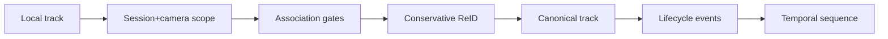

# Contract: Identity Continuity And Temporal Sequence Authority

**Feature**: [Production Behavioral Intelligence Maturity Closure](../spec.md)  
**Plan**: [../plan.md](../plan.md)

## Purpose

This contract defines identity scoping, ReID canonicalization, lifecycle state, pose stream use, typed sequence persistence, feature windows, and anomaly primitive inputs. It exists because behavioral intelligence is invalid if temporal data is computed across switched identities or ambiguous pose streams.

## Identity Flow



The flow shows that local tracker IDs are not scientific identities. They must be scoped, associated, optionally reidentified, and persisted as canonical tracks before sequence features are computed.

## Identity Key Contract

Every identity-bearing payload must include:

```json
{
  "session_id": "session-uuid",
  "camera_id": "camera-uuid",
  "canonical_track_id": "ct-000123",
  "local_track_id": "lt-000045",
  "runtime_mode": "live"
}
```

Rules:

- `camera_id` is mandatory.
- Redis keys must include session, camera, runtime mode, and track scope.
- Session-only identity keys are forbidden.
- Canonical track ID is the primary temporal identity.

## ReID Decision Contract

Accepted ReID merge payload:

```json
{
  "decision_id": "uuid",
  "candidate_local_track_id": "lt-000045",
  "candidate_canonical_track_id": "ct-000123",
  "score": 0.93,
  "threshold": 0.90,
  "camera_scope_ok": true,
  "lifecycle_continuity_ok": true,
  "appearance_ok": true,
  "decision": "accepted",
  "provenance": "triton_reid_embedding_v1"
}
```

Rules:

- Accepted merge requires all policy booleans true.
- If any policy boolean is false, decision must be `rejected` or `unresolved`.
- ReID decisions are append-only audit records.

## Lifecycle Contract

Allowed lifecycle states:

- `ACTIVE`.
- `OCCLUDED`.
- `REIDENTIFIED`.
- `LOST`.
- `ENDED`.

Every lifecycle transition must include:

- Previous state.
- New state.
- Frame number.
- Timestamp in milliseconds.
- Reason.
- Confidence.

## Pose Stream Contract

Allowed pose streams:

| Stream | Authority | Intended Use |
|--------|-----------|--------------|
| `raw_keypoints` | Scientific measurement truth | Reproducibility and audit. |
| `smoothed_keypoints` | Temporal analysis stream | Feature extraction and anomaly primitives. |
| `display_keypoints` | Visualization stream | Frontend overlays only. |

Rules:

- Raw stream cannot be overwritten by smoothing.
- Every stream must include stream version and visibility mask.
- Missing joints must be represented through masks, not zeros.

## Temporal Sequence Contract

Required sequence payload:

```json
{
  "session_id": "session-uuid",
  "camera_id": "camera-uuid",
  "canonical_track_id": "ct-000123",
  "frame_number": 1204,
  "timestamp_ms": 1710000000123,
  "pose_stream": "smoothed_keypoints",
  "lifecycle_state": "ACTIVE",
  "feature_vector_ref": "features://window/...",
  "event_ids": ["event-1"],
  "missing_mask": {
    "left_wrist": false,
    "right_wrist": true
  }
}
```

Idempotency:

- Unique key is `(session_id, camera_id, canonical_track_id, frame_number, pose_stream)`.
- Replays must update idempotently or be rejected with duplicate reason.

Retention:

- Raw temporal sequence records are retained indefinitely.
- Purge means soft-delete/archive only during maturity closure.
- Physical deletion of raw temporal sequence records is not supported during maturity closure.
- Every soft-purge/archive action must preserve tombstone identity and recovery reference.

## Sequence Soft-Purge And Archive Contract

Allowed actors:

- Any authenticated production dashboard user can soft-purge or archive raw temporal sequence records they can view.

Required audit payload:

```json
{
  "action_id": "uuid",
  "actor_id": "user-uuid",
  "action_type": "soft_purge",
  "affected_scope": {
    "session_id": "session-uuid",
    "camera_id": "camera-uuid",
    "canonical_track_id": "ct-000123"
  },
  "reason": "operator-request",
  "timestamp_ms": 1710000000123,
  "tombstone_id": "tombstone-uuid",
  "recovery_ref": "sequence-recovery://...",
  "evidence_impact": "hidden_from_active_views"
}
```

Rules:

- `action_type` is `soft_purge`, `archive`, or `restore`.
- Actor scope must be checked against records the user can view.
- Physical deletion is a contract violation.
- Finalized maturity evidence cannot be silently removed by soft-purge/archive.

## Feature Window Contract

Feature windows must include:

- Ontology version.
- Feature name.
- Window start/end.
- Value.
- Confidence.
- Missing state.
- Source sequence digest.

Zeros are valid only when measured zero. Missing, unavailable, or masked data must use explicit missing states.

## Anomaly Primitive Contract

Anomaly primitive events may be emitted only when:

- Identity continuity gate passes for the window.
- Timestamp continuity gate passes.
- Required pose stream exists.
- Missing-data policy allows scoring.
- Feature ontology version is present.

## Evidence Requirements

Reviewers must inspect:

- Identity scope examples.
- ReID accepted/rejected/unresolved examples.
- ID switch metrics.
- Sequence idempotency tests.
- Feature samples with missing masks.
- Anomaly primitive reports with evidence links.

## Related Documents

- [../plan.md](../plan.md)
- [../data-model.md](../data-model.md)
- [telemetry-benchmark-contract.md](telemetry-benchmark-contract.md)
