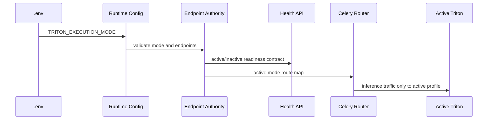

# Contract: Runtime Mode And Triton Endpoint Authority

**Feature**: [Production Behavioral Intelligence Maturity Closure](../spec.md)  
**Plan**: [../plan.md](../plan.md)

## Purpose

This contract defines how production runtime mode, Triton endpoint selection, health readiness, scheduler ownership, and inactive endpoint isolation must behave. It exists to prevent endpoint policy drift across `.env`, settings, Celery, scripts, health checks, and benchmark tooling.

## Contract Diagram



The sequence shows the required authority chain. Runtime mode starts in `.env`, is validated once by runtime config, becomes endpoint authority, then controls both health and routing.

## Environment Inputs

| Variable | Required | Values | Production Rule |
|----------|----------|--------|-----------------|
| `TRITON_EXECUTION_MODE` | Yes | `live`, `offline` | Invalid value blocks startup. |
| `TRITON_LIVE_HTTP_URL` | Yes | URL | Used only when mode is `live`. |
| `TRITON_LIVE_GRPC_URL` | Yes | URL | Used only when mode is `live`. |
| `TRITON_LIVE_METRICS_URL` | Yes | URL | Used only when mode is `live`. |
| `TRITON_OFFLINE_HTTP_URL` | Yes | URL | Used only when mode is `offline`. |
| `TRITON_OFFLINE_GRPC_URL` | Yes | URL | Used only when mode is `offline`. |
| `TRITON_OFFLINE_METRICS_URL` | Yes | URL | Used only when mode is `offline`. |
| `PRODUCTION_INFERENCE_BACKEND` | Yes | `triton` | Non-Triton value blocks production startup. |
| `ALLOW_LOCAL_INFERENCE_FALLBACK` | Yes | `false` | Must be false in production. |

## API Contract

### Health Response Fields

Every production health response that reports model serving must include:

```json
{
  "runtime_mode": "live",
  "active_profile": "live",
  "active_endpoint": {
    "http_url": "http://127.0.0.1:39000",
    "grpc_url": "127.0.0.1:39001",
    "metrics_url": "http://127.0.0.1:39002",
    "ready": true,
    "model_ready_count": 0
  },
  "inactive_profile": {
    "profile": "offline",
    "production_ready": false,
    "routed": false
  },
  "fallback_inference_enabled": false,
  "verdict": "passed"
}
```

Rules:

- `runtime_mode` must equal `TRITON_EXECUTION_MODE`.
- `fallback_inference_enabled` must be false in production.
- `inactive_profile.production_ready` must be false.
- `inactive_profile.routed` must be false.

## Celery Routing Contract

Live mode routes only live queues:

- `live.ingest`.
- `live.detect`.
- `live.pose`.
- `live.telemetry`.

Offline mode routes only offline queues:

- `offline.decode`.
- `offline.detect`.
- `offline.pose`.
- `offline.artifacts`.
- `offline.benchmark`.

Cross-mode route attempts must fail closed with a structured error and a runtime event.

## Failure Semantics

| Condition | Required Behavior |
|-----------|-------------------|
| Missing mode | Startup failure. |
| Invalid mode | Startup failure. |
| Active endpoint unreachable | Startup failure in production. |
| Inactive endpoint reachable | Not fatal, but not ready and not routed. |
| Local fallback enabled | Startup failure in production. |
| Endpoint mismatch | Startup failure. |
| Celery route mismatch | Task rejection and telemetry event. |

## Evidence Requirements

Reviewers must inspect:

- Active endpoint health snapshot.
- Inactive endpoint isolation evidence.
- Route map showing only active-mode queues.
- Environment snapshot with secrets redacted.
- Startup preflight diagnostic JSON.

## Related Documents

- [../plan.md](../plan.md)
- [../data-model.md](../data-model.md)
- [../quickstart.md](../quickstart.md)
