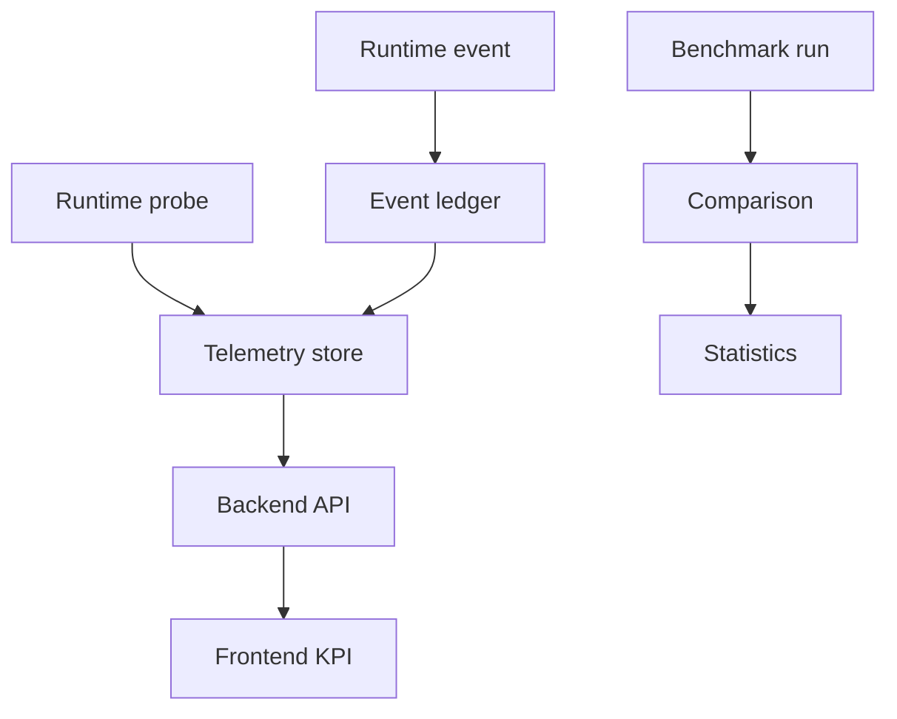

# Contract: Observability Trust And Benchmark Integrity

**Feature**: [Production Behavioral Intelligence Maturity Closure](../spec.md)  
**Plan**: [../plan.md](../plan.md)

## Purpose

This contract defines how telemetry, events, benchmark runs, statistical reports, and frontend metric states must behave. It exists because operational readiness and scientific claims are invalid when metrics are synthetic, duplicated, self-baselined, or masked by the frontend.

## Telemetry Flow



The flow enforces that telemetry is collected, deduplicated, normalized, and served through backend authority before UI display or benchmark acceptance.

## Metric State Contract

Frontend and API payloads must distinguish:

| State | JSON Representation | Meaning |
|-------|---------------------|---------|
| Measured zero | `0` | Collector measured an actual zero. |
| Unknown | `null` | Value has not been measured or loaded. |
| Unavailable | `{ "state": "unavailable" }` | Collector or source unavailable. |
| Degraded | `{ "state": "degraded" }` | Source exists but confidence is reduced. |

Rule:

- Do not coerce `null`, unavailable, or degraded to `0`.

## Runtime Event Contract

Every runtime event must include:

```json
{
  "event_id": "uuid",
  "session_id": "session-uuid",
  "camera_id": "camera-uuid",
  "source": "live_pipeline",
  "event_type": "drop_accounting",
  "timestamp_ms": 1710000000123,
  "payload_digest": "sha256..."
}
```

Dedup rule:

- Unique `(session_id, camera_id, event_id)`.
- Duplicate replay cannot increment counters twice.

## Probe Contract

Probe-backed telemetry must identify:

- Probe type.
- Target.
- Status.
- Observed value.
- Latency.
- Failure reason.
- Timestamp.

Hardcoded availability is not valid production telemetry.

## Benchmark Run Contract

Every benchmark run must include:

- `run_id`.
- `mode`.
- `profile`.
- `input_digest`.
- `candidate_or_baseline`.
- `repetition`.
- `git_sha`.
- `config_digest`.
- `metrics_digest`.
- `evidence_manifest`.

## Benchmark Comparison Contract

Comparison requires:

- At least 5 baseline runs for production acceptance.
- At least 5 candidate runs for production acceptance.
- Same input digest.
- Same mode boundary.
- Same profile family unless explicitly testing profile change.
- Same required telemetry sources.
- Repeated real execution.

Comparison output must include:

- Raw baseline and candidate values.
- Absolute and percent deltas.
- Variance.
- Confidence interval.
- Effect size.
- Pass/fail threshold.
- For paper/research claims: p-value or nonparametric test plus power note.

## Failure Semantics

| Failure | Required Result |
|---------|-----------------|
| Missing baseline | Benchmark fails. |
| Fewer than 5 baseline or 5 candidate runs for production acceptance | Benchmark fails. |
| Candidate compares to itself | Benchmark fails. |
| Synthetic pass state | Benchmark fails. |
| Duplicate event replay | Event rejected or idempotently ignored. |
| Collector unavailable | Metric state is unavailable, not zero. |
| Probe source unknown | Metric state is unknown until measured. |

## Evidence Requirements

Reviewers must inspect:

- `telemetry_probe_report.json`.
- `event_dedup_report.md`.
- `benchmark_baseline_required_report.md`.
- `statistical_repeatability_report.md`.
- `frontend_kpi_truth_report.md`.

## Representative Validation Evidence Contract

Final maturity evidence must include:

- At least 3 offline classroom video runs.
- At least 2 live/RTSP stream runs.
- Coverage tags for normal operation, crowded crossings, occlusion/re-entry, pose partial failures, and RTSP disconnect/reconnect.

Missing a required count or coverage tag fails maturity acceptance even if benchmark statistics pass.

## Related Documents

- [../plan.md](../plan.md)
- [../data-model.md](../data-model.md)
- [identity-sequence-contract.md](identity-sequence-contract.md)
