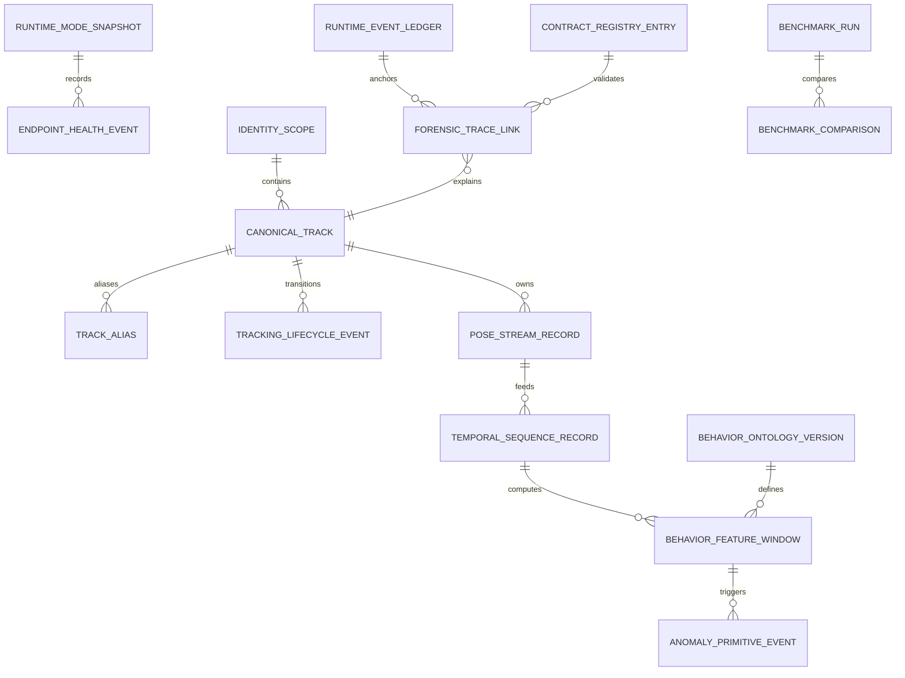
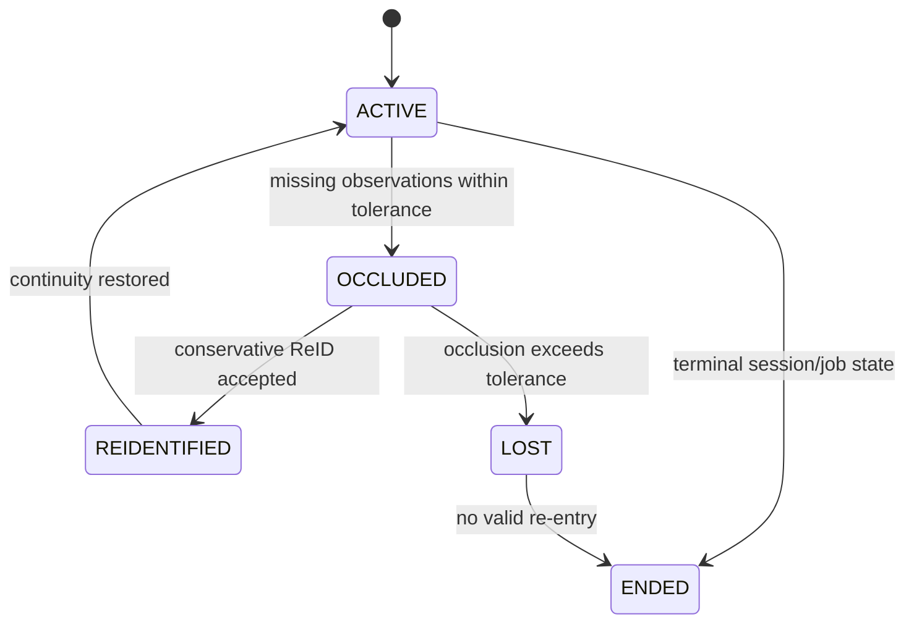

# Data Model: Behavioral Intelligence Maturity Closure

**Feature**: [Production Behavioral Intelligence Maturity Closure](spec.md)  
**Plan**: [plan.md](plan.md)

## Purpose

This document defines the durable data model required to close production maturity gaps. It exists because frame-centric rows and JSON-heavy artifacts cannot support identity-stable temporal behavioral intelligence, reproducible ML exports, or audit-grade forensic traceability.

## Relationship Model

The ER diagram shows the maturity closure lineage. Runtime and endpoint records establish execution authority. Identity records establish student continuity. Pose records feed typed sequence records. Sequences feed behavior features and anomaly primitives. Forensic traces connect events back to the exact identity, pose, feature, anomaly, artifact, and benchmark context.

## Runtime And Deployment Entities

### RuntimeModeSnapshot

| Field | Type | Required | Constraint |
|-------|------|----------|------------|
| `snapshot_id` | UUID | Yes | Primary key |
| `process_boot_id` | string | Yes | Unique with `mode` |
| `mode` | enum `live/offline` | Yes | From `TRITON_EXECUTION_MODE` |
| `active_http_url` | string | Yes | Must match selected profile |
| `active_grpc_url` | string | Yes | Must match selected profile |
| `active_metrics_url` | string | Yes | Must match selected profile |
| `inactive_profile` | enum | Yes | Opposite profile |
| `production_fallback_disabled` | boolean | Yes | Must be true in production |
| `validated_at` | timestamp | Yes | Indexed |
| `verdict` | enum `passed/failed` | Yes | Startup gate |
| `failure_reason` | text | No | Required on failure |

Indexes:

- `idx_runtime_mode_validated_at(mode, validated_at)`.
- `uniq_runtime_boot_mode(process_boot_id, mode)`.

### EndpointHealthEvent

Fields: `event_id`, `snapshot_id`, `profile`, `endpoint_kind`, `url`, `status_code`, `latency_ms`, `model_ready_count`, `is_active_profile`, `checked_at`, `failure_reason`.

Rules:

- Active profile failure blocks startup.
- Inactive profile must not be represented as production-ready.
- Health event is append-only for evidence.

## Ingestion And Queue Entities

### QueueRouteContract

Fields: `queue_name`, `owner`, `task_pattern`, `mode`, `priority`, `retry_limit`, `retry_backoff_ms`, `dlq_name`, `overflow_policy`, `created_at`.

Constraints:

- Unique `(queue_name, task_pattern, mode)`.
- `dlq_name` required for production queues.

### QueueTelemetryEvent

Fields: `event_id`, `queue_name`, `task_id`, `job_id`, `session_id`, `camera_id`, `enqueued_at`, `dequeued_at`, `started_at`, `finished_at`, `wait_ms`, `execution_ms`, `worker_id`, `retry_count`.

Indexes:

- `(queue_name, enqueued_at)`.
- `(session_id, camera_id, enqueued_at)`.
- `(task_id, retry_count)`.

### FrameDropEvent

Fields: `event_id`, `session_id`, `camera_id`, `source_frame_id`, `frame_number`, `source_ts`, `ingest_ts`, `drop_reason`, `failure_class`, `queue_name`, `queue_depth`, `policy_action`, `occurred_at`.

Allowed `drop_reason`: `decode_failure`, `stale_discard`, `timeout_fallback`, `downstream_failure`, `queue_overflow`, `backpressure_discard`, `persistence_failure`.

## Identity Entities

### IdentityScope

Fields: `scope_id`, `session_id`, `camera_id`, `runtime_mode`, `scope_digest`, `created_at`.

Constraints:

- Unique `(session_id, camera_id, runtime_mode)`.
- `camera_id` is mandatory for live and offline multi-camera contexts.

### CanonicalTrack

Fields: `canonical_track_id`, `scope_id`, `created_from_local_track_id`, `current_state`, `started_at_ms`, `ended_at_ms`, `identity_confidence`, `created_at`.

Indexes:

- `(scope_id, canonical_track_id)`.
- `(scope_id, current_state)`.

### TrackAlias

Fields: `alias_id`, `canonical_track_id`, `local_track_id`, `source`, `score`, `threshold`, `decision`, `provenance`, `created_at`.

Constraints:

- Unique `(canonical_track_id, local_track_id, source)`.
- `decision` is `accepted`, `rejected`, or `unresolved`.

### ReidDecision

Fields: `decision_id`, `scope_id`, `candidate_local_track_id`, `candidate_canonical_track_id`, `embedding_ref`, `score`, `threshold`, `camera_scope_ok`, `lifecycle_continuity_ok`, `appearance_ok`, `decision`, `created_at`.

Rule:

- `decision=accepted` requires `camera_scope_ok=true`, `lifecycle_continuity_ok=true`, and `appearance_ok=true`.

### TrackingLifecycleEvent

Fields: `event_id`, `canonical_track_id`, `state_from`, `state_to`, `frame_number`, `timestamp_ms`, `reason`, `confidence`, `created_at`.

Allowed states: `ACTIVE`, `OCCLUDED`, `REIDENTIFIED`, `LOST`, `ENDED`.

## Pose Entities

### PoseStreamRecord

Fields: `record_id`, `canonical_track_id`, `frame_number`, `timestamp_ms`, `stream_type`, `stream_version`, `keypoints`, `visibility_mask`, `confidence`, `provenance`, `source_batch_id`, `created_at`.

Allowed stream types:

- `raw_keypoints`: scientific measurement truth.
- `smoothed_keypoints`: temporal feature input.
- `display_keypoints`: overlay rendering.

Constraints:

- Unique `(canonical_track_id, frame_number, stream_type, stream_version)`.
- `visibility_mask` required.

### PoseBatchItemResult

Fields: `item_id`, `batch_id`, `crop_id`, `canonical_track_id`, `frame_number`, `status`, `failure_reason`, `latency_ms`, `persisted`, `created_at`.

Rule:

- A failed item cannot invalidate successful sibling items in the same batch.

## Temporal Behavior Entities

### TemporalSequenceRecord

Fields: `sequence_id`, `session_id`, `camera_id`, `canonical_track_id`, `frame_number`, `timestamp_ms`, `pose_stream`, `lifecycle_state`, `feature_vector_ref`, `event_ids`, `missing_mask`, `source_digest`, `created_at`.

Constraints:

- Unique `(session_id, camera_id, canonical_track_id, frame_number, pose_stream)`.
- `timestamp_ms` must originate from canonical source timestamp or declared transformed timestamp.

Retention:

- Raw sequence records are retained indefinitely.
- Soft-purge/archive hides or relocates records from active views but does not physically delete rows during maturity closure.
- A soft-purged record must remain recoverable through tombstone and recovery metadata.

### TemporalSequenceRetentionAction

Fields: `action_id`, `actor_id`, `session_id`, `camera_id`, `canonical_track_id`, `action_type`, `affected_scope`, `reason`, `tombstone_id`, `recovery_ref`, `evidence_impact`, `occurred_at`.

Allowed action types:

- `soft_purge`.
- `archive`.
- `restore`.

Rules:

- Actor must be an authenticated production dashboard user.
- Actor can only affect raw temporal sequence records they can view.
- Physical delete is forbidden during maturity closure.
- Every action is append-only audit evidence.

### TemporalMemoryWindow

Fields: `window_id`, `canonical_track_id`, `window_start_ms`, `window_end_ms`, `retention_policy`, `pose_history_ref`, `motion_history_ref`, `behavior_history_ref`, `continuity_score`, `created_at`.

### BehaviorOntologyVersion

Fields: `ontology_version`, `feature_name`, `feature_group`, `unit`, `range_min`, `range_max`, `confidence_semantics`, `missing_data_policy`, `window_ms`, `created_at`.

Feature groups:

- `head`: direction proxy, angular velocity, glance duration, repeated glance count, switching frequency.
- `wrist`: velocity, disappearance duration, visibility ratio, motion bursts.
- `motion`: entropy, intensity, activity ratio, posture instability.
- `torso`: orientation variation, shoulder asymmetry, leaning variation.
- `interaction`: neighbor directional overlap, synchronized movement, proximity cues.

### BehaviorFeatureWindow

Fields: `feature_window_id`, `canonical_track_id`, `ontology_version`, `feature_name`, `window_start_ms`, `window_end_ms`, `value`, `confidence`, `missing_state`, `source_sequence_digest`, `created_at`.

Constraints:

- Unique `(canonical_track_id, ontology_version, feature_name, window_start_ms, window_end_ms)`.
- Missing values use `missing_state`, not zero.

### AnomalyPrimitiveEvent

Fields: `event_id`, `canonical_track_id`, `primitive_type`, `window_start_ms`, `window_end_ms`, `score`, `threshold`, `confidence`, `evidence_refs`, `created_at`.

Allowed primitive types:

- `change_point`.
- `drift`.
- `repeated_pattern`.
- `instability`.
- `attention_deviation`.

## Observability And Benchmark Entities

### RuntimeEventLedger

Fields: `event_id`, `session_id`, `camera_id`, `source`, `event_type`, `timestamp_ms`, `payload_digest`, `created_at`.

Constraint:

- Unique `(session_id, camera_id, event_id)`.

### RuntimeProbeEvent

Fields: `probe_id`, `probe_type`, `target`, `status`, `latency_ms`, `observed_value`, `failure_reason`, `checked_at`.

Allowed statuses:

- `available`.
- `unavailable`.
- `unknown`.
- `degraded`.

### BenchmarkRun

Fields: `run_id`, `mode`, `profile`, `input_digest`, `candidate_or_baseline`, `repetition`, `git_sha`, `config_digest`, `started_at`, `ended_at`, `metrics_digest`, `evidence_manifest`.

### BenchmarkComparison

Fields: `comparison_id`, `baseline_run_ids`, `candidate_run_ids`, `metric`, `baseline_value`, `candidate_value`, `delta`, `confidence_interval`, `effect_size`, `p_value`, `passed`, `created_at`.

Rule:

- Comparison fails if baseline run IDs are missing or input digest/profile boundaries mismatch.
- Production acceptance comparison fails if it has fewer than 5 baseline runs or fewer than 5 candidate runs for the profile/input.

## RepresentativeValidationDataset

Fields: `dataset_id`, `evidence_manifest`, `offline_video_count`, `live_stream_count`, `coverage_tags`, `input_digests`, `created_at`.

Required acceptance constraints:

- `offline_video_count >= 3`.
- `live_stream_count >= 2`.
- `coverage_tags` must include `normal_operation`, `crowded_crossing`, `occlusion_reentry`, `pose_partial_failure`, and `rtsp_disconnect_reconnect`.

## Contract And Forensic Entities

### ContractRegistryEntry

Fields: `schema_id`, `schema_kind`, `version`, `json_schema`, `compatibility`, `active`, `created_at`.

### ArtifactAuthorityRecord

Fields: `artifact_id`, `job_id`, `authority_source`, `path`, `cache_key`, `stale_status`, `digest`, `created_at`.

Authority order:

1. DB metadata.
2. Filesystem payload.
3. Cache projection.

### ForensicTraceLink

Fields: `trace_id`, `event_id`, `canonical_track_id`, `pose_record_id`, `feature_window_id`, `anomaly_event_id`, `artifact_id`, `benchmark_run_id`, `created_at`.

## State Transitions

The state diagram defines identity lifecycle persistence. Any temporal feature window must include the lifecycle state that applied during the window.

## Validation Rules

1. Production startup cannot produce a passing `RuntimeModeSnapshot` when fallback inference is enabled.
2. Queue telemetry must record wait duration for each production task class.
3. `camera_id` is mandatory in identity scope and Redis key scope.
4. Accepted ReID decisions must satisfy all conservative policy booleans.
5. Pose streams must be versioned and cannot overwrite raw pose truth.
6. Temporal sequence rows must be idempotent by identity, frame, and stream.
7. Raw temporal sequence soft-purge/archive actions must preserve tombstone identity, recovery reference, actor, reason, scope, timestamp, and evidence impact.
8. Missing feature data must produce explicit missing state.
9. Benchmark comparisons must include explicit baseline and candidate run sets, with at least 5 baseline and 5 candidate runs per profile/input for production acceptance.
10. Representative maturity acceptance must include at least 3 offline video runs and 2 live/RTSP stream runs with required coverage tags.
11. Frontend-visible metrics must preserve null, zero, unavailable, and degraded states.
12. Forensic trace links must never fabricate missing evidence.

## Related Documents

- [spec.md](spec.md)
- [plan.md](plan.md)
- [research.md](research.md)
- [identity-sequence-contract.md](contracts/identity-sequence-contract.md)
- [telemetry-benchmark-contract.md](contracts/telemetry-benchmark-contract.md)
