# Implementation Plan: Production Behavioral Intelligence Maturity Closure

**Branch**: `010-behavioral-maturity-closure` | **Date**: 2026-05-25 | **Spec**: [spec.md](./spec.md)  
**Input**: Feature specification from `specs/010-behavioral-maturity-closure/spec.md`

## Summary

This plan converts the system from pose-enabled video analytics infrastructure into a production-grade temporal behavioral intelligence platform. It is not an implementation shortcut. It is the PR review authority for closing identity continuity, temporal truth, runtime policy, telemetry trust, benchmark integrity, typed sequence persistence, behavioral feature semantics, forensic traceability, and final production acceptance.

The plan keeps the corrected production inference rule: two Triton endpoint profiles are configured, one for live and one for offline, but a production server activates only one mode at runtime through `.env` using `TRITON_EXECUTION_MODE=live` or `TRITON_EXECUTION_MODE=offline`. The inactive endpoint must not receive scheduler traffic, Celery routing, inference requests, or production-ready health status.

## Technical Context

**Language/Version**: Python 3.11 backend and Celery workers, TypeScript frontend, PowerShell and Bash deployment tooling, SQL migrations for relational persistence  
**Primary Dependencies**: Django/DRF API layer, Celery, Redis, PostgreSQL, Triton Inference Server, TensorRT model repositories, RTMPose, YOLO detector stack, WebSocket transport, pytest/pytest-xdist, Vitest, Playwright, benchmark harnesses  
**Storage**: PostgreSQL for typed relational state, Redis for queue/session runtime state, filesystem artifact storage for high-volume evidence, JSONL/CSV sidecars for high-cardinality telemetry samples  
**Testing**: pytest unit/integration/system/resilience/performance/contract suites, frontend Vitest and Playwright suites, GPU/Triton validation scripts, benchmark repeatability harnesses  
**Target Platform**: Native Linux production server with NVIDIA GPU, no Docker runtime dependency, no sudo operational assumption; Windows development and remote production tooling remain supported  
**Project Type**: Web application with backend AI pipeline services, distributed Celery orchestration, frontend forensic dashboard, GPU-backed inference runtime  
**Performance Goals**: Live mode must preserve latency-first operation under balanced SLO gates: queue depth <=120 frames/camera, p95 queue wait <=1000ms, timeout rate <=2%, and drop rate <=5%. Offline mode must preserve throughput-first operation under balanced SLO gates: queue depth <=2000 frames/job, p95 queue wait <=30s, timeout rate <=2%, and decoded-frame drop rate = 0%. Both modes must expose p50/p95/p99 queue wait, inference latency, end-to-end latency, timeout rate, drop rate, GPU utilization, and persistence cost. Production benchmark acceptance requires at least 5 baseline runs and 5 candidate runs per profile/input.
**Constraints**: Production inference is Triton-only; local ONNX, local TensorRT, OpenVINO, mocks, and synthetic inference are non-authority production paths; runtime mode is single-active-mode only; timestamps must preserve source, ingest, queue, processing, and persistence times; identity keys must include session and camera scope  
**Scale/Scope**: Classroom live streams, offline uploaded videos, 30-student high-density sessions, multi-camera session isolation, long-running temporal sequence retention with no physical deletion during maturity closure, evidence-driven PR acceptance across eight maturity waves, and a balanced maturity validation dataset of at least 3 offline classroom videos plus 2 live/RTSP streams.
**Runtime Scenarios**: Live RTSP processing and offline video processing are both mandatory. Each has its own active Triton endpoint profile, queue topology, SLO envelope, failure semantics, and evidence artifacts.  
**Inference/Tracking Reference**: Triton runtime contracts and generated model configs are authoritative for production inference. Ultralytics official guidance remains authority for YOLO prediction/tracking configuration where YOLO behavior is changed.  
**Deployment Topology**: Development/test may use relaxed services and test doubles where constitution permits. Production is native Linux, no Docker runtime path, no sudo, Triton-only, one active runtime mode at a time.

## Constitution Check

*GATE: Must pass before Phase 0 research. Re-check after Phase 1 design.*

- Supreme Directive Gate: PASS for planning artifacts. This plan creates synchronized `.md` artifacts under the active spec and updates `AGENTS.md`. Implementation tasks must commit each logical modification and update affected docs/README files with diagrams and cross-links.
- Test-in-Loop Gate: PASS. Every implementation task generated from this plan must write unit, integration, system, contract, resilience, and performance tests before implementation and verify the red phase.
- 100% Real-Data Test Gate: PASS with explicit constraint that inference, pose, tracking, overlay, live/offline media, and Triton wiring tests use real model weights and representative raw media where they validate production behavior.
- Live/Offline Scenario Gate: PASS. Both runtime scenarios are mandatory, but only one production mode is active per server process based on `.env`.
- System Hardening Gate: PASS. The plan documents frontend-backend contracts, backend-Triton wiring, Celery queue semantics, native Linux production topology, and no Docker/no sudo production assumptions.
- Ultralytics Authority Gate: PASS. YOLO prediction/tracking changes must cite official Ultralytics guidance in implementation PRs or record a deviation in research notes.

## Project Structure

### Documentation (this feature)

```text
specs/010-behavioral-maturity-closure/
├── spec.md
├── plan.md
├── research.md
├── data-model.md
├── quickstart.md
├── contracts/
│   ├── runtime-mode-contract.md
│   ├── identity-sequence-contract.md
│   ├── telemetry-benchmark-contract.md
│   └── api-ws-forensic-contract.md
└── tasks.md
```

### Source Code (repository root)

```text
backend/
├── apps/
│   ├── video_analysis/
│   ├── pipeline/
│   ├── telemetry/
│   ├── behavior/
│   └── contracts/
├── config/
├── models/triton_repository/
└── tests/
    ├── unit/
    ├── integration/
    ├── contract/
    ├── system/
    ├── performance/
    └── resilience/

frontend/
├── src/
│   ├── pages/
│   ├── components/
│   ├── stores/
│   ├── services/
│   └── contracts/
└── tests/

tools/
├── prod/
└── benchmarks/

docs/
├── backend/
├── frontend/
└── production/
```

**Structure Decision**: This remains a split frontend/backend production AI platform. Planning artifacts are spec-local. Implementation tasks must map changes into existing Django apps, Celery workers, Triton tooling, frontend runtime dashboards, and documentation mirrors without creating duplicate parallel frameworks.

## 1. Executive Technical Position

### Why This Section Exists

This section establishes the current truth before implementation starts. It prevents PRs from overstating maturity based on pose overlays, telemetry scaffolding, or benchmark placeholders.

### Current Position

The current platform is advanced pose-enabled video analytics infrastructure with real RTMPose/Triton integration, live/offline orchestration, Celery topology, artifacts, runtime telemetry surfaces, and broad testing scaffolds. It is not yet a behavioral intelligence engine because identity continuity, temporal memory, typed sequence storage, feature semantics, anomaly primitives, telemetry trust, and forensic traceability are not mature enough to support scientific behavioral claims.

### Readiness Scoring

| Area | Score | Interpretation |
|------|-------|----------------|
| Ingestion/orchestration | 7/10 | Strong scaffolding exists, but live recovery, source timestamp truth, and backpressure closure are incomplete. |
| Triton runtime infrastructure | 7/10 | Runtime exists and dual endpoint profiles are available, but production mode selection and inactive endpoint isolation must become enforceable. |
| Identity continuity | 3/10 | Track entities and lifecycle utilities exist, but ReID is not canonical, interpolation association is weak, and camera/session key scope is unsafe. |
| Pose infrastructure | 6/10 | RTMPose and pose artifacts exist; behavior-grade pose stream semantics and batch partial success need closure. |
| Temporal reasoning | 3/10 | Short-window smoothing and timeline utilities exist, but long-horizon per-student memory is not first-class. |
| Behavioral semantics | 2/10 | Feature taxonomy, temporal windows, anomaly primitives, and interaction semantics are not production-authority paths. |
| Observability trust | 4/10 | Many telemetry hooks exist, but hardcoded availability, frontend masking, and benchmark self-pass logic undermine trust. |
| Benchmark reproducibility | 3/10 | Benchmark tooling exists, but acceptance requires explicit baseline/candidate comparison, repeated runs, confidence gates, and artifact reproducibility. |
| Production deployment maturity | 5/10 | Native Linux tooling exists, but runtime policy, active endpoint enforcement, health contracts, and evidence gates need closure. |
| Future ML readiness | 3/10 | ST-GCN, CTR-GCN, temporal transformers, contrastive learning, and fusion require stable identity-scoped typed sequences first. |

### Operational Consequences

If this plan is omitted, live failures can silently degrade data integrity, queue metrics can mislead operations, inactive Triton endpoints can accidentally receive traffic, benchmark reports can pass without real comparison, and frontend views can hide backend truth. Those failures produce false production confidence.

### Scientific Consequences

If identity continuity and temporal truth are not stabilized first, every downstream behavior feature becomes contaminated. A repeated glance, motion entropy spike, posture drift, or interaction feature is scientifically invalid if it is computed across switched identities, inconsistent timestamps, or missing pose streams without explicit masks.

## 2. Global Runtime Constraints

### Constraint Matrix

| Constraint | Rationale | Implementation Requirement | Failure Scenario |
|------------|-----------|----------------------------|------------------|
| Triton-only production inference | Production claims require one authority runtime. | Disable local ONNX/TensorRT/OpenVINO fallback in production settings and preflight. | Local fallback masks Triton outage and invalidates production evidence. |
| Dual endpoint configuration | Live and offline need different latency/throughput profiles. | Keep live ports `39000/39001/39002` and offline ports `39100/39101/39102` as configured profiles. | Shared endpoint tuning causes live latency regressions or offline throughput loss. |
| Single active runtime mode | A production server should not serve mixed mode traffic unless explicitly deployed that way. | `.env` `TRITON_EXECUTION_MODE` selects `live` or `offline`; inactive endpoint is not routed or declared ready. | Inactive endpoint receives jobs, causing wrong scheduler parameters and misleading health. |
| Native Linux production | Server constraints explicitly forbid Docker and sudo assumptions. | Scripts must run under user-owned service paths and fail with remediation when privileges are missing. | Deployment docs become unusable on production host. |
| Queue isolation | Workload collapse must not spread across model/runtime queues. | Define canonical Celery route map, DLQ policy, retry ceilings, and queue metrics by actual queue name. | A poisoned or overloaded task starves unrelated live or offline work. |
| Timestamp integrity | Temporal reasoning depends on source-to-persistence chronology. | Preserve source, ingest, queue, processing, and persistence timestamps in live/offline payloads. | Behavior windows mix processing delay with real behavior time. |
| Identity continuity | Behavioral sequence correctness depends on stable student identity. | Namespace identities by session, camera, canonical track, local track, lifecycle, and ReID decision. | ID switches corrupt memory, anomaly scoring, and interaction graphs. |
| Telemetry trust | Production and paper claims require real measured signals. | Replace hardcoded readiness and synthetic benchmark pass states with probe-backed signals. | Dashboards and PR evidence report readiness that is not real. |

### Runtime Mode Semantics

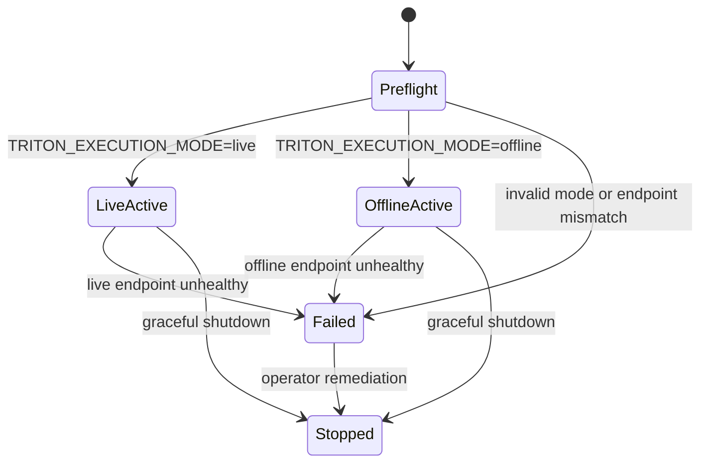

The mode state machine exists because environment files, scripts, Celery routes, health checks, and benchmark runners previously had room to drift. Implementation must make runtime mode an explicit startup state, telemetry field, log dimension, and health diagnostic. The inactive endpoint must be treated as unavailable for production readiness even if its port is reachable in a development environment.

## 2A. Live Benchmark Runtime Failure Remediation Architecture

This section exists because live benchmark execution exposed production-relevant failure classes that are not closed by ordinary health checks: Triton timeout spikes around 3300ms, near-zero GPU utilization while wall latency remains high, app-level fallback retries causing duplicate dispatches, unresolved partial-batch indexes triggering single-call fallback, Celery task `FAILURE` while DB state remains `processing`, exception paths bypassing status finalization, retry amplification loops, dynamic batching inefficiency, queue/Python orchestration latency dominance, Triton-ready mismatch, runtime mode ambiguity, missing request lineage, missing inference-path attribution, and benchmark artifacts disconnected from runtime causality.

### Retry And Fallback Governance

The runtime must implement one retry taxonomy across Triton, application fallback, Celery, degraded execution, and partial batch retry paths. Retry governance solves fallback ambiguity and retry-path instability by forcing every retry to carry parent-child lineage, a retry type, a retry reason, an inference path, and timing attribution. If omitted, duplicate unresolved-index fanout, hidden fallback amplification, and recursive retry storms can appear as ordinary latency variance in benchmark reports.

Implementation must occur in `backend/apps/pipeline/retry_policy.py`, `backend/apps/pipeline/inference_runtime.py`, `backend/apps/video_analysis/tasks.py`, and `backend/apps/pipeline/runtime_ingestion.py`. Retry ceilings must cover max fallback attempts, max unresolved-index retries, and max degraded retries. Every retry attempt emits `request_id`, `parent_request_id`, `retry_reason`, `retry_type`, `inference_path`, `original_batch_id`, `timestamp`, `queue_wait_ms`, and `gpu_wait_ms`. Evidence paths are `ci_evidence/production/runtime/retry_lineage.json` and `ci_evidence/production/runtime/fallback_resolution_report.md`.

### GPU Underutilization And Latency Decomposition

Benchmark acceptance must measure GPU occupancy, GPU duty cycle, CPU orchestration overhead, queue wait contribution, Python scheduling overhead, serialization overhead, Triton queue delay, model execution time, fallback-path ratio, and idle GPU windows. The required latency equation is:

```text
total_latency =
queue_wait +
orchestration +
serialization +
triton_queue +
gpu_compute +
fallback_overhead +
persistence
```

Low GPU utilization with high wall latency invalidates throughput claims unless orchestration attribution is provided. Evidence paths are `ci_evidence/production/runtime/gpu_utilization_analysis.md`, `ci_evidence/production/runtime/latency_decomposition.json`, and `ci_evidence/production/runtime/orchestration_overhead_report.md`.

### Partial-Batch Failure Governance

Partial-batch behavior must preserve successful items, isolate unresolved indexes, tag failed items, and forbid frame-wide invalidation due to one crop failure. Selective per-item retry is allowed only within retry ceilings and only with `unresolved_index_origin`, `source_batch_size`, `effective_batch_size`, `retry_generation`, and `inference_path` preserved. Duplicate dispatch ratio must be bounded and reported.

### Workflow Integrity Governance

The authoritative workflow state machine is `QUEUED`, `DISPATCHED`, `PROCESSING`, `PARTIAL_FAILURE`, `FAILED`, `COMPLETED`, and `DEGRADED_COMPLETED`. Celery result state and DB job state must be reconciled through exception-safe finalization and atomic terminal-state transitions. `FAILURE` while DB state remains `processing` is a blocking defect. Reconciliation watchdogs produce `ci_evidence/production/runtime/workflow_integrity_report.md` and `ci_evidence/production/runtime/terminal_state_reconciliation.json`.

### Triton Readiness And Mode Validation Hardening

Startup readiness graph validation must check active endpoint authority, inactive endpoint isolation, mode-specific health, Triton repository consistency, `config.pbtxt` schema, model warmup, and TensorRT engine lineage. Startup fails on Triton ready mismatch, required endpoint unavailability, active mode ambiguity, model version drift, or contradictory readiness such as `required_offline=True required_live=True reason=forced_triton_not_ready`.

### Benchmark Causality And Forensic Attribution

Every inference event includes `inference_path`, `batch_id`, `source_batch_size`, `effective_batch_size`, `retry_generation`, and `unresolved_index_origin`. Forensic traceability must connect request -> queue -> Triton -> fallback -> persistence -> artifact. Benchmark reports must timestamp-correlate runtime failures, retry spikes, timeout spikes, queue collapse, GPU idle windows, fallback amplification, and Triton queue pressure. Evidence paths are `ci_evidence/production/runtime/benchmark_causality_report.md`, `ci_evidence/production/runtime/retry_amplification_matrix.json`, and `ci_evidence/production/runtime/timeout_correlation_report.md`.

### Runtime Remediation Governance Artifact Map

Implementation must use the new domain artifacts as review authority, not as optional documentation:

| Artifact | Review Authority |
|----------|------------------|
| `architecture.md` | request lineage architecture, cross-wave ownership, benchmark causality architecture |
| `runtime_policy.md` | retry/fallback taxonomy, retry ceilings, workflow states, fail-closed runtime rules |
| `triton_runtime.md` | endpoint authority, readiness graph, partial-batch salvage, dynamic batching efficiency |
| `queueing.md` | Celery retry boundary, queue wait telemetry, starvation/collapse detection |
| `telemetry.md` | per-attempt schema, inference-path attribution, latency decomposition events |
| `observability.md` | GPU underutilization root cause, workflow observability, frontend truth |
| `deployment.md` | startup preflight, active/inactive endpoint enforcement, model repository validation |
| `acceptance_gates.md` | runtime remediation gates for Waves 2, 4, 6, and 8 |
| `benchmarking.md` | benchmark causality, statistical rejection conditions, GPU duty-cycle evidence |
| `identity_temporal_integrity.md` | temporal sequence validity under retry, fallback, and partial success |
| `forensic_debugging.md` | request-to-queue-to-Triton-to-artifact forensic trace |
| `evidence_requirements.md` | deterministic artifact paths, labels, and invalid evidence conditions |
| `risk_register.md` | production/scientific risk ownership for observed runtime failures |
| `production_readiness_checklist.md` | release-blocking readiness checklist |

## 3. Wave-By-Wave Deep Execution Specification

### Wave 1 - Production Policy And Deployment Consistency

#### Architectural Intent

Wave 1 establishes deployment authority. It solves policy drift between `.env`, scripts, docs, settings, Celery routing, health checks, and benchmark runners. Waves 2 through 8 depend on this because none of their evidence is valid if the wrong runtime mode, endpoint profile, or deployment assumption is active.

#### Existing State Analysis

The repository already has production helper scripts, Triton endpoint port conventions, model-serving health surfaces, and active optimization documentation. The dangerous gap is semantic inconsistency: some materials describe single-endpoint production, while the maturity closure specification requires dual configured endpoints with one active mode. That must be reconciled in code and docs as "dual profile, single active mode".

#### Full Engineering Scope

| Task | Implementation Strategy | Integration Points | Risks And Requirements |
|------|-------------------------|--------------------|------------------------|
| Runtime mode validator | Add strict config parser for `TRITON_EXECUTION_MODE`, endpoint URLs, ports, and production fallback flags. | Django settings, Celery app init, health views, scripts in `tools/prod`. | Startup must fail closed; backward compatibility requires dev-only relaxed mode. |
| Endpoint authority module | Centralize live/offline endpoint resolution and inactive endpoint policy. | Triton routing services, model-serving health, benchmark harnesses. | Avoid duplicated string ports; all consumers use same authority. |
| Health contract update | Health output includes active mode, active endpoint readiness, inactive endpoint isolation, model repository readiness. | `/api/v1/health/`, `/api/v1/health/model-serving/`, frontend runtime page. | Health cannot mark inactive endpoint production-ready. |
| Env template alignment | Update `.env.example`, production templates, benchmark env files, and docs. | Root docs, production runbooks, tools. | No Docker or sudo production implication. |
| Preflight validator | Validate endpoint reachability, model readiness, queue connectivity, GPU visibility, active mode, and port conflicts. | `tools/prod`, CI evidence generation. | Must emit machine-readable diagnostics and remediation hints. |

#### Data Model Changes

- `RuntimeModeSnapshot`: `snapshot_id`, `mode`, `active_http_url`, `active_grpc_url`, `active_metrics_url`, `inactive_profile`, `production_fallback_disabled`, `validated_at`, `verdict`, `failure_reason`.
- `EndpointHealthEvent`: `event_id`, `mode`, `profile`, `endpoint_kind`, `status_code`, `latency_ms`, `model_ready_count`, `checked_at`.
- Indexes: `(mode, validated_at)`, `(profile, endpoint_kind, checked_at)`.
- Idempotency: one startup snapshot per process boot ID and mode.

#### Runtime Flow Changes

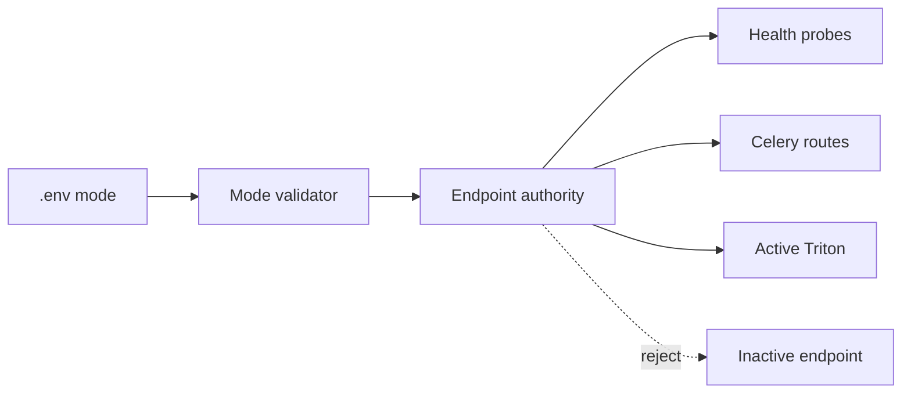

#### Failure Semantics

Invalid mode, unavailable active endpoint, conflicting port usage, model readiness failure, or production fallback enablement are startup-blocking failures. Inactive endpoint reachability is not automatically fatal in development, but it must be reported as inactive and must not receive production traffic.

#### Scientific Integrity Implications

Correct runtime mode prevents mixing live latency-first data with offline throughput-first data. It protects benchmark reproducibility because evidence states which endpoint profile and scheduler policy were active.

#### Required Evidence Artifacts

| Artifact | Why It Matters | Generation | Reviewer Failure Signal |
|----------|----------------|------------|-------------------------|
| `ci_evidence/production/wave1/hash_parity.md` | Confirms local/remote code identity. | prod hash parity script. | Hash mismatch without rationale. |
| `endpoint_health.md` | Proves active/inactive endpoint policy. | preflight health probes. | Inactive endpoint marked ready. |
| `ports_snapshot.txt` | Captures actual Linux listeners. | `ss -ltnp` snapshot. | Unexpected production dependency ports. |
| `backend_health.json` | Proves backend readiness contract. | health endpoint call. | Missing active mode fields. |
| `model_serving_health.json` | Proves Triton model authority. | model-serving health call. | Local fallback reported as ready. |
| `boundary_verifier.txt` | Proves no Docker/no sudo production dependency. | production boundary verifier. | Docker or sudo required for production path. |

#### Acceptance Gates

- `TRITON_EXECUTION_MODE=live` routes only to live endpoint profile and rejects offline scheduler ownership.
- `TRITON_EXECUTION_MODE=offline` routes only to offline endpoint profile and rejects live scheduler ownership.
- Invalid mode fails startup before workers accept tasks.
- Active endpoint readiness returns healthy with model readiness details.
- Inactive endpoint is not consumed by routing, scheduler, benchmark, or health-ready status.
- Production startup evidence shows no Docker and no sudo dependency.

#### Test Strategy

Unit tests validate mode parsing, endpoint selection, inactive rejection, port conflict detection, and health aggregation. Integration tests start live/offline mode configurations and verify routing. Production validation tests run boundary verifier and health snapshots on Linux.

### Wave 2 - Ingestion, Queue Routing, Backpressure, And RTSP Recovery

#### Architectural Intent

Wave 2 hardens ingestion and distributed execution. It exists because live behavioral analysis is invalid when source timestamps, dropped frames, queue delays, and reconnect states are not explicitly accounted for.

Wave 2 also owns retry/fallback governance at the orchestration boundary. Queue wait, Python scheduling overhead, Celery retries, duplicate dispatches, workflow state divergence, and retry amplification are acceptance-blocking because they can dominate wall latency while GPU occupancy remains low.

#### Existing State Analysis

Upload/live orchestration, RTSP validation, buffering primitives, delayed live buffers, queue guards, and fallback mechanics exist. Partial closure includes sparse/delayed flow and observed backpressure. Incomplete areas include real reconnect state machine execution, source-accurate drop accounting, metric naming consistency, and closed-loop capture control.

#### Full Engineering Scope

| Task | Implementation Strategy | Integration Points | Risks And Requirements |
|------|-------------------------|--------------------|------------------------|
| Canonical queue routing map | Define queue names, owners, task classes, retry policy, priority, overflow, and DLQ. | `config/celery.py`, task decorators, worker scripts, telemetry. | Metrics must use actual queue names, not aliases. |
| Queue wait telemetry | Stamp enqueue/dequeue/start/end times and publish p50/p95/p99. | Celery signals, task base classes, runtime telemetry endpoints. | Low overhead required; queue stamps must survive retries and preserve request lineage. |
| DLQ and starvation protection | Add retry ceilings, poison classification, DLQ routes, starvation detectors. | Celery config, Redis queue monitor, evidence reports. | Avoid infinite retry loops and collapse under burst load. |
| Retry/fallback taxonomy | Classify Triton scheduling retry, app fallback retry, Celery task retry, degraded retry, and partial-batch retry. | task base class, inference runtime, telemetry. | Hidden fallback amplification invalidates latency and throughput claims. |
| Workflow state reconciliation | Reconcile Celery result state and DB job state through watchdog jobs. | Celery result backend, job models, terminal state service. | `FAILURE` with DB `processing` is forbidden. |
| RTSP reconnect state machine | Implement `CONNECTED`, `DISCONNECTED`, `RETRY_WAIT`, `RECONNECTING`, `RECOVERED`, `FAILED`, `STOPPED`. | Live ingest loop, stream supervisor, telemetry, frontend status. | Must not block the live loop or starve workers. |
| Timestamp contract | Carry source, ingest, queue, processing, persistence timestamps through live payloads. | frame payload, DB models, artifacts, WebSocket events. | Clock source and monotonic deltas must be distinguishable. |
| Drop accounting | Persist drop reason, failure class, stream context, queue context, timestamps. | buffering, live loop, persistence, telemetry. | Dropped frames are evidence, not silent losses. |
| Backpressure policy engine | Trigger cadence increase, frame discard, throttling, inference shedding, degradation. | queue metrics, GPU metrics, worker saturation, live control loop. | Actions must be policy-driven and auditable. |

#### Data Model Changes

- `QueueRouteContract`: `queue_name`, `owner`, `task_patterns`, `retry_policy`, `dlq_name`, `priority`, `overflow_policy`.
- `QueueTelemetryEvent`: `event_id`, `queue_name`, `task_id`, `enqueued_at`, `dequeued_at`, `started_at`, `finished_at`, `wait_ms`, `execution_ms`, `worker_id`.
- `RtspReconnectEvent`: `stream_id`, `session_id`, `camera_id`, `state_from`, `state_to`, `attempt`, `backoff_ms`, `reason`, `occurred_at`.
- `FrameDropEvent`: `session_id`, `camera_id`, `source_frame_id`, `source_ts`, `drop_reason`, `failure_class`, `queue_depth`, `policy_action`, `occurred_at`.
- Indexes: `(session_id, camera_id, source_ts)`, `(queue_name, enqueued_at)`, `(stream_id, occurred_at)`.

#### Runtime Flow Changes

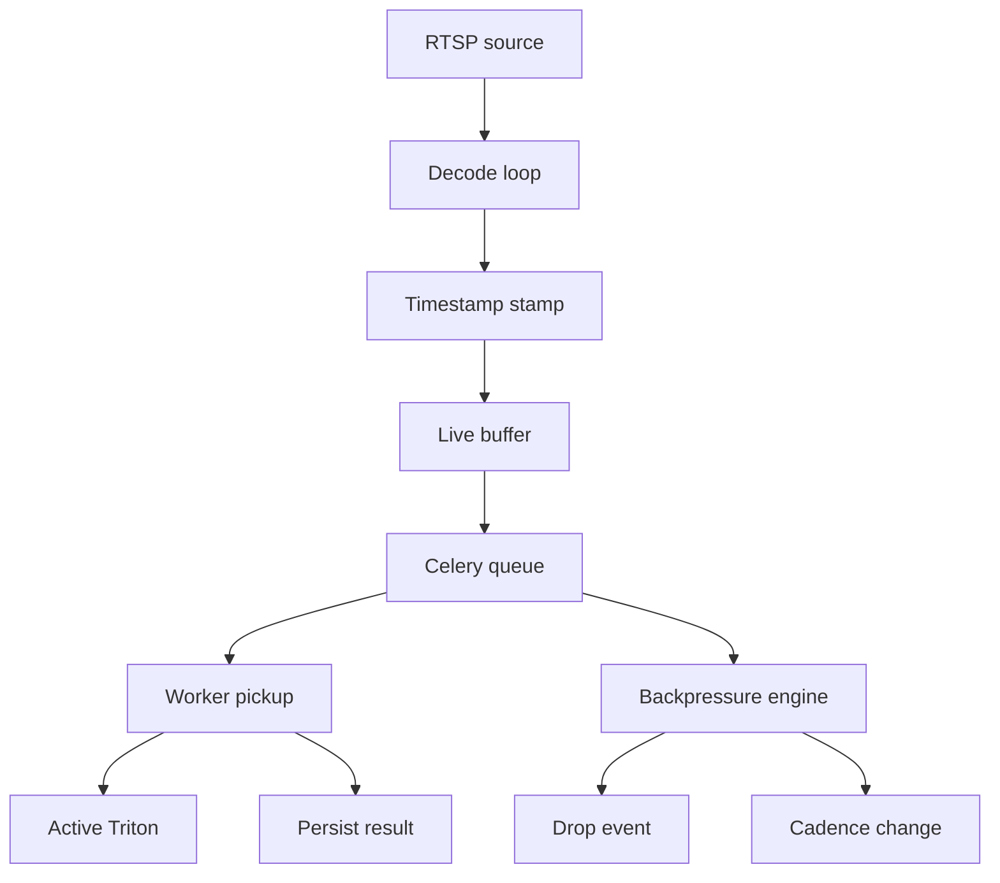

#### Failure Semantics

Timeouts and decode failures create explicit drop events. Retryable queue errors follow bounded retry and then DLQ. Fatal ingest errors transition RTSP state to `FAILED`. Stale streams trigger reconnect with jittered exponential backoff. Queue collapse triggers degraded live mode before unbounded memory growth.

#### Scientific Integrity Implications

Preserving source timestamps and drop reasons distinguishes real behavior gaps from system-induced gaps. This is required before interpreting temporal anomaly windows.

#### Required Evidence Artifacts

Evidence includes `queue_routing_matrix.md`, `active_queues.txt`, `live_queue_wait_events.json`, `rtsp_fault_matrix.md`, `drop_accounting_report.json`, and `backpressure_slo_report.md`. Reviewers inspect queue-name parity, p95/p99 wait calculations, transition coverage, and whether overload produced real control actions.

Additional Wave 2 evidence includes `ci_evidence/production/runtime/retry_lineage.json`, `ci_evidence/production/runtime/fallback_resolution_report.md`, `ci_evidence/production/runtime/workflow_integrity_report.md`, and `ci_evidence/production/runtime/terminal_state_reconciliation.json`.

#### Acceptance Gates

- Queue metrics names match actual Celery queues.
- Preferred/fallback worker absence is detected.
- Queue wait metrics are queryable by mode, queue, task, and worker.
- RTSP reconnect transitions cover disconnect, recovered, failed, stopped.
- Backpressure actions occur when balanced SLO thresholds are exceeded: live queue depth >120 frames/camera, live p95 queue wait >1000ms, live timeout rate >2%, live drop rate >5%, offline queue depth >2000 frames/job, offline p95 queue wait >30s, offline timeout rate >2%, or offline decoded-frame drop rate >0%.
- All live payloads preserve source, ingest, queue, processing, and persistence timestamps.

#### Test Strategy

Unit tests cover queue maps, timestamp propagation, retry policy, and reconnect transitions. Integration tests simulate disconnect/reconnect, queue overload, timeout fallback, and ingestion throttling. Resilience tests cover burst load, stale stream, worker starvation, and queue collapse prevention.

### Wave 3 - Identity Continuity, Tracking Lifecycle, ReID, And Association Correctness

#### Architectural Intent

Wave 3 is the primary scientific blocker. It establishes stable identity before temporal features and anomaly primitives are allowed to claim behavioral meaning.

#### Existing State Analysis

Track entities, bounding boxes, lifecycle classes, and occlusion utilities exist. The dangerous gaps are multiple lifecycle paths, session-only live keys that allow camera cross-talk, synthetic or non-canonical ReID signals, and interpolation by index.

#### Full Engineering Scope

| Task | Implementation Strategy | Integration Points | Risks And Requirements |
|------|-------------------------|--------------------|------------------------|
| Identity namespace contract | Define `session_id`, `camera_id`, `canonical_track_id`, `local_track_id`, `runtime_scope`. | DB models, Redis keys, artifacts, WebSocket payloads. | Backfill/migration must preserve existing track references. |
| Redis key scope hardening | Replace session-only keys with session-camera-mode-track keys. | Live tracking state, Redis helpers, tests. | Cross-camera overwrite becomes impossible. |
| Conservative ReID canonicalization | Apply clarification policy: auto-alias only when score, camera scope, and lifecycle continuity pass; otherwise unresolved candidate. | ReID service, tracking persistence, forensic UI. | Avoid false merges; unresolved is safer than wrong identity. |
| Association interpolation | Use cost matrix, Hungarian matching, IoU/center/size gates, low-confidence rejection. | offline sparse detection, live reuse, tracking lifecycle. | Incorrect association must fail closed and emit unresolved gaps. |
| Lifecycle persistence | Persist `ACTIVE`, `OCCLUDED`, `REIDENTIFIED`, `LOST`, `ENDED`. | runtime events, artifacts, temporal sequence records. | Multiple lifecycle implementations must converge. |
| Identity metrics | Export ID switch, fragmentation, occlusion recovery, re-entry recovery, persistence duration. | telemetry, benchmark, acceptance evidence. | Metrics become gates for Wave 5. |

#### Data Model Changes

- `IdentityScope`: `session_id`, `camera_id`, `runtime_mode`, `scope_digest`.
- `CanonicalTrack`: `canonical_track_id`, `session_id`, `camera_id`, `created_from_local_track_id`, `current_state`, `started_at`, `ended_at`.
- `TrackAlias`: `canonical_track_id`, `local_track_id`, `source`, `score`, `threshold`, `decision`, `provenance`, `created_at`.
- `ReidDecision`: `decision_id`, `candidate_a`, `candidate_b`, `embedding_ref`, `score`, `threshold`, `lifecycle_continuity_ok`, `camera_scope_ok`, `decision`, `operator_override`.
- `TrackingLifecycleEvent`: `canonical_track_id`, `state_from`, `state_to`, `frame_number`, `timestamp_ms`, `reason`, `confidence`.
- Constraints: unique `(session_id, camera_id, canonical_track_id)`, unique `(session_id, camera_id, local_track_id, runtime_mode)`, idempotent `(canonical_track_id, frame_number, state_to, reason)`.

#### Runtime Flow Changes

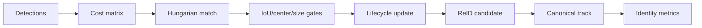

#### Failure Semantics

Low-confidence matches become unresolved association gaps, not forced links. ReID below policy threshold creates unresolved candidates. Redis scope mismatch is fatal in production. Multi-camera collision detection fails the acceptance gate.

#### Scientific Integrity Implications

Identity corruption destroys temporal memory, sequence learning, anomaly labels, and interaction graphs. This wave must pass before Wave 5 behavior feature maturity can be claimed.

#### Required Evidence Artifacts

Evidence includes identity scope contract, ReID mapping examples, ID switch metrics, occlusion/re-entry report, and interpolation association report. Reviewers inspect false-merge rejection, collision tests, and whether xfail tracking scaffolds were removed or formally deferred.

#### Acceptance Gates

- Multi-camera identity collisions are impossible by DB and Redis design.
- ReID canonical merges persist decision score, threshold, provenance, and confidence.
- Interpolation no longer uses raw list index matching.
- Crowded crossing tests reduce invalid identity bridging.
- Lifecycle states are persisted and queryable by timeline.

#### Test Strategy

Unit tests cover scoped keys, ReID persistence, association matching, gate rejection, and lifecycle transitions. Integration tests cover multi-camera isolation, occlusion recovery, re-entry, and crowded tracking. System tests run long-session identity stability and ID-switch regression benchmarks.

### Wave 4 - Pose Runtime Integrity, RTMPose Correctness, And Temporal Truth

#### Architectural Intent

Wave 4 upgrades pose from overlay-grade infrastructure to behavior-grade temporal pose data. Wave 5 cannot compute meaningful features if pose tensors, warmup shapes, stream semantics, or partial failures are ambiguous.

Wave 4 also owns partial-batch salvage and inference-path attribution for pose. It must prevent unresolved index fanout, preserve successful crops, isolate failed crops, and disclose fallback-single or retry inference paths in benchmark and forensic evidence.

#### Existing State Analysis

RTMPose via Triton, ROI clamp/crop/map-back, pose artifacts, confidence, smoothing, stability summaries, and short-window augmentation exist. Incomplete areas include deterministic config validation, true tensor batching, partial crop failure isolation, stream versioning, and behavior-ready pose primitives.

#### Full Engineering Scope

| Task | Implementation Strategy | Integration Points | Risks And Requirements |
|------|-------------------------|--------------------|------------------------|
| RTMPose config validator | Validate IO names, tensor dims, warmup shapes, TensorRT bindings, model config. | Triton repo tooling, preflight, CI evidence. | Shape drift must fail before runtime traffic. |
| Batch partial success | Return per-crop success/failure with selective persistence, unresolved-index isolation, retry-generation lineage, and duplicate dispatch accounting. | pose inference adapter, artifacts, telemetry. | One failed crop cannot discard successful students or trigger hidden duplicate fanout. |
| Inference path attribution | Persist `batch`, `single_fallback`, `degraded`, `retry`, or `timeout_recovery` for every pose inference event. | inference runtime, pose stream writer, forensic trace. | Missing attribution invalidates fallback and benchmark causality analysis. |
| Pose stream contract | Version `raw_keypoints`, `smoothed_keypoints`, `display_keypoints`. | sequence store, artifacts, frontend overlays. | Scientific raw stream must not be overwritten by display smoothing. |
| Temporal pose quality metrics | Measure jitter, confidence stability, missing joints, wrist/head stability. | pose quality reports, telemetry, benchmarks. | Quality thresholds must use real data. |
| Pose fallback metrics | Count timeouts, crop failures, degradation, pose drops, latency. | inference telemetry and acceptance reports. | Fallback frequency cannot be hidden. |
| Behavior-ready primitives | Normalize upper-body keypoints, visibility masks, temporal smoothing outputs. | Wave 5 feature extraction. | Missing joints must become explicit masks. |

#### Data Model Changes

- `PoseStreamRecord`: `session_id`, `camera_id`, `canonical_track_id`, `frame_number`, `timestamp_ms`, `stream_type`, `stream_version`, `keypoints`, `visibility_mask`, `confidence`, `provenance`.
- `PoseBatchItemResult`: `batch_id`, `crop_id`, `track_id`, `status`, `failure_reason`, `latency_ms`, `persisted`.
- `PoseQualityMetric`: `track_id`, `window_start_ms`, `window_end_ms`, `jitter`, `confidence_stability`, `missing_joint_ratio`, `head_stability`, `wrist_stability`.
- Constraints: unique `(track_id, frame_number, stream_type, stream_version)`.

#### Runtime Flow Changes

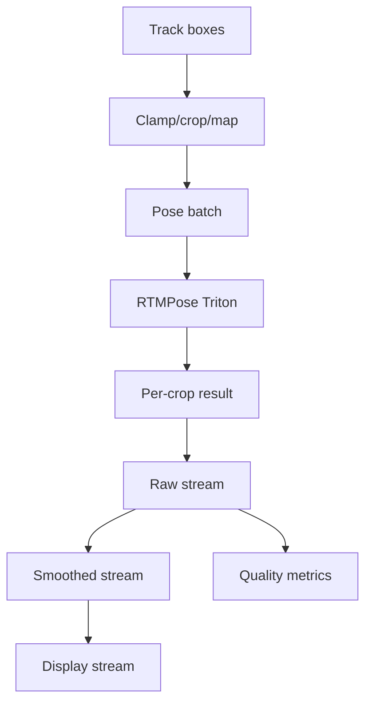

#### Failure Semantics

Tensor mismatch is startup-blocking. Crop failures are per-student failures. Pose timeout is recorded at batch and item level. GPU/Triton failure transitions the active job/session to degraded or failed according to mode-specific policy.

#### Scientific Integrity Implications

Separated pose streams protect raw measurement truth while allowing smoothing for temporal features and display. Visibility masks prevent missing joints from being interpreted as behavior.

#### Required Evidence Artifacts

Evidence includes RTMPose config validation, pose batch partial success, pose fallback metrics, pose stream contract, real-data jitter report, fallback resolution report, and inference-path attribution samples. Reviewers inspect IO shape parity, per-crop failure preservation, unresolved-index isolation, and duplicate dispatch ratio.

#### Acceptance Gates

- RTMPose config validates deterministically before startup.
- Batch partial failure preserves successful outputs.
- Pose streams are versioned and documented.
- Jitter and missing-joint metrics are queryable by student/session.
- Fallback, timeout, and crop failure rates are measurable.

#### Test Strategy

Unit tests cover IO validation, mismatch handling, partial batch success, smoothing, and visibility masks. System tests cover crowded classroom pose stress and temporal jitter. Performance tests validate many-person pose latency and GPU utilization.

### Wave 5 - Typed Temporal Sequence Store And Behavior Feature Layer

#### Architectural Intent

Wave 5 is the maturity transition from frame-centric CV to temporal behavioral intelligence. It introduces typed sequence records, rolling temporal memory, behavior ontology, interpretable features, anomaly primitives, and reproducible exports.

#### Existing State Analysis

Relational entities, runtime events, artifacts, pose quality summaries, timeline utilities, and some temporal structures exist. The dangerous gap is JSON-heavy loosely constrained metadata that is not suitable as the canonical substrate for ST-GCN, transformer, contrastive, anomaly, or graph pipelines.

#### Full Engineering Scope

| Task | Implementation Strategy | Integration Points | Risks And Requirements |
|------|-------------------------|--------------------|------------------------|
| Typed temporal sequence schema | Persist identity-scoped sequence rows with canonical timestamps, pose stream, lifecycle, feature vectors, and event links. | DB migrations, pose/tracking pipeline, exports. | Idempotency required to avoid duplicate windows. |
| Rolling memory buffers | Maintain per-student rolling pose, visibility, motion, anomaly, and behavior history. | live workers, offline processors, Redis/DB persistence. | Memory retention must be bounded in RAM, raw DB records are retained indefinitely, and purge semantics are soft-delete/archive only with tombstones and recovery references. |
| Behavior ontology v1 | Define feature names, units, ranges, confidence, missing-data semantics, window semantics. | feature services, contracts, exports, paper traceability. | Feature names become versioned contracts. |
| Feature extraction services | Implement head, wrist, motion, torso, and interaction feature windows. | sequence store, identity, pose streams. | Features must fail closed on missing identity/timestamp truth. |
| Anomaly primitives | Implement change-point, drift, repeated pattern, instability, attention deviation scoring. | temporal windows, telemetry, forensic UI. | These are interpretable primitives, not final AI claims. |
| Sequence export pipeline | Export typed sequences, ontology versions, masks, train/validation splits, manifests. | ML pipelines, artifacts, benchmark reports. | Exports must be reproducible and hashable. |

#### Data Model Changes

- `TemporalSequenceRecord`: `session_id`, `camera_id`, `canonical_track_id`, `frame_number`, `timestamp_ms`, `pose_stream`, `lifecycle_state`, `feature_vector_ref`, `event_ids`, `missing_mask`, `created_at`.
- `TemporalMemoryWindow`: `track_id`, `window_start_ms`, `window_end_ms`, `retention_policy`, `pose_history_ref`, `motion_history_ref`, `behavior_history_ref`, `continuity_score`.
- `BehaviorOntologyVersion`: `ontology_version`, `feature_name`, `unit`, `range_min`, `range_max`, `confidence_semantics`, `missing_data_policy`, `window_ms`.
- `BehaviorFeatureWindow`: `track_id`, `ontology_version`, `window_start_ms`, `window_end_ms`, `feature_name`, `value`, `confidence`, `missing_state`, `source_sequence_digest`.
- `AnomalyPrimitiveEvent`: `event_id`, `track_id`, `primitive_type`, `window_start_ms`, `window_end_ms`, `score`, `threshold`, `evidence_refs`.
- Constraints: unique sequence `(session_id, camera_id, canonical_track_id, frame_number, pose_stream)`, unique feature `(track_id, ontology_version, feature_name, window_start_ms, window_end_ms)`.
- Retention: raw temporal sequence records are retained indefinitely unless soft-purged or archived. Physical deletion is not supported during maturity closure. Soft-purge/archive actions require actor identity, action type, affected scope, reason, timestamp, tombstone identity, recovery reference, and evidence impact.

#### Runtime Flow Changes

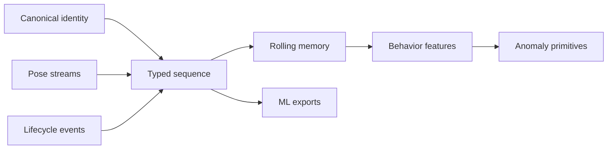

#### Failure Semantics

Missing identity, missing source timestamp, or non-versioned pose stream blocks feature computation for that window. Missing data creates explicit missing states, not zeros. Export mismatch or non-reproducible digest fails the acceptance gate.

#### Scientific Integrity Implications

This wave creates the first defensible behavioral substrate. It enables interpretable temporal features and future ST-GCN/CTR-GCN/transformer/contrastive pipelines only after Wave 3 and Wave 4 evidence passes.

#### Required Evidence Artifacts

Evidence includes sequence schema contract, ontology v1, feature output samples, anomaly primitive report, and export manifest. Reviewers inspect determinism, missing-data semantics, identity references, timestamp provenance, and export reproducibility.

#### Acceptance Gates

- Sequence records are deterministic and idempotent.
- Feature extraction uses canonical identities and source timestamps.
- Missing data is explicit.
- Exports include ontology version, masks, splits, and digest.
- Anomaly primitives operate only on valid temporal windows.

#### Test Strategy

Unit tests cover schema constraints, dedup, feature math, missing data, and anomaly primitive behavior. Integration tests cover pose-to-sequence, sequence-to-feature, export pipeline, and memory continuity. Scenario tests cover repeated glance, occluded wrist, posture instability, and interaction proximity.

### Wave 6 - Observability Trust, Benchmark Integrity, And Scientific Rigor

#### Architectural Intent

Wave 6 makes production telemetry and scientific benchmark evidence trustworthy. It exists because hardcoded availability, frontend metric masking, duplicate events, and self-baselining make operational and paper claims invalid.

Wave 6 now explicitly owns GPU underutilization root-cause analysis and benchmark causality. A benchmark with low GPU occupancy and high wall latency is not accepted unless queue wait, orchestration, serialization, Triton queue, GPU compute, fallback overhead, and persistence are decomposed and attributed.

#### Existing State Analysis

Telemetry models, endpoints, runtime helpers, queue hooks, and benchmark scaffolds exist. The dangerous gaps are synthetic readiness flags, benchmark comparison logic that can always pass, frontend KPI zero-overwrite, and weak machine-structured logging.

#### Full Engineering Scope

| Task | Implementation Strategy | Integration Points | Risks And Requirements |
|------|-------------------------|--------------------|------------------------|
| Probe-backed telemetry | Replace synthetic readiness with process, endpoint, queue, GPU, and collector checks. | health endpoints, runtime pages, evidence reports. | Unknown/unavailable must not be displayed as zero. |
| Event identity and dedup | Add event IDs with session/camera scope and unique constraints. | runtime events, telemetry ingestion, anomaly events. | Replay cannot inflate metrics. |
| Frontend truth alignment | Preserve null, zero, unavailable as distinct states. | frontend stores, KPI components, API contracts. | KPI masking is a blocking failure. |
| Benchmark integrity engine | Require explicit baseline, candidate, same-input proof, and at least 5 baseline plus 5 candidate runs per profile/input for production acceptance. | benchmark scripts, CI evidence, reports. | Candidate cannot compare against itself and under-sampled comparisons cannot pass acceptance. |
| Statistical rigor | Compute variance, confidence intervals, effect sizes, and research-level inference where applicable. | benchmark reports, paper traceability. | Production acceptance uses 5+5 confidence-gated repeated real runs; paper claims use stronger statistical tests. |
| Latency decomposition | Measure queue wait, orchestration, serialization, Triton queue, GPU compute, fallback overhead, and persistence for every accepted run. | telemetry ingestion, benchmark exporter, runtime events. | Low GPU utilization with high wall latency invalidates throughput claims without attribution. |
| Benchmark causality | Correlate retry spikes, timeout spikes, queue collapse, GPU idle windows, fallback amplification, and Triton queue pressure. | benchmark reports, runtime telemetry, forensic trace. | Runtime failures cannot be detached from benchmark reports. |
| Structured logging | Add correlation-aware JSON logs for request, queue, inference, anomaly, benchmark. | backend logging, workers, scripts. | Logs must redact PII/secrets. |

#### Data Model Changes

- `RuntimeProbeEvent`: `probe_id`, `probe_type`, `target`, `status`, `latency_ms`, `observed_value`, `failure_reason`, `checked_at`.
- `RuntimeEventLedger`: `event_id`, `session_id`, `camera_id`, `source`, `event_type`, `timestamp_ms`, `payload_digest`.
- `BenchmarkRun`: `run_id`, `profile`, `mode`, `input_digest`, `candidate_or_baseline`, `repetition`, `metrics_digest`, `started_at`, `ended_at`.
- `BenchmarkComparison`: `comparison_id`, `baseline_run_ids`, `candidate_run_ids`, `metric`, `delta`, `confidence_interval`, `effect_size`, `p_value`, `passed`.
- Constraints: unique `(session_id, camera_id, event_id)`, unique benchmark input/profile/mode/repetition.

#### Runtime Flow Changes

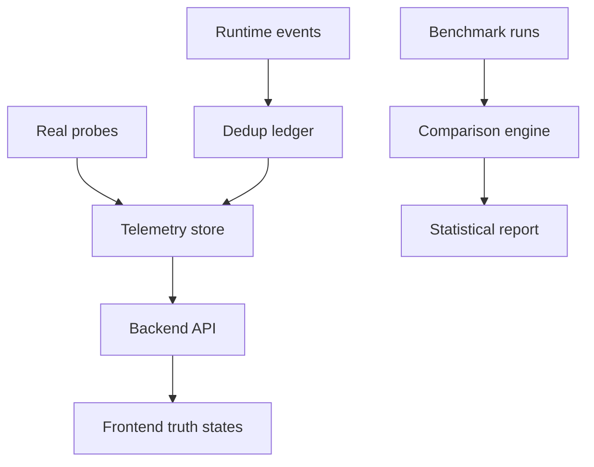

#### Failure Semantics

Unavailable collectors become `unavailable`, not zero. Missing baseline fails benchmark acceptance. Duplicate events are rejected or idempotently ignored. Probe failure degrades health with specific reason.

#### Scientific Integrity Implications

This wave prevents false operational and publication claims. It distinguishes engineering readiness from measured behavior, and measured zero from missing data.

#### Required Evidence Artifacts

Evidence includes telemetry probe report, event dedup report, baseline-required benchmark report, statistical repeatability report, frontend KPI truth report, GPU utilization analysis, latency decomposition JSON, orchestration overhead report, benchmark causality report, retry amplification matrix, and timeout correlation report.

#### Acceptance Gates

- No synthetic readiness reported as production truth.
- Benchmarks fail without explicit baseline.
- Repeated real runs produce statistical outputs with at least 5 baseline runs and 5 candidate runs per profile/input for production acceptance.
- Frontend faithfully represents null, zero, unavailable.
- Duplicate event replay cannot corrupt metrics.

#### Test Strategy

Unit tests cover readiness probes, event dedup, baseline enforcement, and statistical report generation. Frontend tests cover KPI rendering truth. System tests cover telemetry integrity under load and benchmark reproducibility.

### Wave 7 - API/WS Contract Governance And Forensic Behavior Debug UX

#### Architectural Intent

Wave 7 creates contract governance and behavior-forensics UX. It solves backend/frontend drift, serializer exposure risk, WebSocket inconsistencies, artifact authority ambiguity, and fragmented debugging.

#### Existing State Analysis

Overlay playback, runtime pages, timeline views, artifact endpoints, and WebSocket delivery exist. Gaps include contract drift, fragmented behavior debugging, unclear artifact authority order, and serializer hardening.

#### Full Engineering Scope

| Task | Implementation Strategy | Integration Points | Risks And Requirements |
|------|-------------------------|--------------------|------------------------|
| Contract registry | Define versioned REST, WS, event, telemetry, artifact schemas. | backend serializers, frontend TS types, contract tests. | One source of truth required. |
| Serializer hardening | Replace broad field exposure with explicit fields. | DRF serializers, API tests. | Prevent unintended data leakage. |
| WebSocket governance | Consolidate reconnect, version, schema validation, listener lifecycle. | frontend services, backend consumers. | Duplicate sockets and stale listeners must be test-detectable. |
| Artifact authority | Define DB -> filesystem -> cache order and stale handling. | artifact endpoints, forensic UI, evidence reports. | Avoid contradictory artifact views. |
| Forensic trace UX | Link event -> track -> lifecycle -> pose stream -> feature -> anomaly -> artifact -> benchmark/profile. | timeline UI, APIs, WebSocket events. | Trace must be replayable and evidence-backed. |
| API performance validation | Measure endpoint latency, serialization overhead, artifact retrieval, WS throughput. | performance suite, reports. | Large traces cannot degrade dashboard reliability. |

#### Data Model Changes

- `ContractRegistryEntry`: `schema_id`, `schema_kind`, `version`, `json_schema`, `compatibility`, `created_at`.
- `ArtifactAuthorityRecord`: `artifact_id`, `job_id`, `authority_source`, `path`, `cache_key`, `stale_status`, `digest`.
- `ForensicTraceLink`: `trace_id`, `event_id`, `track_id`, `pose_record_id`, `feature_window_id`, `anomaly_event_id`, `artifact_id`, `benchmark_run_id`.
- Constraints: unique active schema `(schema_kind, version)`, unique trace link `(event_id, track_id, artifact_id)`.

#### Runtime Flow Changes

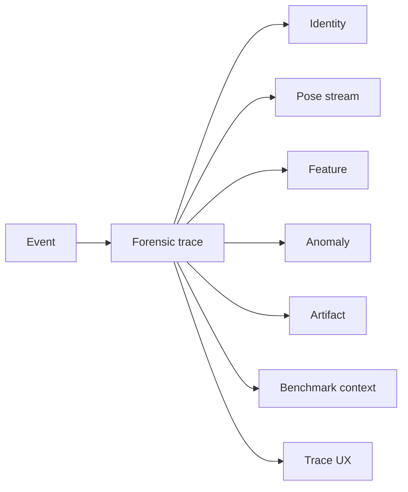

#### Failure Semantics

Schema mismatch rejects payloads or marks compatibility failure. WebSocket disconnect triggers governed reconnect. Artifact stale state is visible. Trace gaps are displayed as unavailable links, not fabricated continuity.

#### Scientific Integrity Implications

Forensics connects behavioral claims to evidence. A reviewer can inspect why an anomaly primitive fired, which identity it used, which pose stream fed it, and which benchmark/profile context applied.

#### Required Evidence Artifacts

Evidence includes API/WS registry, serializer hardening report, WebSocket version compatibility report, artifact source policy, forensic trace E2E report, and API/frontend performance report.

#### Acceptance Gates

- REST and WS share one schema source.
- Serializers use explicit fields.
- WebSocket drift is contract-test detectable.
- Forensic trace supports end-to-end debugging.
- API and frontend bottlenecks are measured.

#### Test Strategy

Contract tests validate schema conformance and serializer exposure. Frontend tests validate reconnect/version handling and trace flows. Performance tests validate timeline load, artifact retrieval, and WS throughput.

### Wave 8 - Final Acceptance, Sign-Off, And Paper Closure

#### Architectural Intent

Wave 8 closes production readiness and paper traceability. It prevents maturity claims from exceeding validated implementation state.

Wave 8 must reject final maturity closure if retry amplification remains unresolved, partial-batch fallback execution is undisclosed, GPU underutilization lacks root-cause attribution, workflow terminal states diverge, or benchmark artifacts cannot be timestamp-correlated with runtime causality.

#### Existing State Analysis

Benchmark exporter scaffolding, optimization phase documents, runtime scripts, and evidence conventions exist. Missing closure includes dynamic batching sign-off, full profile matrix ranking, representative validation, xfail closure, final acceptance reports, and paper traceability alignment.

#### Full Engineering Scope

| Task | Implementation Strategy | Integration Points | Risks And Requirements |
|------|-------------------------|--------------------|------------------------|
| Dynamic batch sign-off | Validate TensorRT dynamic batching, Triton scheduler, queue delay, latency/throughput. | Triton configs, benchmark harnesses, evidence. | Batch tuning must not break live latency. |
| Runtime causality sign-off | Validate retry lineage, inference-path attribution, GPU idle windows, and latency decomposition. | telemetry, benchmarks, forensic trace, evidence package. | Benchmark artifacts disconnected from runtime causality fail sign-off. |
| Full profile matrix | Execute baseline, throughput_guardrails, live_latency_first profiles. | scripts, CI evidence, benchmark DB. | Compare within same input/mode boundaries. |
| Representative validation | Run at least 3 offline classroom videos and 2 live/RTSP streams covering normal operation, crowded crossings, occlusion/re-entry, pose partial failures, and RTSP disconnect/reconnect. | production scripts, tests, raw media. | Mock-only evidence is insufficient and missing coverage blocks final maturity acceptance. |
| Automated validation | Execute backend, frontend, contract, resilience, performance, benchmark, telemetry suites. | CI/local commands. | Failures block closure. |
| XFail closure | Convert strict xfail scaffolds to passing tests or formal deferred rationale. | test suite, closure report. | Hidden scaffolds cannot support maturity claims. |
| Paper traceability | Align thesis/paper claims with implemented evidence and measured behavior. | paper folder, evidence artifacts. | No claim may exceed validation state. |

#### Data Model Changes

- `FinalAcceptanceRun`: `acceptance_id`, `git_sha`, `mode`, `profile_matrix_digest`, `test_gate_digest`, `evidence_manifest`, `verdict`.
- `XfailClosureRecord`: `test_id`, `status`, `closure_type`, `rationale`, `owner`, `expiry`.
- `PaperTraceabilityRecord`: `claim_id`, `paper_section`, `implementation_ref`, `evidence_ref`, `claim_status`.

#### Runtime Flow Changes

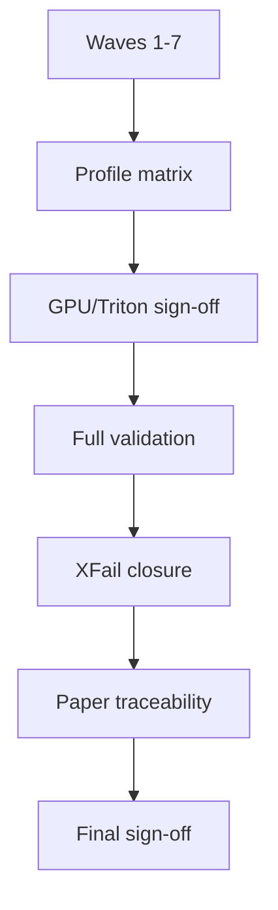

#### Failure Semantics

Any missing required evidence, unresolved strict xfail without deferment, benchmark mismatch, mock-only production claim, or paper claim exceeding implementation state fails final closure.

#### Scientific Integrity Implications

Wave 8 converts engineering evidence into defensible claims. It is the only wave allowed to declare maturity closure.

#### Required Evidence Artifacts

Evidence includes final profile matrix, profile ranking, dynamic batch signoff, offline validation, live soak, final test gates, xfail closure, paper traceability, and hash sync reports.

#### Acceptance Gates

- Waves 1-7 pass or have explicit deferment rationale.
- Real/mock, CPU/GPU, live/offline evidence are distinguishable.
- Final evidence includes at least 3 offline classroom video runs and 2 live/RTSP stream runs covering the required scenario set.
- Benchmark artifacts are attached and reproducible.
- Final maturity claims match implementation reality.
- Paper traceability closure is complete.

#### Test Strategy

Full backend, frontend, GPU, Triton, contract, resilience, performance, telemetry, benchmark, and forensic UX suites execute with published results.

## 4. Cross-Wave Dependency Graph

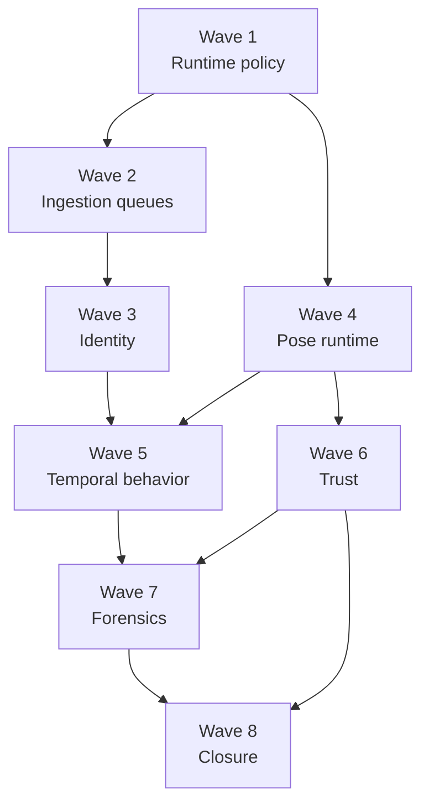

| Dependency | Reason | Rollback Implication | Partial Completion Risk |
|------------|--------|----------------------|-------------------------|
| Wave 1 -> all | Runtime mode determines every evidence boundary. | Roll back endpoint policy before runtime tests. | Mixed mode evidence becomes invalid. |
| Wave 3 -> Wave 5 | Sequence features require stable identity. | Disable behavior feature claims if identity metrics fail. | Features computed on switched identities. |
| Wave 4 -> Wave 5 | Pose streams feed temporal features. | Retain overlays but block behavior features. | Missing joints become false behavior. |
| Wave 4 -> Wave 6 | Pose benchmark quality depends on runtime truth. | Exclude pose quality claims from benchmark reports. | Benchmark reports valid latency but invalid scientific quality. |
| Wave 6 -> Wave 8 | Final claims require trustworthy evidence. | Block maturity sign-off. | False-ready telemetry enters paper claims. |
| Wave 7 -> Wave 8 | Traceability requires governed contracts. | Block forensic maturity claim. | Debug UI cannot prove event lineage. |

## 5. Production Risk Register

| Risk ID | Category | Severity | Likelihood | Blast Radius | Operational Consequence | Scientific Consequence | Mitigation | Fallback | Observability | Owner |
|---------|----------|----------|------------|--------------|-------------------------|------------------------|------------|----------|---------------|-------|
| R-001 | Queue collapse | Critical | Medium | Live/offline workers | Tasks starve and latency explodes. | Missing windows bias behavior. | Queue SLOs, DLQ, backpressure. | Degraded live cadence. | p95/p99 wait, DLQ rate. | Backend/SRE |
| R-002 | GPU starvation | High | Medium | Inference runtime | Triton timeouts and dropped pose. | Pose sequence gaps corrupt features. | GPU metrics, batching policy. | Throttle/offline pause. | GPU util, memory, timeout rate. | ML Infra |
| R-003 | Triton instability | Critical | Low-Med | All inference | Jobs fail or fallback temptation. | Evidence invalid if fallback hidden. | Triton-only preflight, health. | Fail closed. | active endpoint health. | ML Infra |
| R-004 | ID switches | Critical | High | Temporal layer | Track memory corrupts. | Anomaly and features invalid. | ReID policy, association gates. | unresolved identity gaps. | ID switch metrics. | CV/Tracking |
| R-005 | Timestamp corruption | Critical | Medium | Sequence store | Ordering and windows wrong. | Temporal claims invalid. | timestamp contract. | mark windows invalid. | timestamp delta checks. | Backend |
| R-006 | WebSocket drift | Medium | Medium | Frontend dashboard | UI consumes wrong payload. | Forensic trace misleading. | schema registry. | REST fallback. | contract test failures. | Frontend |
| R-007 | Event duplication | High | Medium | Telemetry/anomaly | Metrics inflate. | Benchmark and anomaly scores corrupt. | event dedup constraints. | idempotent replay. | duplicate rejection count. | Backend |
| R-008 | Telemetry corruption | High | Medium | Ops/paper evidence | False readiness. | Claims invalid. | probe-backed telemetry. | unavailable state. | probe confidence. | SRE |
| R-009 | Benchmark fraud condition | Critical | Medium | Acceptance gate | Self-pass reports. | Paper claims invalid. | explicit baselines. | fail benchmark. | comparison provenance. | Benchmark |
| R-010 | RTSP instability | High | High | Live mode | Stream stalls. | Missing behavior intervals. | reconnect state machine. | fail-stop session. | reconnect events. | Backend |
| R-011 | Sequence corruption | Critical | Medium | ML datasets | Exports unusable. | Research invalid. | typed schema/digests. | regenerate from raw. | sequence hash checks. | Research/Backend |
| R-012 | JSON artifact growth | Medium | High | Storage | Disk pressure. | Evidence loss if pruned incorrectly. | manifests, retention policy. | compaction after sign-off. | artifact size trends. | SRE |
| R-013 | DB write amplification | High | Medium | Live persistence | DB latency affects live loop. | Dropped or delayed windows. | batching/materialized views. | async sidecar spill. | write latency. | Backend |
| R-014 | Celery starvation | High | Medium | Queue topology | Critical tasks delayed. | Temporal gaps. | worker isolation. | priority shedding. | worker pickup delay. | Backend |
| R-015 | Memory leak | High | Medium | Long live sessions | Process restart. | Session continuity loss. | soak tests. | graceful restart. | RSS trend. | SRE |
| R-016 | Temporal inconsistency | Critical | Medium | Behavior layer | Wrong ordering. | Invalid anomaly semantics. | canonical source timestamps. | invalidate window. | continuity score. | Research |
| R-017 | Anomaly hallucination | Critical | Medium | Product/science | False suspicion. | Ethical/scientific failure. | interpretable primitives, confidence. | suppress unsupported alerts. | evidence trace. | Research |
| R-018 | Frontend truth masking | High | Medium | Dashboard | Operators see zeros. | Misleading validation. | null/zero/unavailable states. | raw JSON inspection. | KPI truth tests. | Frontend |

## 6. Temporal Behavioral Intelligence Architecture

Frame-centric processing is insufficient because behavior is defined by duration, repetition, direction changes, interaction context, and deviations over time. The target architecture turns identity-scoped pose streams into typed temporal sequences, rolling memory, behavior features, anomaly primitives, interaction graphs, and future ML exports.

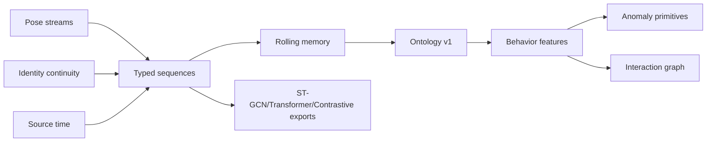

ST-GCN/CTR-GCN readiness requires skeleton topology, stable node order, visibility masks, and track continuity. Transformer readiness requires tokenized windows with positional time, missing masks, and event links. Contrastive learning requires clean positive/negative pairs from stable identities. VLM fusion readiness requires versioned multimodal contracts so future visual-language signals do not bypass temporal truth.

## 7. Identity Continuity Architecture

The canonical identity model is `session_id + camera_id + canonical_track_id`, with `local_track_id` preserved as an alias, not the scientific identity. ReID becomes a canonical decision path only under conservative policy. Occlusion and re-entry update lifecycle state and identity confidence rather than creating silent merges.

Interpolation association uses a cost matrix with IoU, center distance, size consistency, lifecycle priors, and confidence. Hungarian matching proposes assignments; gating rejects unsafe matches. Crowded classroom crossings must prefer unresolved gaps over wrong bridges.

Redis keys must include runtime mode, session, camera, and track scope. Session-only keys are forbidden. Forensic identity traceability must show local track, canonical track, ReID decision, lifecycle transitions, and metric impact.

## 8. Observability And Scientific Trust Architecture

Telemetry architecture uses real probes, structured logs, event dedup, benchmark integrity, statistical validation, and frontend truth alignment. Synthetic telemetry is dangerous because it creates a false authority surface. Benchmark self-baselining is invalid because it measures no change. Repeatability and confidence matter because GPU inference and queue systems have variance.

Production dashboards must represent `null`, `0`, and `unavailable` differently. Logs must include correlation IDs for request, job, session, camera, queue task, Triton request, track, event, and benchmark run.

## 9. API, WebSocket, And Forensic Governance

Schema governance requires one registry for REST, WebSocket, events, telemetry, artifacts, and forensic traces. Serializer governance requires explicit fields. WebSocket governance requires versioning, reconnect policy, schema validation, and listener cleanup. Artifact authority order is DB, filesystem, then cache.

Forensic debugging operates by starting from an event and resolving identity, lifecycle, pose stream, feature window, anomaly primitive, artifact, benchmark profile, and evidence manifest. Missing links must be displayed as unavailable with reason.

## 10. Deployment And Runtime Topology

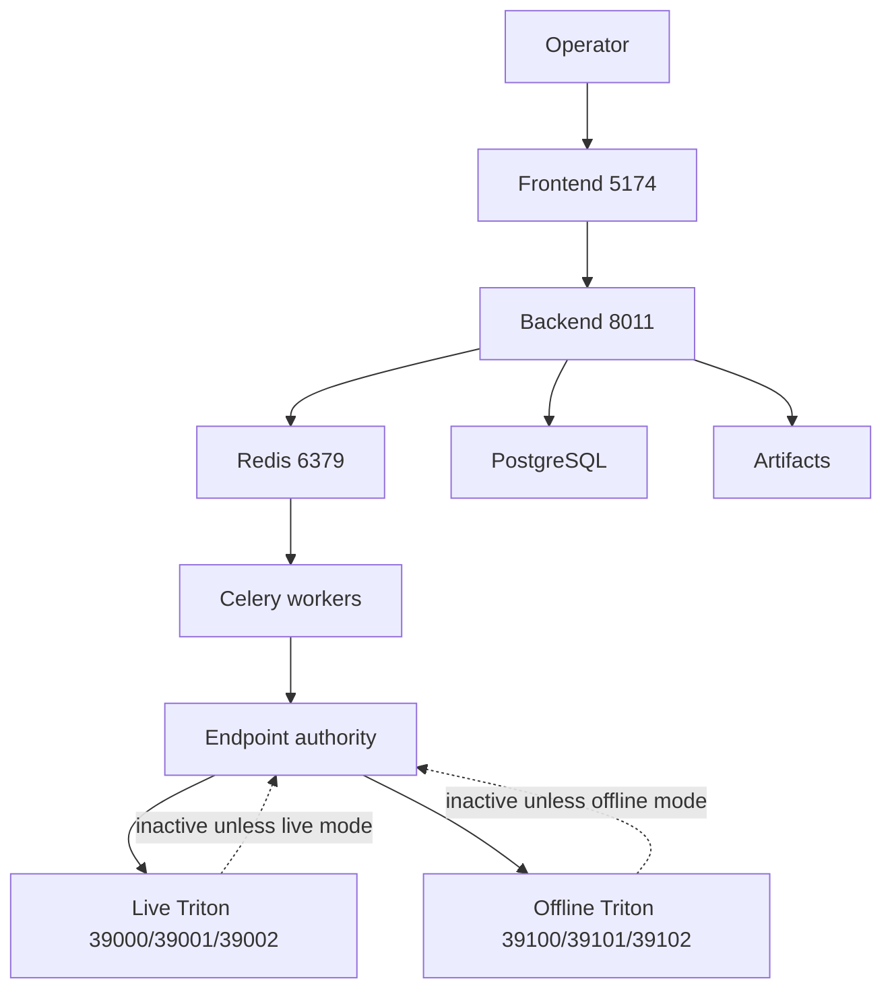

Live mode executes RTSP ingestion, latency-first queues, live endpoint routing, delayed buffer policy, WebSocket runtime updates, and drop-accounting telemetry. Offline mode executes uploaded video jobs, throughput-first queues, offline endpoint routing, artifact-heavy persistence, and benchmark exports. Both modes use the same identity, pose, sequence, telemetry, and contract semantics but different SLO envelopes.

## 11. Benchmarking And Validation Architecture

Benchmark governance requires baseline/candidate methodology, same input digest, same model set, same endpoint profile class, at least 5 baseline runs and 5 candidate runs per profile/input for production acceptance, confidence-gated production acceptance, and stronger paper/research statistics. Latency metrics matter operationally; identity switch rate, pose jitter, sequence continuity, and anomaly primitive correctness matter scientifically.

Invalid benchmarks include self-baseline comparisons, synthetic pass states, missing raw evidence, fewer than 5 baseline or 5 candidate runs for production acceptance, missing confidence intervals for repeated acceptance runs, mock-only inference, and profiles that mix live/offline endpoint semantics.

## 12. Final Maturity Closure Interpretation

Behavioral intelligence maturity means the platform can make temporal behavior claims over stable identities, trustworthy timestamps, versioned pose streams, typed sequences, explicit feature ontology, interpretable anomaly primitives, probe-backed telemetry, governed contracts, and reproducible evidence.

Pose extraction alone is insufficient because a keypoint overlay does not define glance duration, repeated interaction, posture drift, wrist disappearance, or anomaly semantics. The maturity transition occurs when temporal semantics become first-class, identity continuity is measured, missing data is explicit, and every claim can be traced to evidence.

Future research remains for learned anomaly models, contrastive representation learning, graph neural interaction reasoning, VLM fusion, and teacher-student architectures. Operational debt remains where accepted deferments exist, but deferred items cannot be used as maturity claims.

## Phase 0: Research Plan

Research outputs are captured in [research.md](./research.md). They resolve runtime mode authority, conservative ReID policy, numeric SLO governance, representative validation dataset scope, indefinite raw sequence retention with no physical deletion, forensic access/purge scope, and benchmark rigor with 5+5 repeated-run production acceptance.

## Phase 1: Design And Contracts Plan

Design outputs are captured in [data-model.md](./data-model.md), [quickstart.md](./quickstart.md), and [`contracts/`](./contracts/). They define the closure data model, runtime mode contract, identity/sequence contract, telemetry/benchmark contract, and API/WS/forensic contract.

## Phase 2: Task Planning Approach

`/speckit.tasks` must generate dependency-ordered tasks by wave. Each task must include tests first, explicit affected files, evidence artifact path, acceptance gate, rollback strategy, and whether it blocks future waves. Parallel work is permitted only where write scopes and runtime dependencies do not overlap.

## Post-Design Constitution Re-Check

- Supreme Directive Gate: PASS for planning artifacts. Implementation still requires commit/documentation discipline.
- Test-in-Loop Gate: PASS. All waves define test categories before implementation.
- 100% Real-Data Test Gate: PASS. Production behavioral claims require real model weights and representative raw media.
- Live/Offline Scenario Gate: PASS. Dual endpoint profiles are preserved with single active production mode.
- System Hardening Gate: PASS. Native Linux production, no Docker, no sudo, backend/frontend contracts, backend-Triton wiring, and queue topology are documented.
- Ultralytics Authority Gate: PASS. Any YOLO tracking behavior changes must use official Ultralytics authority.

## Complexity Tracking

| Violation | Why Needed | Simpler Alternative Rejected Because |
|-----------|------------|-------------------------------------|
| None | N/A | N/A |
