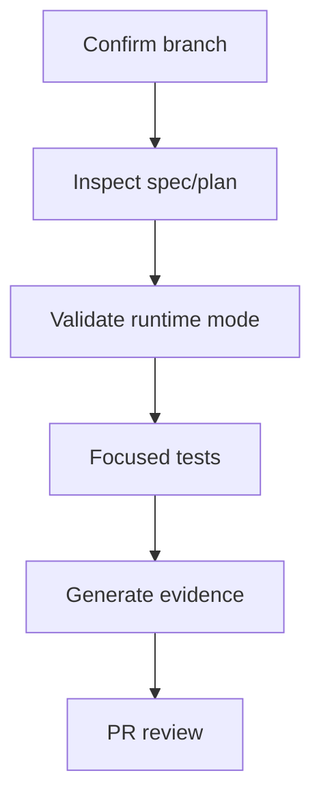

# Quickstart: Behavioral Intelligence Maturity Closure Validation

**Feature**: [Production Behavioral Intelligence Maturity Closure](spec.md)  
**Plan**: [plan.md](plan.md)

## Purpose

This quickstart defines the validation order operators and implementers should use while closing the waves. It is not a replacement for `/speckit.tasks`; it is the operational sequence used to prove that implementation work is ready for PR review.

## Validation Flow



The flow starts with branch and spec verification because the active plan controls task generation. Runtime mode validation happens before tests that depend on Triton endpoint routing. Evidence is generated before PR review because reviewer acceptance depends on reproducible artifacts.

## 1. Confirm Active Feature

```powershell
git branch --show-current
Get-Content .specify\feature.json
```

Expected:

- Branch is `010-behavioral-maturity-closure`.
- Active spec directory points to `specs/010-behavioral-maturity-closure`.

## 2. Confirm Runtime Mode Policy

Production must use one active mode:

```env
TRITON_EXECUTION_MODE=live
```

or:

```env
TRITON_EXECUTION_MODE=offline
```

Configured profiles:

| Mode | HTTP | gRPC | Metrics |
|------|------|------|---------|
| live | 39000 | 39001 | 39002 |
| offline | 39100 | 39101 | 39102 |

Validation rule:

- Active profile must be healthy.
- Inactive profile must not receive production traffic or production-ready health status.

## 3. Production Health Snapshot

Use the existing production helper scripts when validating on the Linux server:

```powershell
.\tools\prod\prod-hash-parity.ps1
.\tools\prod\prod-health-snapshot.ps1
.\tools\prod\prod-workers.ps1 status
```

Reviewer expectations:

- Git hash parity is recorded.
- Backend health includes runtime mode.
- Model-serving health identifies active endpoint.
- Worker status aligns with active mode.

## 4. Focused Test Order

Run focused tests before broader suites:

```powershell
.\.venv\Scripts\python.exe -m pytest backend/tests/unit/video_analysis/test_tasks_detection_cadence.py -q --tb=short
.\.venv\Scripts\python.exe -m pytest backend/tests/unit/scripts/test_benchmark_export_csv.py -q --tb=short
```

After implementation tasks exist, expand to:

```powershell
.\.venv\Scripts\python.exe -m pytest backend/tests/unit -n auto --dist=loadscope -q --tb=short
.\.venv\Scripts\python.exe -m pytest backend/tests/integration -n auto --dist=loadscope -q --tb=short
.\.venv\Scripts\python.exe -m pytest backend/tests/contract -n auto --dist=loadscope -q --tb=short
.\.venv\Scripts\python.exe -m pytest backend/tests/resilience -n auto --dist=loadscope -q --tb=short
.\.venv\Scripts\python.exe -m pytest backend/tests/performance -n auto --dist=loadscope -q --tb=short
```

Frontend validation:

```powershell
npm run test:unit:parallel
npm run test:e2e:parallel
```

## 5. Evidence Directory Contract

Each wave writes evidence under:

```text
ci_evidence/production/waveN/
```

Minimum directories:

```text
ci_evidence/production/wave1/
ci_evidence/production/wave2/
ci_evidence/production/wave3/
ci_evidence/production/wave4/
ci_evidence/production/wave5/
ci_evidence/production/wave6/
ci_evidence/production/wave7/
ci_evidence/production/wave8/
```

Evidence must distinguish:

- Mock vs real execution.
- CPU vs GPU execution.
- Synthetic vs production telemetry.
- Live vs offline mode.
- Baseline vs candidate benchmark runs.

## 6. Representative Dataset Gate

Maturity acceptance requires evidence for:

- At least 3 offline classroom video runs.
- At least 2 live/RTSP stream runs.
- Coverage of normal operation, crowded crossings, occlusion/re-entry, pose partial failures, and RTSP disconnect/reconnect.

The evidence manifest must list the input digest, mode, profile, coverage tags, and whether each run is real or mock. Mock runs cannot satisfy the final representative dataset gate.

## 7. Benchmark Repetition Gate

Production benchmark acceptance requires:

- At least 5 baseline runs per profile/input.
- At least 5 candidate runs per profile/input.
- Variance, confidence intervals, stability metrics, and explicit pass/fail thresholds.
- Paper/research claims additionally require effect sizes, p-values or nonparametric tests, and power notes.

## 8. Sequence Soft-Purge Gate

Raw temporal sequence purge means soft-delete/archive only during maturity closure.

Validation must prove:

- Authenticated production dashboard users can only soft-purge/archive records they can view.
- Physical deletion does not occur.
- Each action records actor, action type, affected scope, reason, timestamp, tombstone identity, recovery reference, and evidence impact.

## 9. PR Review Gate

Before requesting PR review, verify:

- No `NEEDS CLARIFICATION` markers exist in spec, plan, data model, contracts, or tasks.
- Tests for the task were written before implementation.
- Evidence artifact paths match the plan.
- Active endpoint policy is not contradicted by docs/scripts/settings.
- Maturity claims do not exceed completed waves.

## Related Documents

- [spec.md](spec.md)
- [plan.md](plan.md)
- [research.md](research.md)
- [data-model.md](data-model.md)
- [contracts/runtime-mode-contract.md](contracts/runtime-mode-contract.md)
