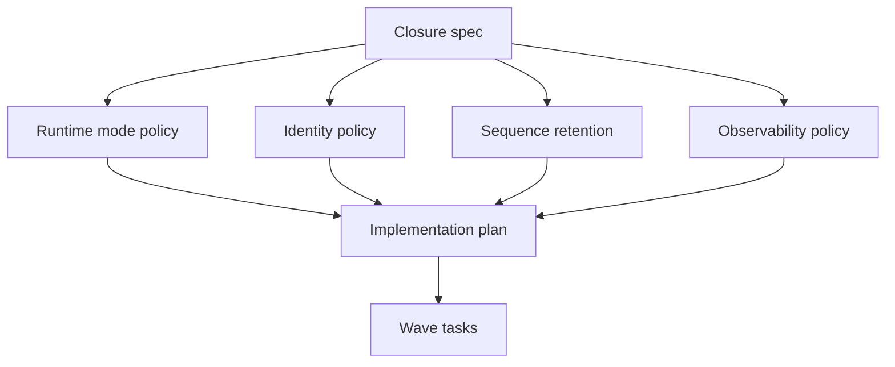

# Research: Behavioral Intelligence Maturity Closure

**Feature**: [Production Behavioral Intelligence Maturity Closure](spec.md)  
**Plan**: [plan.md](plan.md)  
**Date**: 2026-05-25

## Purpose

This document records the architectural decisions that remove ambiguity before task generation. It exists to prevent implementation teams from reopening settled policy choices in PRs and to make the plan auditable against the clarified specification.

## Decision Diagram

The diagram shows that clarified policy decisions feed the implementation plan before tasks are generated. This prevents task authors from encoding contradictory endpoint, identity, retention, or benchmark assumptions.

## Decision Summary

| Topic | Decision | Reason | Rejected Alternatives |
|-------|----------|--------|-----------------------|
| Production Triton topology | Preserve dual configured endpoint profiles for live and offline, but run exactly one active production mode per server based on `TRITON_EXECUTION_MODE`. | Live and offline need different scheduler/latency profiles, while production operational safety requires one active mode. | Running both modes concurrently on one production server; collapsing to one endpoint profile for all workloads. |
| Production inference authority | Triton-only. Local ONNX, local TensorRT standalone, OpenVINO, mocks, or synthetic inference cannot be production authority. | Production evidence must be tied to one serving authority and GPU-backed runtime. | Silent local fallback during outage. |
| ReID merge policy | Conservative auto-alias only when appearance score, camera scope, and lifecycle continuity pass; otherwise mark unresolved candidate. | False merges are more damaging than unresolved identity gaps for temporal behavior. | Aggressive automatic merging; manual-only ReID for all cases. |
| Backpressure thresholds | Use balanced numeric operational SLO gates per mode: live queue depth <=120 frames/camera, live p95 queue wait <=1000ms, live timeout rate <=2%, live drop rate <=5%, offline queue depth <=2000 frames/job, offline p95 queue wait <=30s, offline timeout rate <=2%, and offline decoded-frame drop rate = 0%. | Operators and tests need measurable overload criteria. | Qualitative backpressure labels only; profile-defined thresholds without default acceptance values. |
| Representative validation dataset | Maturity acceptance requires at least 3 offline classroom videos and 2 live/RTSP streams covering normal operation, crowded crossings, occlusion/re-entry, pose partial failures, and RTSP disconnect/reconnect. | This gives coverage across identity, pose, queue, RTSP, and behavior risks without making every acceptance cycle a large research study. | Minimal one-clip validation; strict 10+5 dataset requirement; evidence-defined only. |
| Raw sequence retention | Retain all raw temporal sequence records indefinitely; purge means soft-delete/archive only with tombstones and recovery references, and physical deletion is not supported during maturity closure. | Thesis/paper reproducibility and future ML experiments require replayable raw sequences. | Short TTL, aggregate-only retention, physical deletion after export. |
| Forensic access and purge authority | Any authenticated production dashboard user can view, soft-purge, or archive raw temporal sequences they can view; every soft-purge/archive action is audited. | The clarified requirement prioritizes operational review access while retaining audit evidence and recovery path. | Admin-only purge/archive; operations-only purge/archive; hard delete. |
| Benchmark rigor | Production acceptance requires at least 5 baseline runs and 5 candidate runs per profile/input with confidence-gated repeated real runs; paper/research claims require effect sizes, p-values or nonparametric tests, and power notes. | Operational acceptance and scientific publication have different evidence burdens. | Single-run thresholds; three-run light acceptance; ten-run strict acceptance; research-grade stats for every PR gate. |
| Frontend KPI truth | Preserve `null`, measured `0`, and `unavailable` as distinct states. | Zero-overwrite hides collector and backend truth. | Coercing missing metrics to zero for display simplicity. |
| Event dedup | Runtime events must have event ID plus session/camera scope with uniqueness constraints. | Replay or duplicate delivery must not inflate metrics or anomaly scores. | Best-effort dedup in application memory only. |
| Artifact authority | DB metadata is authoritative, filesystem validates payload, cache is acceleration only. | Artifact views must not diverge between APIs, forensic UI, and evidence reports. | Cache-first artifact authority. |

## Runtime Mode Research

### Selected Policy

Production preserves two endpoint profiles:

- Live profile: HTTP `39000`, gRPC `39001`, metrics `39002`.
- Offline profile: HTTP `39100`, gRPC `39101`, metrics `39102`.

Only one profile is active for production runtime traffic. The active profile is selected by `TRITON_EXECUTION_MODE=live` or `TRITON_EXECUTION_MODE=offline`. The inactive profile must not receive inference traffic, scheduler requests, Celery routing, benchmark traffic, or production-ready health status.

### Operational Consequence

This policy supports profile-specific Triton tuning without allowing one production server to silently mix modes. It also gives SREs a simple readiness invariant: the active profile must be ready, and inactive profile consumption is a defect.

### Implementation Consequence

The endpoint resolver must be centralized. Scripts, Django settings, Celery routes, health checks, model-serving diagnostics, and benchmark runners must consume the same resolver or generated config snapshot.

## Identity Research

### Selected Policy

Identity is scoped by `session_id`, `camera_id`, `canonical_track_id`, and `local_track_id`. Redis keys and database uniqueness constraints must include camera scope. ReID creates canonical aliases only under conservative policy.

### Why Conservative ReID

For behavioral intelligence, false identity merge is worse than unresolved continuity. A wrong merge contaminates all future windows and can create false behavioral events. An unresolved candidate reduces coverage but preserves scientific integrity.

### Association Strategy

Sparse detection/interpolation must use a cost matrix and Hungarian matching with gates:

- IoU gate.
- Center distance gate.
- Size consistency gate.
- Confidence gate.
- Lifecycle compatibility gate.

Raw list index matching is forbidden for production association.

## Backpressure SLO Research

### Selected Policy

Balanced SLO gates are the initial acceptance authority:

| Mode | Queue Depth | p95 Queue Wait | Timeout Rate | Drop Rate |
|------|-------------|----------------|--------------|-----------|
| live | <=120 frames/camera | <=1000ms | <=2% | <=5% |
| offline | <=2000 frames/job | <=30s | <=2% | decoded-frame drop rate = 0% |

### Operational Rationale

These thresholds are strict enough to catch live queue collapse, excessive offline backlog, timeout storms, and unintended frame loss while avoiding unrealistic early-wave rejection on GPU-heavy validation runs.

## Temporal Sequence Research

### Selected Policy

Typed temporal records become the canonical substrate for behavior. JSON artifacts remain evidence/export sidecars, not the primary ML representation. Raw temporal sequence records are retained indefinitely. Soft-purge/archive hides or relocates records from active views but preserves tombstones, recovery references, audit metadata, and the underlying evidence. Physical deletion is not allowed during maturity closure.

## Representative Dataset Research

### Selected Policy

Final maturity acceptance must include at least:

- 3 offline classroom video runs.
- 2 live/RTSP stream runs.
- Coverage of normal operation, crowded crossings, occlusion/re-entry, pose partial failures, and RTSP disconnect/reconnect.

### Rationale

The dataset is intentionally balanced. It is large enough to prevent maturity claims based on a single easy clip, but small enough to keep acceptance feasible while the platform is still closing infrastructure, identity, pose, and telemetry gaps.

### Scientific Rationale

ST-GCN, CTR-GCN, transformer, contrastive, and anomaly pipelines require deterministic identity-scoped sequence windows, visibility masks, lifecycle state, and reproducible export manifests. Loosely typed JSON payloads are not sufficient for long-term research reproducibility.

## Observability Research

### Selected Policy

Production telemetry must be probe-backed. Synthetic availability, hardcoded readiness, and benchmark self-pass logic are invalid production evidence.

### Benchmark Method

Production acceptance uses at least 5 baseline runs and 5 candidate runs per profile/input with confidence-gated thresholds. Paper/research claims require:

- Baseline and candidate run sets.
- Same input digest and profile boundaries.
- Variance reporting.
- Confidence intervals.
- Effect size.
- p-value or nonparametric alternative when assumptions do not hold.
- Power note or sample-size rationale.

## Contract Governance Research

### Selected Policy

REST, WebSocket, telemetry, event, artifact, sequence, and forensic trace payloads must share a registry. Frontend TypeScript types are generated or validated from that registry. Public serializers must use explicit fields.

### Why This Matters

Forensic behavior debugging crosses backend persistence, WebSocket delivery, frontend state, artifacts, and benchmark context. Contract drift at any boundary makes traceability untrustworthy.

## Remaining Planning-Level Details

The following are intentionally deferred to task generation and implementation PRs, not clarification:

- Exact representative dataset list and raw media hashes.
- Exact PostgreSQL partitioning syntax after current schema inspection.
- Exact frontend component split for forensic trace UX.

These details do not change the architecture decision. They must be specified in `/speckit.tasks` and implementation PRs with tests and evidence.

## Related Documents

- [spec.md](spec.md)
- [plan.md](plan.md)
- [data-model.md](data-model.md)
- [runtime-mode-contract.md](contracts/runtime-mode-contract.md)
- [identity-sequence-contract.md](contracts/identity-sequence-contract.md)
- [telemetry-benchmark-contract.md](contracts/telemetry-benchmark-contract.md)
- [api-ws-forensic-contract.md](contracts/api-ws-forensic-contract.md)
