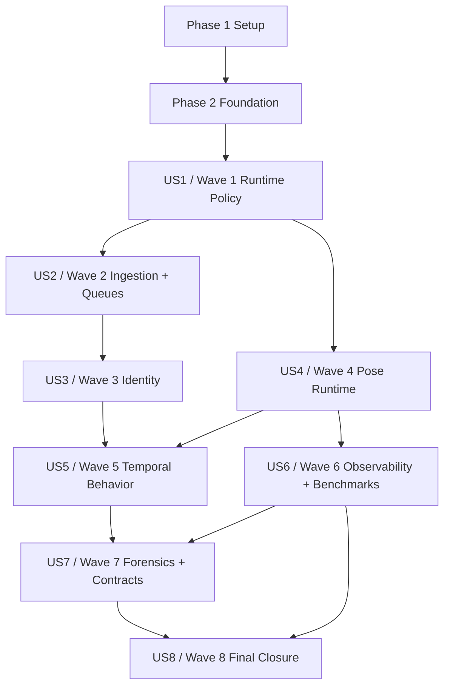

# Tasks: Production Behavioral Intelligence Maturity Closure

**Input**: Design documents from `specs/010-behavioral-maturity-closure/`  
**Prerequisites**: [plan.md](plan.md), [spec.md](spec.md), [research.md](research.md), [data-model.md](data-model.md), [quickstart.md](quickstart.md), [contracts/](contracts/)

**Execution Rules**: Tasks are ordered by maturity wave and user story priority. Test tasks appear before implementation tasks for the same behavior. Production and scientific maturity cannot be claimed from mocks, synthetic telemetry, local fallback inference, or frame-only behavior reasoning.

**Task Record Contract**: Every executable task line below contains `Task ID`, title/action, story label where applicable, and exact files/modules affected. The task detail matrices and acceptance/risk/evidence matrices encode purpose, technical scope, dependencies, blocking risks, acceptance criteria, required tests, evidence artifacts, runtime impact, scientific impact, production risk, implementation complexity, validation complexity, suggested order, rollback, observability implications, failure modes, and PR review checklist.

## 1. Master Dependency Graph

| Edge | Hard Blocker | Reason | Rollback Implication |
|------|--------------|--------|----------------------|
| Setup -> Foundation | Yes | Tests, app registration, evidence paths, and docs structure must exist before feature work. | Revert setup task commit before any story branch merges. |
| Foundation -> US1 | Yes | Runtime policy primitives and shared test/evidence conventions are needed by all waves. | Disable story tasks if shared schema/contracts are unstable. |
| US1 -> US2 | Yes | Queue and ingestion evidence must know active mode and endpoint authority. | Backpressure evidence invalid if runtime mode can drift. |
| US2 -> US3 | Yes | Identity continuity depends on source timestamps, frame/drop accounting, and queue lifecycle. | Tracking metrics cannot be trusted if frame chronology is wrong. |
| US3 -> US5 | Yes | Temporal features cannot operate on unstable identity. | Suppress behavior feature claims and exports. |
| US4 -> US5 | Yes | Pose streams and visibility masks feed temporal feature extraction. | Retain overlays only; block behavior semantics. |
| US4 -> US6 | Partial | Pose benchmark quality requires RTMPose runtime truth. | Exclude pose quality from benchmark claims. |
| US5 + US6 -> US7 | Yes | Forensic UX needs features/anomalies and trustworthy event/metric state. | Trace view may show unavailable links only. |
| US6 + US7 -> US8 | Yes | Final maturity requires benchmark trust and forensic traceability. | No paper/production closure. |

## 2. Critical Path Analysis

| Critical Path Step | Tasks | Why Critical | Blocked Waves |
|--------------------|-------|--------------|---------------|
| Runtime authority | T007-T010, T019-T028 | Prevents mixed live/offline endpoint evidence. | All waves |
| Queue/timestamp truth | T011-T014, T029-T040 | Preserves source, queue, processing, persistence chronology. | Wave 3, Wave 5, Wave 8 |
| Identity continuity | T015-T016, T041-T052 | Stabilizes per-student temporal memory and sequence exports. | Wave 5, Wave 7, Wave 8 |
| RTMPose behavior-grade streams | T017-T018, T053-T063 | Ensures pose streams are valid feature inputs. | Wave 5, Wave 6 |
| Typed sequence and ontology | T064-T080 | Establishes behavioral semantics and anomaly primitives. | Wave 7, Wave 8 |
| Observability and benchmark trust | T081-T094 | Removes synthetic readiness and self-baseline benchmark pass logic. | Wave 8 |
| Forensic contract and UX | T095-T108 | Provides reviewable evidence chain. | Wave 8 |
| Final validation and paper closure | T109-T122 | Converts engineering outputs into signed maturity evidence. | Final release |

## 3. Parallel Execution Opportunities

| Parallel Group | Tasks | Constraint |
|----------------|-------|------------|
| Setup docs/tests scaffolding | T001-T006 | No shared write conflict except `AGENTS.md`; coordinate T006. |
| Foundation schema contracts | T011-T018 | Can run after T007-T010 if files are disjoint. |
| US2 queue tests and RTSP tests | T029-T032 | Test files are disjoint and can be written before implementation. |
| US3 identity tests | T041-T044 | Can run in parallel after foundational identity contract task T015. |
| US4 pose tests | T053-T056 | Can run in parallel after Triton runtime contract task T017. |
| US5 temporal feature services | T068-T074 | After schema migrations T066-T067, feature extractors are disjoint. |
| US6 benchmark/telemetry tests | T081-T085 | Disjoint test modules; avoid running GPU benchmark jobs concurrently. |
| US7 frontend contract components | T097-T104 | Backend schema registry and frontend components can be split by API vs UI. |
| US8 report generators | T109-T115 | Run after waves 1-7 evidence contracts exist; avoid overlapping GPU soak runs. |

## 4. Wave-By-Wave Epic Decomposition

| Wave | User Story | Epic | Domain Ownership | Hard Blocker |
|------|------------|------|------------------|--------------|
| Wave 1 | US1 | Production policy and deployment consistency | Backend, ML Infra, SRE | Yes |
| Wave 2 | US2 | Ingestion, queue routing, backpressure, RTSP recovery | Backend, SRE | Yes |
| Wave 3 | US3 | Identity continuity, tracking lifecycle, ReID, association | CV/Tracking, Backend | Yes |
| Wave 4 | US4 | RTMPose correctness, pose streams, temporal pose truth | CV/Pose, ML Infra | Yes |
| Wave 5 | US5 | Typed sequence store, ontology, features, anomaly primitives | Research, Backend, ML | Yes |
| Wave 6 | US6 | Telemetry truth, benchmark integrity, statistical rigor | SRE, Benchmark, Frontend | Yes |
| Wave 7 | US7 | API/WS governance and forensic behavior debug UX | Backend, Frontend | Yes |
| Wave 8 | US8 | Final acceptance, profile matrix, paper traceability | Release, Research, SRE | Yes |

## 5. Detailed Task Trees

### Phase 1: Setup (Shared Infrastructure)

**Purpose**: Prepare the repository, test scaffolds, evidence directories, and documentation targets needed by all waves.

- [ ] T001 Create maturity closure evidence directory scaffold in `ci_evidence/production/wave1/.gitkeep`, `ci_evidence/production/wave2/.gitkeep`, `ci_evidence/production/wave3/.gitkeep`, `ci_evidence/production/wave4/.gitkeep`, `ci_evidence/production/wave5/.gitkeep`, `ci_evidence/production/wave6/.gitkeep`, `ci_evidence/production/wave7/.gitkeep`, `ci_evidence/production/wave8/.gitkeep`
- [ ] T002 [P] Create shared maturity test helpers in `backend/tests/utils/maturity_evidence.py` and `backend/tests/utils/maturity_media.py`
- [ ] T003 [P] Create production evidence manifest schema fixture in `backend/tests/fixtures/maturity_evidence_schema.json`
- [ ] T004 [P] Create backend behavior app package skeleton in `backend/apps/behavior/__init__.py`, `backend/apps/behavior/apps.py`, `backend/apps/behavior/README.md`
- [ ] T005 [P] Create backend contract governance app skeleton in `backend/apps/contracts/__init__.py`, `backend/apps/contracts/apps.py`, `backend/apps/contracts/README.md`
- [ ] T006 Update active Spec Kit handoff references in `AGENTS.md` and production task guidance in `tools/prod/README.md`

### Phase 2: Foundational (Blocking Prerequisites)

**Purpose**: Shared runtime authority, test/evidence conventions, schema foundations, and production safety primitives that block all user stories.

**Critical Gate**: No user story implementation may be accepted until T007-T018 are complete.

- [ ] T007 Write runtime mode contract tests in `backend/tests/unit/pipeline/test_runtime_mode_authority.py`
- [ ] T008 Write endpoint isolation contract tests in `backend/tests/contract/test_runtime_mode_contract.py`
- [ ] T009 Implement validated runtime mode settings in `backend/apps/pipeline/runtime_mode.py` and wire production flags in `backend/config/settings.py`
- [ ] T010 Implement Triton endpoint authority resolver in `backend/apps/pipeline/triton_endpoints.py` and route integration in `backend/apps/pipeline/inference_runtime.py`
- [ ] T011 [P] Write timestamp envelope and drop-accounting unit tests in `backend/tests/unit/pipeline/test_timestamp_drop_contract.py`
- [ ] T012 [P] Implement canonical timestamp envelope in `backend/apps/pipeline/timestamps.py`
- [ ] T013 [P] Implement drop-accounting value objects and failure classes in `backend/apps/pipeline/drop_accounting.py`
- [ ] T014 [P] Define queue route contract helpers in `backend/apps/pipeline/queue_routes.py`
- [ ] T015 [P] Write identity namespace and Redis key contract tests in `backend/tests/unit/tracking/test_identity_scope_contract.py`
- [ ] T016 [P] Implement identity namespace helpers in `backend/apps/tracking/identity_scope.py`
- [ ] T017 [P] Write RTMPose Triton IO contract tests in `backend/tests/unit/pipeline/test_rtmpose_config_validation.py`
- [ ] T018 [P] Implement RTMPose model config validator in `backend/apps/pipeline/pose_runtime_validator.py`

### Phase 3: User Story 1 - Govern Production Runtime Policy (Priority: P1, Wave 1)

**Goal**: Live/offline Triton endpoint profiles are both configured, but production consumes only the active mode selected by `.env`.

**Independent Test**: Select `TRITON_EXECUTION_MODE=live` and `TRITON_EXECUTION_MODE=offline` separately and verify active profile readiness, inactive profile isolation, fallback rejection, and machine-readable preflight evidence.

- [ ] T019 [P] [US1] Write production mode parser unit tests in `backend/tests/unit/pipeline/test_runtime_mode_authority.py`
- [ ] T020 [P] [US1] Write model-serving health contract tests in `backend/tests/contract/test_model_serving_runtime_mode.py`
- [ ] T021 [P] [US1] Write production endpoint policy script tests in `backend/tests/unit/scripts/test_prod_triton_endpoint_policy_script.py`
- [ ] T022 [US1] Extend health serializers and responses with active/inactive endpoint fields in `backend/apps/video_analysis/views.py` and `backend/apps/video_analysis/serializers.py`
- [ ] T023 [US1] Enforce active-mode routing and inactive endpoint rejection in `backend/apps/pipeline/inference_runtime.py` and `backend/apps/video_analysis/tasks.py`
- [ ] T024 [US1] Update Celery route ownership by runtime mode in `backend/config/celery.py`
- [ ] T025 [US1] Implement production preflight validator in `tools/prod/prod_triton_endpoint_policy.sh` and `tools/prod/prod-health-snapshot.ps1`
- [ ] T026 [P] [US1] Align environment examples and production docs in `.env.example`, `docs/linux_production_optimization_execution_phases.md`, and `tools/prod/README.md`
- [ ] T027 [US1] Generate Wave 1 evidence writer in `tools/prod/prod-wave1-evidence.ps1`
- [ ] T028 [US1] Add Wave 1 system validation tests in `backend/tests/system/test_wave1_runtime_policy.py`

### Phase 4: User Story 2 - Stabilize Ingestion And Queue Control (Priority: P1, Wave 2)

**Goal**: Ingestion, queue routing, backpressure, RTSP recovery, timestamps, and drop accounting become deterministic and observable.

**Independent Test**: Run controlled disconnects, queue overload, stale stream, timeout, and drop scenarios across real live/offline validation inputs and verify SLO evidence.

- [ ] T029 [P] [US2] Write queue route matrix unit tests in `backend/tests/unit/pipeline/test_queue_routing_contract.py`
- [ ] T030 [P] [US2] Write queue wait telemetry tests in `backend/tests/unit/pipeline/test_queue_wait_telemetry.py`
- [ ] T031 [P] [US2] Write RTSP reconnect state-machine tests in `backend/tests/unit/pipeline/test_rtsp_reconnect_state_machine.py`
- [ ] T032 [P] [US2] Write backpressure SLO tests for live/offline thresholds in `backend/tests/unit/pipeline/test_backpressure_slo_policy.py`
- [ ] T033 [US2] Implement canonical Celery route map and DLQ policy in `backend/apps/pipeline/queue_routes.py` and `backend/config/celery.py`
- [ ] T034 [US2] Implement queue wait telemetry with enqueue/dequeue/start/finish stamps in `backend/apps/pipeline/queue_telemetry.py` and `backend/apps/video_analysis/tasks.py`
- [ ] T035 [US2] Implement RTSP reconnect state machine in `backend/apps/pipeline/rtsp_reconnect.py` and integrate it in `backend/apps/video_analysis/tasks.py`
- [ ] T036 [US2] Implement balanced backpressure controller in `backend/apps/pipeline/backpressure.py` with live/offline SLO thresholds
- [ ] T037 [US2] Persist drop-accounting events and timestamp envelopes in `backend/apps/video_analysis/models.py` and migration `backend/apps/video_analysis/migrations/0004_maturity_runtime_events.py`
- [ ] T038 [US2] Expose queue wait, drop, and reconnect telemetry endpoints in `backend/apps/video_analysis/views.py` and `backend/apps/video_analysis/urls.py`
- [ ] T039 [US2] Add RTSP fault-injection integration tests in `backend/tests/integration/test_wave2_rtsp_fault_matrix.py`
- [ ] T040 [US2] Generate Wave 2 evidence reports in `tools/prod/prod-wave2-ingestion-evidence.ps1`

### Phase 5: User Story 3 - Stabilize Identity And Temporal Continuity (Priority: P1, Wave 3)

**Goal**: Identity scope, lifecycle, ReID decisions, and association interpolation become canonical and scientifically auditable.

**Independent Test**: Multi-camera same-session, crowded crossing, occlusion/re-entry, and long-session clips produce zero key collisions and measurable ID-switch metrics.

- [ ] T041 [P] [US3] Write multi-camera identity isolation tests in `backend/tests/unit/tracking/test_identity_scope_contract.py`
- [ ] T042 [P] [US3] Write conservative ReID decision tests in `backend/tests/unit/tracking/test_reid_canonicalization.py`
- [ ] T043 [P] [US3] Write Hungarian association and gating tests in `backend/tests/unit/tracking/test_association.py`
- [ ] T044 [P] [US3] Write lifecycle persistence tests in `backend/tests/unit/tracking/test_track_lifecycle_states.py`
- [ ] T045 [US3] Add identity scope, canonical track alias, ReID decision, and lifecycle fields in `backend/apps/video_analysis/models.py` and migration `backend/apps/video_analysis/migrations/0005_identity_continuity.py`
- [ ] T046 [US3] Implement scoped Redis identity keys in `backend/apps/tracking/identity_scope.py` and `backend/apps/tracking/tracker.py`
- [ ] T047 [US3] Implement conservative ReID canonicalization in `backend/apps/tracking/reid.py`
- [ ] T048 [US3] Replace index-order interpolation with cost matrix and Hungarian association in `backend/apps/tracking/association.py`
- [ ] T049 [US3] Persist tracking lifecycle events and expose timeline state in `backend/apps/tracking/tracker.py` and `backend/apps/video_analysis/serializers.py`
- [ ] T050 [US3] Implement identity quality metrics exporter in `backend/apps/tracking/identity_metrics.py`
- [ ] T051 [US3] Add crowded crossing and occlusion/re-entry integration tests in `backend/tests/integration/test_wave3_identity_continuity.py`
- [ ] T052 [US3] Generate Wave 3 identity evidence artifacts in `tools/prod/prod-wave3-identity-evidence.ps1`

### Phase 6: User Story 4 - Make Pose Runtime Behavior-Grade (Priority: P1, Wave 4)

**Goal**: RTMPose model validation, pose batch partial success, pose stream semantics, and pose temporal quality become behavior-grade.

**Independent Test**: Real RTMPose/Triton validation verifies IO shape, warmup, partial crop success, stream versioning, jitter, missing joints, fallback rate, timeout rate, and latency.

- [ ] T053 [P] [US4] Write pose stream contract tests in `backend/tests/unit/pipeline/test_pose_stream_contract.py`
- [ ] T054 [P] [US4] Write pose batch partial-success tests in `backend/tests/unit/pipeline/test_pose_batch_partial_success.py`
- [ ] T055 [P] [US4] Write pose quality metric tests in `backend/tests/unit/video_analysis/test_pose_quality_service.py`
- [ ] T056 [P] [US4] Write real Triton RTMPose system validation scaffold in `backend/tests/system/test_wave4_rtmpose_triton_runtime.py`
- [ ] T057 [US4] Integrate RTMPose config validator with startup preflight in `backend/apps/pipeline/pose_runtime_validator.py` and `tools/prod/prod_triton_endpoint_policy.sh`
- [ ] T058 [US4] Implement pose batch item result model and persistence in `backend/apps/video_analysis/models.py` and migration `backend/apps/video_analysis/migrations/0006_pose_streams.py`
- [ ] T059 [US4] Implement raw, smoothed, and display pose stream writers in `backend/apps/pipeline/pose_streams.py`
- [ ] T060 [US4] Implement partial-success pose batching in `backend/apps/pipeline/inference_runtime.py`
- [ ] T061 [US4] Extend pose quality service with jitter, missing joints, stability, fallback, timeout, crop failure, and latency metrics in `backend/apps/video_analysis/services/pose_quality.py`
- [ ] T062 [US4] Add high-density pose performance test in `backend/tests/performance/test_wave4_pose_latency_gpu.py`
- [ ] T063 [US4] Generate Wave 4 pose evidence artifacts in `tools/prod/prod-wave4-pose-evidence.ps1`

### Phase 7: User Story 5 - Establish Temporal Behavior Features (Priority: P2, Wave 5)

**Goal**: Typed temporal sequence records, rolling memory, ontology v1, interpretable features, anomaly primitives, and reproducible exports become the behavioral intelligence foundation.

**Independent Test**: Representative clips produce deterministic sequence records, ontology-versioned feature windows, explicit missing states, anomaly primitive reports, and reproducible exports.

- [ ] T064 [P] [US5] Write temporal sequence schema tests in `backend/tests/unit/behavior/test_sequence_schema.py`
- [ ] T065 [P] [US5] Write soft-purge/archive retention tests in `backend/tests/unit/behavior/test_sequence_retention_actions.py`
- [ ] T066 [P] [US5] Write behavior ontology tests in `backend/tests/unit/behavior/test_behavior_ontology.py`
- [ ] T067 [P] [US5] Write feature extraction math tests in `backend/tests/unit/behavior/test_behavior_features.py`
- [ ] T068 [P] [US5] Write anomaly primitive tests in `backend/tests/unit/behavior/test_anomaly_primitives.py`
- [ ] T069 [US5] Add TemporalSequenceRecord, TemporalSequenceRetentionAction, TemporalMemoryWindow, BehaviorOntologyVersion, BehaviorFeatureWindow, and AnomalyPrimitiveEvent models in `backend/apps/behavior/models.py` and migration `backend/apps/behavior/migrations/0001_initial.py`
- [ ] T070 [US5] Register behavior app routes, admin, and serializers in `backend/apps/behavior/urls.py`, `backend/apps/behavior/admin.py`, and `backend/apps/behavior/serializers.py`
- [ ] T071 [US5] Implement pose-to-sequence materializer in `backend/apps/behavior/sequences.py`
- [ ] T072 [US5] Implement per-student rolling memory in `backend/apps/behavior/memory.py`
- [ ] T073 [US5] Implement ontology v1 registry and seed data in `backend/apps/behavior/ontology.py`
- [ ] T074 [US5] Implement head, wrist, motion, torso, and interaction feature extractors in `backend/apps/behavior/features.py`
- [ ] T075 [US5] Implement change-point, drift, repeated-pattern, instability, and attention-deviation primitives in `backend/apps/behavior/anomaly_primitives.py`
- [ ] T076 [US5] Implement reproducible sequence export pipeline in `backend/apps/behavior/exports.py`
- [ ] T077 [US5] Add pose-to-sequence integration tests in `backend/tests/integration/test_wave5_sequence_flow.py`
- [ ] T078 [US5] Add behavior scenario tests for glance, wrist occlusion, posture instability, and interaction cues in `backend/tests/system/test_wave5_behavior_scenarios.py`
- [ ] T079 [US5] Implement raw sequence soft-purge/archive API in `backend/apps/behavior/views.py` and `backend/apps/behavior/urls.py`
- [ ] T080 [US5] Generate Wave 5 sequence, ontology, feature, anomaly, and export evidence in `tools/prod/prod-wave5-behavior-evidence.ps1`

### Phase 8: User Story 6 - Make Observability And Benchmarks Trustworthy (Priority: P2, Wave 6)

**Goal**: Telemetry truth, event deduplication, benchmark integrity, statistics, structured logging, and frontend KPI truth become production-authority behavior.

**Independent Test**: Disabled telemetry sources, duplicate events, missing baselines, under-sampled benchmarks, and frontend null/zero/unavailable states all behave correctly.

- [ ] T081 [P] [US6] Write probe-backed telemetry tests in `backend/tests/unit/pipeline/test_telemetry_truth.py`
- [ ] T082 [P] [US6] Write event dedup ledger tests in `backend/tests/unit/pipeline/test_runtime_event_dedup.py`
- [ ] T083 [P] [US6] Write benchmark baseline and 5+5 repetition tests in `backend/tests/unit/pipeline/test_benchmark_integrity.py`
- [ ] T084 [P] [US6] Write statistical report tests in `backend/tests/unit/pipeline/test_benchmark_statistics.py`
- [ ] T085 [P] [US6] Write frontend KPI truth tests in `frontend/src/pages/__tests__/RuntimePage.kpiTruth.test.tsx`
- [ ] T086 [US6] Implement runtime probe service in `backend/apps/pipeline/telemetry_truth.py`
- [ ] T087 [US6] Implement runtime event ledger and dedup constraints in `backend/apps/video_analysis/models.py` and migration `backend/apps/video_analysis/migrations/0007_telemetry_dedup.py`
- [ ] T088 [US6] Replace hardcoded availability and synthetic readiness in `backend/apps/video_analysis/views.py` and `backend/apps/pipeline/runtime_ingestion.py`
- [ ] T089 [US6] Implement benchmark integrity engine with explicit baseline/candidate and 5+5 run enforcement in `backend/apps/pipeline/benchmark_integrity.py`
- [ ] T090 [US6] Implement confidence interval, variance, effect size, and nonparametric report helpers in `backend/apps/pipeline/benchmark_statistics.py`
- [ ] T091 [US6] Add structured correlation logging in `backend/config/settings.py` and `backend/apps/pipeline/logging_context.py`
- [ ] T092 [US6] Update frontend runtime types and KPI rendering semantics in `frontend/src/types/runtime.ts`, `frontend/src/stores/healthStore.ts`, and `frontend/src/pages/RuntimePage.tsx`
- [ ] T093 [US6] Add telemetry integrity system tests under load in `backend/tests/system/test_wave6_telemetry_integrity.py`
- [ ] T094 [US6] Generate Wave 6 telemetry and benchmark evidence in `tools/prod/prod-wave6-observability-evidence.ps1`

### Phase 9: User Story 7 - Govern API, WebSocket, Artifacts, And Forensic Review (Priority: P3, Wave 7)

**Goal**: REST/WS schema governance, serializer hardening, artifact authority, and forensic trace UX support end-to-end behavioral debugging.

**Independent Test**: REST and WebSocket payloads validate against one registry, serializers expose only approved fields, and a behavior event can be traced to identity, pose, feature, anomaly, artifact, and benchmark context.

- [ ] T095 [P] [US7] Write schema registry contract tests in `backend/tests/contract/test_api_ws_registry.py`
- [ ] T096 [P] [US7] Write serializer exposure tests in `backend/tests/contract/test_serializer_field_governance.py`
- [ ] T097 [P] [US7] Write WebSocket version compatibility tests in `frontend/src/hooks/__tests__/useRuntimeSocket.versioning.test.ts`
- [ ] T098 [P] [US7] Write forensic trace API tests in `backend/tests/contract/test_forensic_trace_contract.py`
- [ ] T099 [US7] Implement contract registry models and schema store in `backend/apps/contracts/models.py` and migration `backend/apps/contracts/migrations/0001_initial.py`
- [ ] T100 [US7] Implement explicit-field serializer governance in `backend/apps/contracts/serializers.py` and update public serializers in `backend/apps/video_analysis/serializers.py`, `backend/apps/anomalies/serializers.py`, and `backend/apps/exports/serializers.py`
- [ ] T101 [US7] Implement governed WebSocket payload envelope in `backend/apps/video_analysis/consumers.py` and `backend/apps/anomalies/consumers.py`
- [ ] T102 [US7] Implement artifact authority policy in `backend/apps/exports/services.py` and `backend/apps/exports/views.py`
- [ ] T103 [US7] Implement forensic trace resolver in `backend/apps/behavior/forensics.py` and API endpoint in `backend/apps/behavior/views.py`
- [ ] T104 [US7] Add frontend TypeScript contracts in `frontend/src/types/forensics.ts` and API client in `frontend/src/api/forensics.ts`
- [ ] T105 [US7] Build forensic trace UI in `frontend/src/pages/ForensicTracePage.tsx` and `frontend/src/pages/ForensicTracePage.module.css`
- [ ] T106 [US7] Add forensic trace navigation from anomalies and runtime pages in `frontend/src/pages/AnomalyListPage.tsx` and `frontend/src/pages/RuntimePage.tsx`
- [ ] T107 [US7] Add API/frontend performance tests in `backend/tests/performance/test_wave7_api_forensic_perf.py` and `frontend/src/pages/__tests__/ForensicTracePage.perf.test.tsx`
- [ ] T108 [US7] Generate Wave 7 API/WS/forensic evidence in `tools/prod/prod-wave7-forensic-evidence.ps1`

### Phase 10: User Story 8 - Close Final Evidence And Paper Traceability (Priority: P3, Wave 8)

**Goal**: Final acceptance, profile matrix, representative validation, xfail closure, and paper traceability produce defensible maturity closure.

**Independent Test**: Final acceptance fails unless waves 1-7 evidence exists, final profile matrix is reproducible, representative dataset gate is satisfied, and paper claims map to implementation evidence.

- [ ] T109 [P] [US8] Write final acceptance manifest tests in `backend/tests/unit/pipeline/test_final_acceptance_manifest.py`
- [ ] T110 [P] [US8] Write representative dataset gate tests in `backend/tests/unit/pipeline/test_representative_dataset_gate.py`
- [ ] T111 [P] [US8] Write xfail closure report tests in `backend/tests/unit/pipeline/test_xfail_closure_report.py`
- [ ] T112 [P] [US8] Write paper traceability validation tests in `backend/tests/unit/pipeline/test_paper_traceability.py`
- [ ] T113 [US8] Implement final acceptance run model in `backend/apps/pipeline/models.py` or `backend/apps/video_analysis/models.py` and migration `backend/apps/video_analysis/migrations/0008_final_acceptance.py`
- [ ] T114 [US8] Implement profile matrix runner enforcing live/offline mode isolation in `tools/benchmarks/run_maturity_profile_matrix.ps1`
- [ ] T115 [US8] Implement representative dataset evidence manifest generator in `tools/benchmarks/generate_representative_dataset_manifest.py`
- [ ] T116 [US8] Implement dynamic batch sign-off report generator in `tools/benchmarks/generate_dynamic_batch_signoff.py`
- [ ] T117 [US8] Implement xfail closure scanner in `tools/benchmarks/generate_xfail_closure_report.py`
- [ ] T118 [US8] Implement paper traceability updater in `tools/benchmarks/generate_paper_traceability_report.py`
- [ ] T119 [US8] Add final acceptance orchestration command in `backend/apps/video_analysis/management/commands/run_maturity_acceptance.py`
- [ ] T120 [US8] Add full acceptance system tests in `backend/tests/system/test_wave8_final_acceptance.py`
- [ ] T121 [US8] Add live soak and offline validation performance tests in `backend/tests/performance/test_wave8_live_soak_offline_validation.py`
- [ ] T122 [US8] Generate Wave 8 final evidence package in `tools/prod/prod-wave8-final-evidence.ps1`

### Phase 11: Polish And Cross-Cutting Closure

**Purpose**: Documentation, code hygiene, CI/CD, and final PR readiness across all waves.

- [ ] T123 [P] Update source-mirrored docs for backend runtime modules in `docs/backend/apps/pipeline/`, `docs/backend/apps/tracking/`, `docs/backend/apps/behavior/`, and `docs/backend/apps/contracts/`
- [ ] T124 [P] Update frontend source-mirrored docs for forensic and runtime UI in `docs/frontend/src/pages/`, `docs/frontend/src/api/`, and `docs/frontend/src/types/`
- [ ] T125 [P] Update module READMEs in `backend/apps/pipeline/README.md`, `backend/apps/tracking/README.md`, `backend/apps/behavior/README.md`, `backend/apps/contracts/README.md`, and `frontend/src/api/README.md`
- [ ] T126 [P] Add CI maturity job definitions in `.github/workflows/maturity-closure.yml`
- [ ] T127 [P] Add production evidence retention and soft-purge runbook in `docs/production/temporal_sequence_retention.md`
- [ ] T128 [P] Add behavioral ontology and anomaly semantics documentation in `docs/production/behavioral_ontology_v1.md`
- [ ] T129 Run backend unit, integration, contract, resilience, performance, and system suites using `backend/tests/` and store outputs under `ci_evidence/production/final_test_gate_results.md`
- [ ] T130 Run frontend unit, WebSocket, forensic UX, and E2E suites using `frontend/src/` tests and store outputs under `ci_evidence/production/frontend_test_gate_results.md`
- [ ] T131 Run native Linux GPU/Triton acceptance validation using `tools/prod/` and store outputs under `ci_evidence/production/gpu_triton_acceptance.md`
- [ ] T132 Create final PR review packet linking tasks, tests, evidence, risk, rollback, and paper traceability in `ci_evidence/production/final_pr_review_packet.md`

### Phase 12: Live Benchmark Runtime Remediation Addendum

**Purpose**: Close concrete live benchmark failure classes: Triton timeout spikes, low GPU occupancy with high wall latency, duplicate fallback dispatches, unresolved partial-batch indexes, Celery/DB state divergence, retry amplification, readiness mismatch, missing inference-path attribution, and benchmark causality gaps.

- [ ] T133 [P] [US2] Implement authoritative retry taxonomy and ceilings in `backend/apps/pipeline/retry_policy.py` and tests in `backend/tests/unit/pipeline/test_retry_policy.py`
- [ ] T134 [US2] Persist retry lineage with request ID, parent request ID, retry reason, retry type, inference path, original batch ID, queue wait, and GPU wait in `backend/apps/pipeline/runtime_ingestion.py` and `backend/apps/video_analysis/models.py`
- [ ] T135 [US4] Implement partial-batch salvage with successful-item preservation, unresolved-index isolation, failed-item tagging, and duplicate dispatch accounting in `backend/apps/pipeline/inference_runtime.py`
- [ ] T136 [US4] Implement per-item retry isolation and unresolved-index origin propagation in `backend/apps/pipeline/pose_streams.py` and `backend/apps/pipeline/inference_runtime.py`
- [ ] T137 [P] [US6] Add Triton queue telemetry collection for queue delay, dynamic batch wait, model execution time, and timeout spikes in `backend/apps/pipeline/triton_queue_telemetry.py`
- [ ] T138 [P] [US6] Add GPU utilization and duty-cycle instrumentation in `backend/apps/pipeline/gpu_telemetry.py` and `tools/prod/prod-gpu-utilization-analysis.ps1`
- [ ] T139 [US6] Add latency decomposition instrumentation for queue_wait, orchestration, serialization, triton_queue, gpu_compute, fallback_overhead, and persistence in `backend/apps/pipeline/latency_decomposition.py`
- [ ] T140 [US2] Implement Celery/DB reconciliation watchdog and terminal-state repair command in `backend/apps/video_analysis/management/commands/reconcile_runtime_workflows.py`
- [ ] T141 [US2] Implement atomic terminal-state finalization for queued, dispatched, processing, partial_failure, failed, completed, and degraded_completed in `backend/apps/video_analysis/tasks.py`
- [ ] T142 [US7] Propagate structured request lineage through request, queue, Triton, fallback, persistence, artifact, and forensic trace in `backend/apps/pipeline/request_lineage.py`
- [ ] T143 [US4] Propagate inference-path attribution fields in pose artifacts and runtime telemetry in `backend/apps/pipeline/inference_runtime.py` and `backend/apps/video_analysis/services/pose_quality.py`
- [ ] T144 [US8] Add dynamic batching tuning and sign-off harness in `tools/benchmarks/tune_triton_dynamic_batching.py`
- [ ] T145 [US2] Implement queue starvation detection and queue collapse prevention in `backend/apps/pipeline/queue_telemetry.py` and `backend/apps/pipeline/backpressure.py`
- [ ] T146 [US1] Harden runtime mode validator against active-mode ambiguity and forced Triton not-ready contradictions in `backend/apps/pipeline/runtime_mode.py`
- [ ] T147 [US1] Implement Triton repository, model version, and TensorRT engine lineage validator in `backend/apps/pipeline/triton_repository_validator.py`
- [ ] T148 [US4] Implement `config.pbtxt` schema and model warmup validator in `backend/apps/pipeline/pose_runtime_validator.py`
- [ ] T149 [US6] Implement fallback amplification detector and retry recursion detector in `backend/apps/pipeline/retry_amplification.py`
- [ ] T150 [US6] Implement benchmark causality exporter correlating retries, timeouts, queues, GPU idle windows, fallback amplification, and Triton pressure in `tools/benchmarks/export_benchmark_causality.py`
- [ ] T151 [P] [US6] Add flamegraph/perf-style orchestration overhead report generation in `tools/benchmarks/export_orchestration_overhead.py`
- [ ] T152 [US8] Generate runtime remediation evidence bundle in `tools/prod/prod-runtime-remediation-evidence.ps1`

#### Runtime Remediation Task Register

| Task | Objective | Implementation Details | Dependencies | Blocking Risks | Acceptance Criteria | Evidence Outputs | Complexity | Owner |
|------|-----------|------------------------|--------------|----------------|---------------------|------------------|------------|-------|
| T133 | Create retry taxonomy. | Define retry types, ceilings, recursion guards, and retry reason enum. | T011-T014 | Retry storm hidden as latency. | Unit tests reject unbounded recursion and unsupported retry type. | `retry_policy_unit_report.md` | Medium impl / Medium validation | Backend/SRE |
| T134 | Persist retry telemetry. | Store lineage and emit telemetry per retry attempt. | T133 | Lost causality for fallback. | 100% retry attempts have parent/child IDs and timing. | `ci_evidence/production/runtime/retry_lineage.json` | High impl / High validation | Backend |
| T135 | Salvage partial batches. | Preserve successful items, tag failed items, isolate unresolved indexes. | T053-T060 | Frame-wide invalidation. | Successful crops survive partial failure. | `fallback_resolution_report.md` | High impl / High validation | CV/Pose |
| T136 | Isolate item retries. | Retry unresolved indexes selectively with retry generation and origin. | T135 | Duplicate unresolved-index fanout. | Duplicate dispatch ratio bounded and reported. | `retry_amplification_matrix.json` | High impl / High validation | CV/Pose |
| T137 | Measure Triton queue. | Capture Triton queue delay, dynamic batch wait, execution time. | T010, T089 | Triton wait hidden in orchestration. | Accepted benchmarks include Triton queue fields. | `latency_decomposition.json` | Medium impl / High validation | ML Infra |
| T138 | Measure GPU duty cycle. | Collect occupancy, duty cycle, idle windows. | T137 | Hidden GPU starvation. | Low utilization runs include root-cause report. | `gpu_utilization_analysis.md` | Medium impl / High validation | ML Infra |
| T139 | Decompose latency. | Attribute total latency by queue, orchestration, serialization, Triton, GPU, fallback, persistence. | T034, T137, T138 | Invalid throughput claims. | 100% benchmark runs include latency equation components. | `latency_decomposition.json` | High impl / High validation | Backend/SRE |
| T140 | Reconcile workflow state. | Add watchdog for Celery/DB terminal-state divergence. | T037 | DB remains processing after task failure. | Zero Celery FAILURE with DB processing. | `terminal_state_reconciliation.json` | Medium impl / Medium validation | Backend |
| T141 | Atomic terminal finalization. | Wrap exception paths with finalization transaction. | T140 | Exceptions bypass status finalization. | Terminal-state atomicity tests pass. | `workflow_integrity_report.md` | High impl / Medium validation | Backend |
| T142 | Propagate request lineage. | Carry request lineage through queue, inference, persistence, artifact, forensic trace. | T134 | Missing E2E causality. | Forensic trace resolves full request path. | `benchmark_causality_report.md` | High impl / High validation | Backend/Frontend |
| T143 | Propagate inference path. | Add batch/single_fallback/degraded/retry/timeout_recovery fields to telemetry and artifacts. | T135, T142 | Fallback ambiguity. | 100% inference events have path attribution. | `inference_path_samples.json` | Medium impl / Medium validation | CV/Pose |
| T144 | Tune dynamic batching. | Sweep preferred batch sizes and queue delays per mode. | T137-T139 | Low GPU duty cycle. | Dynamic batch sign-off includes latency/throughput tradeoff. | `dynamic_batch_signoff.md` | Medium impl / High validation | ML Infra |
| T145 | Detect starvation/collapse. | Detect queue starvation and collapse; trigger bounded backpressure. | T034, T036 | Queue wait dominates latency. | SLO breach emits control action and evidence. | `backpressure_slo_report.md` | Medium impl / High validation | Backend/SRE |
| T146 | Harden runtime mode. | Fail on active-mode ambiguity and forced Triton readiness contradiction. | T009-T010 | Wrong endpoint selected. | Startup fails for readiness mismatch. | `runtime_mode_validation_report.md` | Medium impl / Medium validation | Backend |
| T147 | Validate Triton repo. | Check model versions, TensorRT engine lineage, repository consistency. | T146 | Model drift. | Drift blocks startup. | `triton_repository_validation.json` | Medium impl / High validation | ML Infra |
| T148 | Validate config/warmup. | Schema-check `config.pbtxt` and warmup shapes. | T147 | Warmup mismatch. | Bad config fails preflight. | `rtmpose_config_validation.txt` | Medium impl / High validation | ML Infra/CV |
| T149 | Detect amplification. | Detect fallback amplification, retry recursion, and duplicate fanout. | T133-T136 | Silent retry amplification. | Amplification unresolved => benchmark rejected. | `retry_amplification_matrix.json` | Medium impl / High validation | SRE |
| T150 | Export causality. | Correlate failures, retries, timeouts, queues, GPU idle, Triton pressure. | T137-T149 | Benchmark detached from runtime causes. | Causality table exists for each benchmark. | `benchmark_causality_report.md` | High impl / High validation | Benchmark |
| T151 | Attribute orchestration. | Produce flamegraph/perf-style Python orchestration overhead report. | T139 | CPU orchestration hidden. | High wall/low GPU runs include attribution. | `orchestration_overhead_report.md` | Medium impl / Medium validation | SRE |
| T152 | Bundle evidence. | Generate deterministic runtime remediation artifact package. | T133-T151 | Missing review evidence. | All runtime remediation artifacts exist with mode/profile labels. | `runtime_remediation_manifest.json` | Low impl / Medium validation | Release |

## 6. Acceptance-Gate Matrix

| Wave | Gate | Tasks | Pass Criteria | Evidence |
|------|------|-------|---------------|----------|
| Wave 1 | Runtime mode authority | T019-T028 | Invalid mode fails startup; active endpoint ready; inactive profile unrouted; no local fallback production authority. | `ci_evidence/production/wave1/hash_parity.md`, `endpoint_health.md`, `ports_snapshot.txt`, `backend_health.json`, `model_serving_health.json`, `boundary_verifier.txt` |
| Wave 2 | Ingestion and backpressure | T029-T040 | Queue metrics match actual names; reconnect transitions pass; balanced SLO gates enforced; all drops have reason/timestamp/context. | `queue_routing_matrix.md`, `active_queues.txt`, `live_queue_wait_events.json`, `rtsp_fault_matrix.md`, `drop_accounting_report.json`, `backpressure_slo_report.md` |
| Wave 3 | Identity continuity | T041-T052 | Zero multi-camera collisions; ReID decisions auditable; index interpolation removed; ID switch metrics produced. | `identity_scope_contract.md`, `reid_mapping_examples.json`, `id_switch_metrics.json`, `occlusion_reentry_report.md`, `interpolation_association_report.md` |
| Wave 4 | Pose runtime truth | T053-T063 | RTMPose config validates; partial crop failures isolated; pose streams versioned; jitter/fallback metrics queryable. | `rtmpose_config_validation.txt`, `pose_batch_partial_success.json`, `pose_fallback_metrics.json`, `pose_stream_contract.md`, `pose_jitter_real_data_report.md` |
| Wave 5 | Temporal behavior foundation | T064-T080 | Sequence idempotency; ontology v1; explicit missing states; anomaly primitives operate on valid windows; no physical deletion. | `sequence_schema_contract.md`, `behavior_ontology_v1.md`, `feature_output_samples.json`, `temporal_anomaly_primitives_report.md`, `export_manifest.json`, `sequence_retention_audit.json` |
| Wave 6 | Telemetry and benchmark trust | T081-T094 | No synthetic readiness; duplicate events do not inflate metrics; 5+5 benchmark enforcement; frontend truth states preserved. | `telemetry_probe_report.json`, `event_dedup_report.md`, `benchmark_baseline_required_report.md`, `statistical_repeatability_report.md`, `frontend_kpi_truth_report.md` |
| Wave 7 | Contract and forensic trace | T095-T108 | REST/WS schema registry active; serializers explicit; artifact authority enforced; forensic trace E2E works. | `api_ws_registry.json`, `serializer_hardening_report.md`, `ws_version_compat_report.md`, `artifact_source_policy.md`, `forensic_trace_e2e_report.md`, `api_frontend_perf_report.md` |
| Wave 8 | Final maturity closure | T109-T122 | Waves 1-7 passed/deferred; representative dataset gate satisfied; profile matrix reproducible; paper claims aligned. | `final_profile_matrix_results.json`, `profile_ranking_report.md`, `dynamic_batch_signoff.md`, `offline_validation_report.md`, `live_soak_report.md`, `final_test_gate_results.md`, `xfail_closure_report.md`, `paper_traceability_update_report.md`, `hash_sync_report.md` |
| Runtime remediation | Cross-wave Wave 2/4/6/8 | T133-T152 | Retry lineage complete, partial-batch salvage bounded, GPU underutilization attributed, workflow terminal states reconciled, benchmark causality attached. | `ci_evidence/production/runtime/retry_lineage.json`, `fallback_resolution_report.md`, `gpu_utilization_analysis.md`, `latency_decomposition.json`, `workflow_integrity_report.md`, `benchmark_causality_report.md` |

## 7. Testing Matrix

| Test Type | Tasks | Requires Real Triton | Requires Real GPU | Mocks Allowed | Mocks Forbidden |
|-----------|-------|----------------------|-------------------|---------------|-----------------|
| Runtime mode unit/contract | T007-T010, T019-T021 | No | No | Config/env mocks allowed | Production acceptance |
| Active endpoint system validation | T022-T028 | Yes | Yes | No | Endpoint readiness, routing, fallback rejection |
| Queue/backpressure unit | T029-T036 | No | No | Celery clock/queue doubles allowed | Final SLO evidence |
| RTSP recovery integration | T031, T035, T039 | Partial | No | Fault-injected RTSP allowed | Final live evidence |
| Identity association unit | T041-T048 | No | No | Synthetic boxes allowed for unit math | Maturity identity metrics |
| Identity system validation | T049-T052 | Yes when using production inference | Yes for production path | No for final clips | ID switch/occlusion/crossing evidence |
| Pose runtime validation | T053-T063 | Yes | Yes | Shape/unit mocks allowed | RTMPose config, latency, jitter evidence |
| Temporal behavior tests | T064-T080 | No for unit, Yes for final flow | No for unit, Yes for final flow | Synthetic sequences allowed for unit math | Final behavior maturity evidence |
| Telemetry/benchmark trust | T081-T094 | Yes for final benchmark | Yes for final benchmark | Probe failure simulation allowed | Production readiness and benchmark pass |
| Frontend/contract tests | T095-T108 | No | No | API fixtures allowed | Forensic E2E production evidence |
| Final acceptance | T109-T132 | Yes | Yes | No for acceptance gates | All maturity claims |
| Runtime remediation | T133-T152 | Yes for Triton queue and dynamic batching | Yes for GPU duty-cycle evidence | Unit tests may mock clocks/queues | Retry lineage, GPU attribution, terminal-state reconciliation, benchmark causality |

## 8. Evidence Artifact Matrix

| Artifact Family | Generation Tasks | Required Labels | Reproducibility Metadata |
|-----------------|------------------|-----------------|--------------------------|
| Runtime policy evidence | T025-T028 | live/offline, active/inactive, real/mock, GPU/CPU | git SHA, env digest, endpoint URLs, model readiness, port snapshot |
| Queue and ingestion evidence | T033-T040 | live/offline, drop reason, SLO pass/fail | source timestamp, queue timestamp, worker ID, task ID, stream ID |
| Identity evidence | T045-T052 | session, camera, canonical/local track, ReID decision | input digest, tracker config, association thresholds, lifecycle transitions |
| Pose evidence | T057-T063 | raw/smoothed/display stream, batch item status | RTMPose model version, Triton config digest, GPU profile, visibility masks |
| Sequence/feature evidence | T069-T080 | ontology version, feature window, missing state | source sequence digest, export hash, split seed, soft-purge tombstone |
| Telemetry/benchmark evidence | T086-T094 | baseline/candidate, profile/input, repetition index | 5+5 run IDs, confidence interval, variance, effect size, p-value where applicable |
| API/WS/forensic evidence | T099-T108 | schema version, artifact authority, trace completeness | contract version, serializer exposure hash, trace ID, artifact digest |
| Final acceptance evidence | T113-T132 | final/pass/deferred, mock/real, CPU/GPU, live/offline | git SHA, profile matrix, representative dataset manifest, xfail closure, paper claim IDs |
| Runtime remediation evidence | T133-T152 | request_id, parent_request_id, inference_path, retry_type, mode/profile, GPU/CPU | retry lineage IDs, latency components, Triton queue delay, GPU duty cycle, workflow terminal state, benchmark causality timestamps |

## 9. Production Risk Matrix

| Risk | Tasks | Severity | Mitigation | Rollback |
|------|-------|----------|------------|----------|
| Mixed live/offline endpoint traffic | T019-T028 | Critical | Central endpoint authority, health contract, route rejection. | Revert runtime routing and block startup. |
| Queue collapse or starvation | T029-T040 | Critical | DLQ, queue wait telemetry, balanced SLO backpressure. | Disable new backpressure policy and keep read-only telemetry. |
| Identity corruption | T041-T052 | Critical | Scoped keys, conservative ReID, Hungarian gating, unresolved candidates. | Disable canonical merge and mark tracks unresolved. |
| Pose model shape drift | T053-T063 | High | Startup RTMPose IO validation and warmup checks. | Block production startup for pose model. |
| Sequence data bloat | T064-T080 | High | Soft-purge/archive, tombstones, recovery refs, evidence impact audit. | Hide new UI actions; retain raw rows. |
| Synthetic telemetry trust | T081-T094 | High | Probe-backed telemetry and unavailable/null/zero states. | Fail health readiness instead of returning synthetic available. |
| Contract drift | T095-T108 | Medium | Schema registry, versioned WS, explicit serializers. | Reject incompatible payloads and use REST fallback. |
| Final claim overreach | T109-T132 | Critical | Paper traceability gates and final acceptance manifest. | Mark claim deferred; block maturity closure. |
| Retry/fallback amplification | T133-T152 | Critical | Retry ceilings, lineage, amplification detector, benchmark rejection. | Disable fallback retry and mark unresolved indexes failed. |
| Workflow state divergence | T140-T141 | Critical | Watchdog reconciliation and atomic finalization. | Force terminal failed state with audit event. |
| Hidden GPU starvation | T137-T139, T151 | High | GPU duty-cycle and orchestration attribution. | Reject throughput claim pending attribution. |

## 10. Scientific Risk Matrix

| Risk | Tasks | Scientific Consequence | Mitigation |
|------|-------|------------------------|------------|
| Frame-only behavior reasoning | T064-T080 | Behavior claims lack temporal validity. | Typed sequences, windows, rolling memory, ontology. |
| ID switch contamination | T041-T052 | Feature/anomaly windows attach to wrong student. | Identity metrics and conservative ReID. |
| Missing pose treated as behavior | T053-T080 | False wrist/head/anomaly signals. | Visibility masks and explicit missing states. |
| Timestamp ambiguity | T011-T014, T029-T040 | Window duration and ordering invalid. | Source/ingest/queue/processing/persistence timestamp envelope. |
| Benchmark self-pass | T081-T094 | Performance claims invalid. | Explicit baseline/candidate and 5+5 repetition enforcement. |
| Feature schema drift | T064-T080, T095-T108 | ML exports unreproducible. | Ontology version and contract registry. |
| Evidence deletion | T064-T080 | Paper reproducibility compromised. | No physical deletion; soft-purge/archive only. |
| Forensic trace gaps | T095-T108 | Reviewers cannot verify anomaly evidence. | Trace resolver exposes unavailable links with reason. |
| Benchmark causality gap | T133-T152 | Throughput and scientific claims cannot be trusted. | Timestamp-correlated causality tables and failure timelines. |

## 11. Rollback Strategy Matrix

| Area | Rollback Trigger | Safe Rollback Path | Data Safety Requirement |
|------|------------------|--------------------|-------------------------|
| Runtime mode authority | Startup failures in valid mode | Revert router binding while retaining diagnostics read-only. | Do not re-enable production local fallback. |
| Queue/backpressure | False drops or excessive throttling | Disable active backpressure actions, retain telemetry. | Preserve drop event evidence. |
| ReID canonicalization | False merges detected | Disable auto-alias; keep unresolved candidates only. | Do not delete ReID decision rows. |
| Pose streams | Smoothing corrupts feature inputs | Disable smoothed stream consumers; keep raw stream. | Raw pose stream remains immutable. |
| Sequence store | Migration performance issue | Stop materialization jobs; retain source pose/identity artifacts. | No physical deletion. |
| Benchmark engine | Incorrect comparison rejection | Disable release gating only; keep reports marked invalid. | Preserve run IDs and input digests. |
| Forensic UI | UI regression | Hide route from navigation; keep backend trace API. | Artifact authority remains unchanged. |
| Final closure | Evidence mismatch | Mark claims deferred; block final sign-off. | Preserve all evidence manifests. |

## 12. Suggested Implementation Sequencing

1. Complete T001-T018 in order; these are infra-first and data-integrity-first.
2. Complete US1 T019-T028 before touching live/offline workload behavior.
3. Complete US2 T029-T040 before identity metrics or temporal features.
4. Complete US3 T041-T052 and US4 T053-T063 before US5.
5. Complete US5 T064-T080 before forensic trace UX claims.
6. Complete US6 T081-T094 before benchmark or paper readiness claims.
7. Complete US7 T095-T108 before final release review.
8. Complete US8 T109-T122 only after waves 1-7 evidence exists.
9. Complete T123-T132 as PR/release closure and documentation gates.
10. Interleave T133-T152 with Waves 2, 4, 6, and 8: T133-T141 after queue/workflow foundations, T135-T143 after pose runtime foundations, T137-T151 before benchmark trust gates, and T152 before final maturity closure.

## 13. PR Batching Strategy

| PR Batch | Tasks | Review Focus | Merge Constraint |
|----------|-------|--------------|------------------|
| PR-1 Foundation | T001-T018 | Shared contracts, app skeletons, runtime authority primitives. | No production behavior change without tests. |
| PR-2 Runtime Policy | T019-T028 | Dual endpoint profile, one active mode, no fallback. | Must pass Wave 1 evidence. |
| PR-3 Ingestion Queue | T029-T040 | Queue route map, DLQ, SLO backpressure, RTSP recovery. | Must pass Wave 2 evidence. |
| PR-4 Identity | T041-T052 | Scoped identity, ReID policy, association gating. | Must pass collision and ID switch tests. |
| PR-5 Pose Runtime | T053-T063 | RTMPose validation, pose streams, partial batch success. | Must pass real Triton/GPU validation before production claim. |
| PR-6 Behavior Layer | T064-T080 | Sequence schema, ontology, features, anomaly primitives, soft-purge. | Must pass scenario tests and no-delete validation. |
| PR-7 Observability | T081-T094 | Probe truth, event dedup, 5+5 benchmark integrity. | Must reject synthetic/self-baseline reports. |
| PR-8 Forensic UX | T095-T108 | Contracts, serializers, WS, artifact authority, trace UI. | Must pass E2E trace and schema registry tests. |
| PR-9 Final Closure | T109-T132 | Acceptance, CI/CD, docs, paper traceability. | Must include final evidence packet. |
| PR-10 Runtime Remediation | T133-T152 | Retry governance, partial-batch salvage, GPU attribution, workflow reconciliation, Triton readiness, benchmark causality. | Must include runtime remediation evidence bundle and reject unresolved retry amplification. |

## 14. CI/CD Execution Strategy

| Stage | Command | Scope | Blocking |
|-------|---------|-------|----------|
| Backend unit | `.\.venv\Scripts\python.exe -m pytest backend/tests/unit -n auto --dist=loadscope -q --tb=short` | Unit and schema math, mocks allowed where noted. | Yes |
| Backend contract | `.\.venv\Scripts\python.exe -m pytest backend/tests/contract -n auto --dist=loadscope -q --tb=short` | REST/WS/schema/serializer contracts. | Yes |
| Backend integration | `.\.venv\Scripts\python.exe -m pytest backend/tests/integration -n auto --dist=loadscope -q --tb=short` | DB, queues, timestamp, identity, pose-to-sequence. | Yes |
| Backend resilience | `.\.venv\Scripts\python.exe -m pytest backend/tests/resilience -n auto --dist=loadscope -q --tb=short` | Queue collapse, RTSP, dependency degradation. | Yes for release |
| Backend performance | `.\.venv\Scripts\python.exe -m pytest backend/tests/performance -n auto --dist=loadscope -q --tb=short` | API, pose, live soak/offline validation. | Yes for release |
| Frontend unit | `npm run test:unit:parallel` | KPI truth, forensic components, socket handling. | Yes |
| Frontend E2E | `npm run test:e2e:parallel` | Runtime/forensic flows. | Yes for release |
| Native production validation | `.\tools\prod\prod-health-snapshot.ps1` plus wave evidence scripts | Linux, GPU, Triton-only, active-mode windows. | Yes for maturity |
| Benchmark acceptance | `tools/benchmarks/run_maturity_profile_matrix.ps1` | 5+5 baseline/candidate per profile/input. | Yes for maturity |
| Runtime remediation evidence | `.\tools\prod\prod-runtime-remediation-evidence.ps1` | retry lineage, partial-batch salvage, latency decomposition, GPU utilization, workflow reconciliation, benchmark causality. | Yes for maturity |

## 15. Final Maturity Closure Checklist

- Runtime policy: dual configured Triton endpoint profiles, exactly one active production mode, inactive profile unrouted.
- Deployment policy: native Linux, no Docker runtime dependency, no sudo assumption, Triton-only production inference.
- Ingestion policy: queue route map, DLQ, RTSP state machine, timestamp envelope, balanced SLO backpressure.
- Identity policy: session+camera scoped identity, conservative ReID, association gating, lifecycle persistence, ID metrics.
- Pose policy: RTMPose IO validation, batch partial success, raw/smoothed/display streams, visibility masks, pose quality metrics.
- Temporal policy: typed sequence store, rolling memory, ontology v1, feature windows, anomaly primitives, reproducible exports.
- Retention policy: raw sequence records retained indefinitely; soft-purge/archive only; no physical deletion during maturity closure.
- Observability policy: probe-backed telemetry, event dedup, null/zero/unavailable frontend truth.
- Benchmark policy: explicit baseline/candidate, at least 5 baseline and 5 candidate runs per profile/input, confidence intervals and variance.
- Forensic policy: schema registry, explicit serializers, governed WebSocket payloads, artifact authority, end-to-end trace UX.
- Representative dataset: at least 3 offline classroom videos and 2 live/RTSP streams with required coverage tags.
- Runtime remediation: retry lineage, inference-path attribution, partial-batch salvage, workflow integrity, latency decomposition, GPU duty-cycle analysis, and benchmark causality evidence are present.
- Scientific rejection: low GPU utilization with high wall latency has root-cause attribution; unresolved retry amplification fails benchmark acceptance; partial-batch fallback is disclosed.
- Evidence policy: mock vs real, CPU vs GPU, synthetic vs production telemetry, live vs offline labels on every acceptance report.
- XFail policy: implemented strict xfail scaffolds removed, converted to passing tests, or formally deferred with rationale.
- Paper policy: every paper/thesis maturity claim links to implementation evidence and does not exceed validated state.
