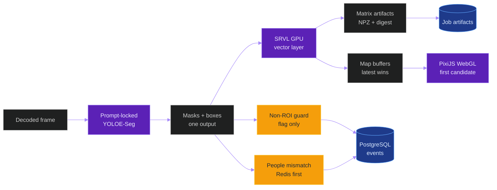

# Implementation Plan: YOLOE Scene Segmentation And SRVL

**Branch**: `014-yoloe-scene-srvl` | **Date**: 2026-06-07 | **Spec**: [spec.md](spec.md)  
**Input**: Feature specification from `/specs/014-yoloe-scene-srvl/spec.md`

## Summary

Add a disabled-by-default, offline-first YOLOE scene-segmentation lane and a
Spatial Relationship Vectorization Layer (`SRVL`) to the existing video
inference pipeline. YOLOE uses the prompt-locked `yoloe-26s-seg.pt` checkpoint
to segment people and non-ROI classroom regions, stores recoverable mask
artifacts, preserves confidence scores and every runtime-emitted YOLOE output
needed for decisions, flags downstream hallucination risks without mutating
existing detections, and feeds ordered object coordinates into SRVL for
distance, angle, vector, heatmap, direction, and correlation artifacts.

The implementation is evidence-first. Production acceptance cannot come from
local runs, mocks, templates, or component probes. It requires native Linux RTX
5090 production evidence on `combined.mp4`, PostgreSQL-backed relational state,
Redis-backed embedding checks where recovery is enabled, generated figures
from the same raw benchmark artifacts, and rollback proof showing that disabling
`YOLOE_SCENE_ENABLED` and `SRVL_ENABLED` restores the current offline pipeline.



## Technical Context

**Language/Version**: Python >=3.11,<3.13 backend, TypeScript/React 19/Vite 8
frontend, Bash and PowerShell production helpers.  
**Primary Dependencies**: Django 5.1, Django REST Framework, Channels, Celery
5.4, Redis, PostgreSQL via `psycopg`, Ultralytics 8.4.56, PyTorch 2.7.1,
TensorRT 10.16 on Linux, Triton client, NumPy, OpenCV/ImageIO/Pillow,
React/Vite, Playwright/Vitest, and a planned PixiJS WebGL renderer candidate.  
**Storage**: PostgreSQL for compact indexed summaries/events; Redis for
latency-recorded track embedding lookup; job-scoped artifact files for masks, matrices, figures,
snapshots, MP4 outputs, manifests, and traces. V1 masks use RLE-Zstd; V1 dense
matrices use compressed NPZ with JSON manifests and digests. SQLite is not an
accepted runtime, test, migration, benchmark, or acceptance backend.  
**Testing**: Backend pytest with PostgreSQL, focused Python unit tests,
Django integration tests, contract tests, frontend Vitest/Playwright,
Mermaid/docs verifiers, shell/PowerShell syntax checks, production benchmark
helpers, and artifact digest validation.  
**Target Platform**: Local Windows checks are contract validation only.
Production authority is native Linux on the RTX 5090 server, no Docker and no
`sudo`.  
**Project Type**: Django API/Celery backend, Triton GPU inference integration,
React frontend, production helper scripts, and Spec Kit governed documentation.  
**Performance Goals**: Disabled flags preserve current behavior. Enabled V1
targets non-blocking offline processing, SRVL p95 <= 10 ms for the accepted
representative object-count range, frontend visualization >= 30 FPS with no
freeze > 500 ms, bounded visualization queues, and no inference stalls waiting
for rendering. YOLOE cadence is measured and may stay disabled if it misses the
production latency/correctness gates.  
**Constraints**: YOLOE export must resolve prompts and call
`model.set_classes(...)` before ONNX or TensorRT export. `classroom_roi_guard_v1`
is the fixed production benchmark/test profile by default, but `.env` may
override the ordered prompts; any prompt change requires a fresh export and
manifest digest. V1 live profile remains disabled. Contradictions are
append-only flags, not suppression. Recovery re-pass is disabled by default.
Dense SRVL matrices are allowed only up to 128 objects/frame; above that the
module must use top-k, thresholded, or heatmap-only output. Production SRVL must
avoid Python loops over object pairs and Matplotlib real-time rendering. Scene
artifacts containing classroom imagery require job-scoped authenticated access.
Every operational prompt, threshold, score weight, cadence, limit, codec,
renderer choice, matrix mode, and recovery gate must be declared through
`.env`/settings; hardcoded operational constants are forbidden in feature code.  
**Scale/Scope**: Offline `combined.mp4` is the canonical production benchmark
input. Expected classroom object counts are small-to-medium, with stress tests
at 8, 16, 32, 64, 128, and above-128 objects/frame. V1 is not a live-stream
feature and not a real-world metric-distance feature.  
**Runtime Scenarios**: Offline upload/raw-video path is in scope. Live stream
use is explicitly N/A for V1 and must return `disabled_for_live` or
`unavailable` without blocking camera flow.  
**Inference/Tracking Reference**: Existing pipeline model registry, model route
service, Triton client, video-analysis task loop, Redis embedding cache, and
tracking embedding helpers are integration points. YOLOE-Seg produces boxes,
labels/class IDs, class names, confidence scores, masks, shape metadata, and
possibly backend-specific raw-output references in one result object; masks are
expected through the Ultralytics-style `results[0].masks` before conversion to
artifact schemas. Any emitted YOLOE output not persisted inline must be
artifact-referenced or recorded as unavailable with a reason.  
**Runtime Authority**: Production uses the active offline profile only. Startup
and model-route validation must reject missing manifests, stale prompt digests,
wrong checkpoint, wrong class order, unsupported live enablement, and stale
TensorRT/ONNX artifacts.  
**Temporal/Identity Authority**: Every object/event/relation carries job ID,
video ID, frame number, timestamp, prompt profile digest, export manifest
digest, coordinate source, source-scoped local track ID when available, and
provisional recovery ID when not assigned. Raw local tracker labels are opaque
and are never cross-run identity proof.  
**Evidence/Schema Authority**: New payloads use versioned schemas in contracts,
explicit serializers, idempotency keys, migration/retention rules, artifact
manifests with SHA-256 digests, and immutable benchmark evidence.  
**Deployment Topology**: Development validates contracts locally. Production
helpers install only user-space tools through `uv`, `npm`, or local downloads
when needed; they must not require Docker or `sudo`.  
**Runtime Reconciliation**: Task state, queue state, model-route state,
PostgreSQL rows, Redis lookup state, artifact manifests, telemetry,
frontend status, and rendered media must converge or expose a blocking fault
with reason codes.  
**Lineage/Fingerprints**: Evidence records source video, Git SHA, `.env`
fingerprint, active flags, checkpoint URL, prompt digest, export artifact
digest, Triton model/version, GPU/runtime fingerprint, raw metric artifacts,
figure manifests, and rollback command output.  
**Budgets/SLOs**: Visualization queue size <= 2 by default, latest-frame-wins
drop policy, explicit unavailable reasons for missing GPU/power/frontend
metrics, per-stage deadlines if async job orchestration changes, fail-closed
error ratios for scene stages, and rollback with `YOLOE_SCENE_ENABLED=0` plus
`SRVL_ENABLED=0`.

## Constitution Check

*GATE: Must pass before Phase 0 research. Re-check after Phase 1 design.*

| Gate | Status | Plan response |
|---|---|---|
| Production Runtime Authority | PASS | Native Linux RTX 5090, no Docker/no `sudo`, Triton route validation, offline profile only, local checks non-authoritative. |
| Heterogeneous Runtime Maturity | PASS | Separates Windows/local validation from production evidence and requires Git SHA, `.env` fingerprint, PostgreSQL, Redis/Celery, Triton, and evidence root. |
| Temporal and Identity Truth | PASS | Defines frame/timestamp/prompt/export/track/provisional identity fields and append-only recovery evidence. |
| Independent-Run Identity | PASS | Mismatch recovery uses observation matching and deterministic one-to-one assignment; raw local IDs are opaque. |
| Pose and Behavior Semantics | NOT APPLICABLE | V1 does not change pose/behavior ontology or claim behavioral truth from SRVL correlation maps. |
| Queue and Failure | PASS | Visualization is bounded and best effort; analytics artifacts persist independently of rendering; failures become unavailable/degraded evidence. |
| Concurrency Scaling Authority | PASS | V1 does not increase worker/pool/concurrency topology. Future changes need a separate benchmark gate. |
| Contract and Storage | PASS | Versioned API/WS/artifact/frontend contracts, explicit serializers, PostgreSQL summaries, artifact sidecars, digests, and retention rules. |
| Observability and Evidence | PASS | Requires probe-backed telemetry, raw JSON/CSV/log evidence, missing metric reasons, and immutable manifests. |
| Benchmark Decision Authority | PASS | Acceptance requires baseline/candidate `combined.mp4` production benchmarks, comparison table, GPU/CPU/DB/Redis/frontend metrics, correctness counters, figure bundle, and rollback proof. Figure Planner is the task owner for the required figure-plan task; Figure Implementer is the separate task owner for the generator task, and no benchmark decision is valid until tasks name both exactly once. |
| Live/Offline Validation | PASS | Offline is V1. Live is disabled with explicit rationale and must get a separate plan before enablement. |
| Anti-Regression Runtime Truth | PASS | Acceptance scripts must inspect runtime processes, ports, queues, model states, DB rows, artifacts, telemetry, and frontend output. |
| Evidence Integrity and Lineage | PASS | Evidence is digest-addressed, non-placeholder, production/local labeled, and PostgreSQL-backed where relational. |
| Replay and Closure | PASS | Acceptance replay policy is `new-attempt`; failed or partial runs cannot close acceptance. |
| XFail, Drift and Debt | PASS | Hidden xfails, stale prompt digests, unsupported live flags, missing metrics, and untracked CI-required files block closure. |
| Runtime Job Lifecycle and Vector Integrity | PASS WITH CONDITIONS | If implementation touches async stages or vector persistence, tasks must add beat-scheduled reconciliation, idempotency keys, vector size guards at DB write boundaries, and fail-closed error accounting before acceptance. |
| DSP Documentation | PASS | New Mermaid diagrams use the required initializer; docs checks must run before commit. |

### Post-Design Constitution Re-Check

Phase 0 and Phase 1 artifacts below resolve the open design decisions without
introducing a constitution violation. The feature remains disabled by default,
offline-only for V1, append-only for contradiction/recovery evidence, and
blocked from production acceptance until real `combined.mp4` benchmark evidence,
figures, manifests, and rollback proof exist.

## YOLOE Output And Configuration Authority

YOLOE confidence scores are first-class evidence. They must not be treated as
display-only metadata. Contradiction events, false-alarm handling,
missing-person eligibility, recovery scoring, visualization truth states, and
threshold decisions must record the YOLOE score used, the threshold value, the
threshold `.env` key, and the export/runtime manifest that produced the score.

The normalizer must preserve every YOLOE output emitted by the deployed route:

- bounding boxes;
- class IDs, class names, and prompt class order;
- confidence scores and any score components exposed by the route;
- instance segmentation masks from `results[0].masks`;
- mask geometry/area and source image shape metadata;
- runtime timing and model-output shape metadata;
- raw tensor/prototype/coefficients references when the backend exposes them;
- explicit unavailable reasons for outputs missing after export or runtime.

All operational values are configuration. Implementation code may define env key
names and typed settings schemas, but feature behavior must not be controlled by
hardcoded prompt classes, thresholds, score weights, strides, dense limits,
renderer choices, artifact codecs, or recovery gates.

The tracked env contract must include at least:

| Area | Required `.env` keys |
|---|---|
| Prompt/export | `YOLOE_SCENE_PROFILE`, `YOLOE_SCENE_PROMPT_CLASSES`, `YOLOE_SCENE_PROMPT_CLASSES_SHA256`, `YOLOE_SCENE_CHECKPOINT`, `YOLOE_SCENE_CHECKPOINT_URL`, `YOLOE_SCENE_EXPORT_FORMAT`, `YOLOE_SCENE_ONNX_FORMAT`, `YOLOE_SCENE_PROMPT_LOCK_REQUIRED` |
| YOLOE output capture | `YOLOE_SCENE_OUTPUT_CAPTURE_MODE`, `YOLOE_SCENE_PERSIST_RAW_OUTPUT_REFS`, `YOLOE_SCENE_CONFIDENCE_THRESHOLD`, `YOLOE_SCENE_MASK_CONFIDENCE_THRESHOLD`, `YOLOE_SCENE_MIN_MASK_AREA_PX` |
| Non-ROI guard | `YOLOE_SCENE_NON_ROI_CLASSES`, `YOLOE_SCENE_CONTRADICTION_OVERLAP`, `YOLOE_SCENE_CONTRADICTION_MIN_CONFIDENCE`, `YOLOE_SCENE_PERSON_MASK_SUPPORT_THRESHOLD` |
| Mismatch recovery | `YOLOE_SCENE_MISMATCH_RECOVERY`, `YOLOE_SCENE_REDIS_EMBEDDING_CHECK`, `YOLOE_SCENE_RECOVERY_MIN_SCORE`, `YOLOE_SCENE_RECOVERY_CONFIDENCE_WEIGHT`, `YOLOE_SCENE_RECOVERY_GEOMETRY_WEIGHT`, `YOLOE_SCENE_RECOVERY_APPEARANCE_WEIGHT`, `YOLOE_SCENE_RECOVERY_REPASS` |
| SRVL | `SRVL_ENABLED`, `SRVL_RUN_EVERY_N_FRAMES`, `SRVL_MATRIX_MODE`, `SRVL_TOP_K`, `SRVL_MAX_DISTANCE_PX`, `SRVL_DISTANCE_NORMALIZATION`, `SRVL_MATRIX_DTYPE`, `SRVL_VISUALIZATION_DTYPE` |
| Rendering/artifacts | `SCENE_RENDER_BACKEND`, `YOLOE_SCENE_MASK_CODEC`, `YOLOE_SCENE_RENDER_MP4`, `SRVL_RENDER_BACKEND`, `SRVL_DEBUG_RENDER_BACKEND`, `SRVL_MAX_VISUALIZATION_QUEUE_SIZE`, `SRVL_DROP_VISUALIZATION_IF_LATE` |
| Benchmark/trace | `YOLOE_SCENE_PROD_BENCHMARK_VIDEO`, `SRVL_TRACE_ENABLED`, `SRVL_BENCHMARK_ENABLED`, `SRVL_GPU_METRICS_ENABLED`, `SCENE_RENDER_BENCHMARK_ENABLED` |

Tasks must add a config test that fails if an operational value used by the
feature is not declared in the env/settings contract or is bypassed by a
hardcoded implementation value.

## Project Structure

### Documentation (this feature)

```text
specs/014-yoloe-scene-srvl/
|-- plan.md
|-- research.md
|-- data-model.md
|-- quickstart.md
|-- contracts/
|   |-- api-scene-artifacts.md
|   |-- artifact-manifest-schema.md
|   |-- frontend-scene-types.md
|   |-- production-helper-commands.md
|   `-- websocket-scene-events.md
|-- checklists/
|   `-- requirements.md
`-- tasks.md                  # created by /speckit.tasks, not this command
```

### Source Code (repository root)

```text
backend/
|-- apps/
|   |-- pipeline/
|   |   |-- model_registry.py
|   |   `-- services/
|   |       |-- model_route_service.py
|   |       `-- triton_client.py
|   |-- tracking/
|   |   |-- embeddings.py
|   |   `-- embeddings_batch.py
|   `-- video_analysis/
|       |-- models.py
|       |-- serializers_scene.py
|       |-- urls_scene.py
|       |-- serializers.py
|       |-- tasks.py
|       |-- views.py
|       |-- views_scene.py
|       |-- ws_broadcast.py
|       `-- scene/
|           |-- access.py
|           |-- artifacts.py
|           |-- config.py
|           |-- contradictions.py
|           |-- export_manifest.py
|           |-- live_guard.py
|           |-- masks.py
|           |-- normalizer.py
|           |-- prompts.py
|           |-- recovery_*.py
|           |-- srvl*.py
|           |-- telemetry.py
|           `-- visualization_queue.py
|-- config/settings/base.py
`-- tests/
    |-- unit/
    |-- integration/
    |-- contract/
    `-- system/

frontend/
|-- src/
|   |-- components/
|   |   |-- VideoPlayer/OverlayCanvas.tsx
|   |   `-- camera/BoundingBoxCanvas.tsx
|   |-- types/videoAnalysis.ts
|   `-- services/
`-- tests/

tools/prod/
|-- prod_export_yoloe_scene_model.*
|-- prod_verify_yoloe_scene_export.*
|-- prod_run_yoloe_scene_benchmark.*
|-- prod_collect_yoloe_scene_metrics.py
|-- prod_generate_yoloe_scene_figures.py
|-- prod_benchmark_scene_renderers.*
`-- prod_rollback_yoloe_scene.*

docs/
|-- yoloe_scene_segmentation_plan.md
|-- production_inference_benchmark.md
`-- entity/

.github/workflows/
`-- yoloe-scene-srvl.yml

.env.example
```

**Structure Decision**: Use the existing Django backend, Triton route service,
Redis embedding helpers, React/Vite frontend, and `tools/prod` helper-script
layout. Add modules only where the existing app boundaries require them; do not
create a separate service or worker topology for V1 unless production evidence
proves the simpler integration cannot meet latency/throughput gates.

**Task path authority**: Generated tasks may target
`backend/apps/video_analysis/scene/`,
`backend/apps/video_analysis/models.py`,
`backend/apps/video_analysis/serializers_scene.py`,
`backend/apps/video_analysis/urls_scene.py`,
`backend/apps/video_analysis/views_scene.py`,
`backend/apps/pipeline/model_registry.py`,
`backend/apps/pipeline/services/model_route_service.py`,
`backend/config/settings/base.py`, `backend/tests/`, `frontend/src/`,
`frontend/tests/`, `tools/prod/`, `.github/workflows/`, `.env.example`,
and the feature/evidence docs listed above.

## Complexity Tracking

No constitution violation or extra architectural project is justified for this
planning phase. The only planned frontend dependency candidate is PixiJS, and it
must be added only after renderer benchmark evidence supports it.
