# Implementation Plan: Explainable Behavioral Evidence And Anomaly Scoring

**Branch**: `015-xai-anomaly-score` | **Date**: 2026-06-08 |
**Spec**: [spec.md](spec.md)
**Planning status**: Current active implementation plan

## Summary

Add a modular, versioned XAI and anomaly-scoring layer across every active model
and derived signal without creating a parallel service or blocking critical
inference. The design introduces an immutable route snapshot, a common evidence
envelope, model-specific fast explainers, optional isolated deep XAI,
calibration and uncertainty, a transparent hierarchical
`review_priority_score`, governed review feedback, and a shared WebGL2
analytical renderer. Every implementation step is delivered as an indivisible
atomic cycle with one causal variable, native RTX 5090 production benchmark,
figure evidence, and rollback. The anomaly layer is deterministic per-student
multivariate signal-pattern analysis; this plan contains no anomaly-model
training or fine-tuning because no valid anomaly-behavior dataset or
ground-truth method exists. All pretrained models consumed are frozen and
catalogued in [pretrained-models-registry.md](pretrained-models-registry.md):
Class A production signal sources (e.g. `person_detector`, `rtmpose_model`,
gaze/posture models, the COMBINED `yolo11m` head) and Class B `PROBE_ONLY`
representations (e.g. skeleton normalizing-flow VAD over existing `rtmpose`
skeletons). It also adds a deterministic, identity-gated student-interaction
graph that turns existing relational signals into per-student graph features for
scoring and into shared-WebGL2 node-link/adjacency plots; learned graph models
stay `PROBE_ONLY`. A corpus-ingested, contamination-aware **general baseline**
(population/context tiers) is learned with the same machinery and compared
alongside each student's own profile (dual comparison). Every operational value
is **learned or `.env`-configured with provenance** — no hardcoding — keeping XAI
the top priority. Any research/probe model becomes a production requirement only
through an **evidence-gated promotion lifecycle** (`PROBE_ONLY` → `SHADOW` →
`CANARY` → `MANDATORY`) with a benchmark, computed serving metrics, governed
approval, and rollback — and only as a governed signal, never a behavioral judge.

## Technical Context

**Language/Version**: Python 3.12 backend; TypeScript 6/React 19 frontend
**Primary Dependencies**: Django 5, PostgreSQL, Redis, Celery, Triton, NumPy,
existing model clients, PixiJS 8, WebGL2, Vite
**Storage**: PostgreSQL for relational authority; digest-addressed job-scoped
artifacts for large attribution/calibration/figure payloads
**Testing**: pytest, Vitest, Playwright, contract/system tests, production
helpers, benchmark ledger and figure verifier
**Target Platform**: Native Linux RTX 5090 production; local Windows validation
is contract-only
**Project Type**: Existing Django/React video behavioral intelligence platform
**Performance Goals**: Preserve accepted inference throughput and latency;
bound fast-XAI/scoring overhead per accepted cycle; isolate deep XAI; WebGL
updates remain interactive under representative and stress payloads
**Constraints**: PostgreSQL only; Triton-only production model inference; no
Docker/no sudo production assumptions; frame stride 1 for acceptance;
non-accusatory semantics; immutable lineage; bounded live state; binding
no-ground-truth doctrine; no anomaly-model training/fine-tuning
**Scale/Scope**: Nine ready Triton models, millions of current evidence rows,
offline uploads and indefinite live streams, multi-student time series and
matrices
**Runtime Scenarios**: Fast explanation/scoring incrementally during live and
offline processing; deep XAI asynchronous and on-demand
**Inference/Tracking Reference**: Active route snapshot, source-scoped local
IDs, governed canonical identity/ReID only when available
**Runtime Authority**: One active Triton profile; production route/model/env
fingerprint required before valid explanation or score
**Temporal/Identity Authority**: Full timestamp envelope, invalid windows,
identity continuity, reconnect gaps, and one-to-one independent-run evaluation
**Evidence/Schema Authority**: Versioned evidence, score, attribution,
calibration, API/WS, WebGL, and benchmark contracts
**Deployment Topology**: Existing application stack; no new service or worker
topology until a separate benchmark proves it necessary
**Runtime Reconciliation**: Route/task/queue/database/artifact/telemetry/
frontend/review convergence blocks production-valid output on mismatch
**Lineage/Fingerprints**: SHA, environment, route, model artifact, source-model
calibration evidence where available, feature schema, observed-pattern profile,
replay/cohort manifest, runtime, and artifact digests
**Budgets/SLOs**: Declared per atomic cycle; missing metrics invalidate the
decision unless explicitly unavailable with reason

## Constitution Check

| Gate | Result | Plan treatment |
|---|---|---|
| PostgreSQL authority | PASS | All relational XAI/anomaly state is PostgreSQL-backed; no SQLite path |
| Production runtime authority | PASS | Native Linux RTX 5090, Triton-only, one active profile |
| Temporal/identity truth | PASS | Versioned timestamp/identity/invalid-window fields in all contracts |
| Independent-run identity | PASS | Local labels opaque; one-to-one association required |
| Pose/behavior semantics | PASS | Raw/derived/heuristic/model sources remain distinct |
| Streaming compatibility | PASS | Fast path bounded; deep path not automatic on live |
| Queue/failure | PASS | Deep tasks bounded, isolated, reconciled, idempotent |
| Contract/storage | PASS | Explicit versioned schemas and retention/access rules |
| Scientific evidence | PASS | No-ground-truth doctrine; reconstruction, invariants, controlled fixtures, fidelity, stability, sanity, and non-ground-truth reviewer evidence |
| Benchmark authority | PASS | Every cycle requires stride-1 production benchmark and ledger entry |
| Figure evidence | PASS | Every cycle requires one planner and one implementer plus manifest/digests |
| Evidence lineage | PASS | Immutable route/calibration/artifact snapshots |
| XFail/drift/debt | PASS | Hidden fallback, route drift, empty required layers, and placeholders block closure |
| Runtime lifecycle/vector integrity | PASS WITH CONDITIONS | Deep-XAI jobs require deadlines, reconciler, idempotency, and payload guards |
| Documentation system | PASS | New docs use source-backed claims and compiled Mermaid |
| No hardcoded constants / provenance | PASS | Every operational value is learned or fingerprinted-`.env`-configured and bound via a provenance record; a static verifier rejects magic numbers |
| Tiered assumed-normal baselines | PASS | General baseline reuses contamination-aware profile machinery; never ground truth; dual comparison keeps self primary |
| Model promotion governance | PASS | Probe→mandatory only via evidence-gated lifecycle (benchmark + serving metrics + governed approver + rollback); signal/representation role only; no behavioral-accuracy claim |

## Governing Architecture

```mermaid
%%{init: {'theme': 'dark', 'themeVariables': {'primaryColor': '#7C3AED', 'primaryTextColor': '#EDE9FE', 'primaryBorderColor': '#A78BFA', 'lineColor': '#A78BFA', 'secondaryColor': '#1E3A8A', 'tertiaryColor': '#5B21B6', 'fontSize': '14px'}}}%%
flowchart LR
    SRC["Video evidence<br/>models + derived signals"] --> SNAP["Immutable route<br/>and schema snapshot"]
    SNAP --> ENV["Evidence envelope<br/>quality + lineage"]
    ENV --> FAST["Fast explainers<br/>bounded critical path"]
    ENV --> DEEP["Deep XAI queue<br/>on-demand only"]
    FAST --> PATTERN["Per-student signal pattern<br/>bounded + contamination-aware"]
    PATTERN --> SCORE["Pattern-deviation score<br/>review priority"]
    DEEP --> COMPOSE["Explanation composer<br/>fidelity + artifacts"]
    SCORE --> COMPOSE
    COMPOSE --> API["Versioned API/WS<br/>incremental evidence"]
    API --> WEBGL["Shared WebGL2<br/>analysis workbench"]
    ENV --> PG[("PostgreSQL")]
    DEEP --> ART[("Job artifacts")]
    classDef prod fill:#5B21B6,stroke:#A78BFA,color:#EDE9FE;
    classDef store fill:#1E3A8A,stroke:#60A5FA,color:#DBEAFE;
    classDef warn fill:#F59E0B,stroke:#FCD34D,color:#1F2937;
    classDef fail fill:#DC2626,stroke:#F87171,color:#FFFFFF;
    classDef ok fill:#16A34A,stroke:#86EFAC,color:#053B17;
    class FAST,PATTERN,SCORE,WEBGL prod;
    class PG,ART store;
    class DEEP warn;
```



## Ownership And Modular Design

### Existing Ownership Preserved

| Owner | New responsibility |
|---|---|
| `apps.pipeline` | Immutable route snapshot, model-bound raw explanation extraction, and the model promotion registry/records (probe→mandatory lifecycle) |
| `apps.video_analysis` | Authoritative frames, detections, tracks, pose, scene, and SRVL sources |
| `apps.behavior` | Evidence envelope, signal registry, fast explainer interfaces, temporal evidence, explanation composition, lineage, deterministic student-interaction graph builder and per-student graph signals |
| `apps.anomalies` | Source-model calibration where evidence exists, observed-pattern profiles, pattern-deviation scoring, thresholds, drift, contribution persistence, governed non-ground-truth review feedback, corpus-ingested general baseline (dual comparison), and parameter provenance (no hardcoding) |
| `apps.telemetry` | Performance/resource/quality metrics |
| `frontend/src/features/xai` | Reviewer workbench and state orchestration |
| `frontend/src/services/webgl` | Shared WebGL2 renderer, context budget, typed-array stores, export, interaction-graph node-link and adjacency layers |

### Core Interfaces

```text
SignalProvider
  -> produce(scope, route_snapshot) -> EvidenceEnvelope

Explainer
  -> explain_fast(envelope) -> ExplanationFragment
  -> deep_eligibility(envelope) -> EligibilityDecision
  -> explain_deep(request) -> AttributionArtifact

Calibrator
  -> calibrate(raw_score, calibration_snapshot) -> CalibratedConfidence

PatternProfiler
  -> update(valid_window, profile_snapshot) -> PatternProfileSnapshot
  -> compare(valid_window, profile_snapshot) -> PatternComparison

AnomalyScorer
  -> score(pattern_comparison, valid_evidence) -> AnomalyScoreRecord

FusionPolicy
  -> combine(contributions, contradictions) -> FusionResult

ExplanationComposer
  -> compose(score, fragments, artifacts) -> ExplanationRecord

ExplanationArtifactStore
  -> publish_idempotent(artifact, lineage) -> ArtifactReference
```

Interfaces live under the existing owning apps. Concrete model adapters are
registered; orchestration never branches through repeated model-name `if`
chains.

## Fast Path

The inline path is deterministic and bounded:

1. freeze route/schema/calibration snapshot references;
2. normalize source evidence and explicit missingness;
3. calculate model-specific output decomposition and reliability;
4. build a bounded per-student multivariate signal-pattern window;
5. compare it with a compatible contamination-aware observed-pattern profile;
6. calculate pattern-deviation magnitude and transparent score contributions;
7. withhold or degrade when validity gates fail;
8. publish incremental versioned API/WS evidence.

No saliency image, prototype search, full-history query, whole-video scan, or
unbounded artifact write occurs on this path.

## Deep XAI Path

Deep XAI is:

- explicitly requested or selected by governed sampling;
- idempotent by `(observation, method, parameters, route_snapshot)`;
- deadline- and payload-bounded;
- isolated from critical inference queues;
- denied for stale/incompatible routes;
- evaluated for fidelity, stability, sanity, cost, and privacy;
- published as a job-scoped authenticated artifact;
- incapable of mutating accepted source evidence or the score that caused the
  request.

## Review Priority Score Contract

The first accepted score is transparent, hierarchical, and derived only from
observed signal-pattern comparison. It is not trained against anomaly,
cheating, normality, or non-cheating labels.

### Per-Signal Component

```text
component_i =
    pattern_deviation_magnitude_i
    * reliability_i
    * temporal_support_i
    * configured_weight_i
```

Only valid components enter the weighted mean. Missing components are reported
as missing and reduce coverage; they do not contribute zero.

### Aggregate

```text
review_priority_score =
    100
    * clamp(weighted_valid_component_mean
            * context_support
            * persistence_support
            * (1 - uncertainty_penalty))
```

### Mandatory Output

- score and non-accusatory band;
- pattern state: `within_observed_pattern`, `pattern_deviation`,
  `insufficient_context`, or `withheld`;
- valid/missing/degraded evidence coverage;
- each contribution and configured weight;
- observed-pattern profile, threshold, optional source-model calibration, and
  route references;
- reliability, uncertainty, contradictions, and identity continuity;
- withholding/degradation reasons;
- counterfactual deltas needed to cross/recover from the threshold;
- reconstruction digest.
- student-local results remain scoped to the student that produced the
  supporting evidence;
- reviewer-approved deviation may lift only a separate session/classroom
  aggregate term and must never mutate a peer student's score or pattern
  state.

## Student Interaction Graph

The interaction graph is a deterministic, identity-gated consolidation of
relational signals already produced by the stack; it is not a trained model.

### Build (deterministic, in `apps.behavior.explainability`)

1. resolve nodes from identity-gated tracks; skip/`unresolved` ambiguous identity;
2. build typed edges from existing evidence — `proximity` (SRVL/detector
   geometry), directed/`mutual_gaze` (gaze + `head_yaw` cone test),
   `orientation_toward_peer` (pose/torso), `co_movement` (bounded temporal
   correlation), `shared_scene` (scene segmentation);
3. compute bounded per-student graph features (degree, mutual-gaze dwell,
   directed-attention duration, persistence, clustering/centrality proxy, dyad
   strength) and register them as governed signals feeding the observed-pattern
   profile;
4. cap node/edge counts by configuration; on overflow use bounded sampling and
   log it (never silent truncation);
5. persist a reconstructable `StudentInteractionGraphFrame` with source lineage.

### Render (shared WebGL2 core)

- a node-link layer (spatially anchored to real student positions for stable,
  deterministic layout; optional GPU force-directed as a measured candidate),
- the N×N interaction adjacency matrix on the existing `MatrixTileStore`, and
- per-dyad interaction timelines on the `TypedSeriesStore`,
- all under the same context-budget, incremental-append, LOD/tiling,
  context-loss-recovery, and numeric/tabular-fallback rules.

The node-link layer is a **mandatory live, real-time, continuously-updating plot**
— additional to, not a replacement for, the existing plots. It refreshes
incrementally on every `xai.interaction_graph.appended` event during both live and
offline jobs, uses latest-frame-wins under backpressure, and stays within the
declared live frame-time and update-latency budgets with bounded state.

### Guardrails

- A graph edge or feature is relational context; it never asserts collusion,
  intent, or cheating, and a graph feature lifts only the producing student's own
  review priority (per the student-independence rule above).
- Any learned graph model (ST-GCN-family, GAT/GraphSAGE, ARG/GroupFormer,
  StrGNN/TADDY-style dynamic-graph anomaly) is `PROBE_ONLY` per
  [pretrained-models-registry.md](pretrained-models-registry.md) and cannot drive
  a production score or report anomaly accuracy/AUROC.

## General Baseline And Parameter Provenance

### General baseline (corpus ingestion)

- An offline ingestion pass reads the supported-video corpus and accumulates the
  same bounded multivariate signal-pattern windows used for per-student profiles.
- It builds a versioned, contamination-aware `general` tier (population) plus
  context tiers (age-band, scene type, camera, session) with robust statistics,
  cold-start, quarantine, drift, and append-only governance.
- The general baseline is assumed-normal — never known-normal ground truth, never
  a trained anomaly/cheating model, never a per-student verdict.
- It is computed across many students/sessions (at least a configured minimum of
  distinct students) and is **never derived from a single student**. It yields
  **General Boundaries**; each student's own time-windowed, cold-start-aware
  profile yields **Local Boundaries**; and the General Boundaries also support a
  general classroom-level deviation distinct from any individual.

### Dual comparison

- Scoring compares each valid window against both the student's own profile
  (primary) and the compatible general baseline (contextual), and exposes
  `deviation_vs_self` and `deviation_vs_population` separately.
- The score is withheld when a required tier is missing, incompatible, cold-start,
  or quarantined; tier disagreement stays visible.
- `deviation_vs_self` reflects the Local Boundaries and `deviation_vs_population`
  reflects the General Boundaries; the General Boundaries also yield a
  classroom-level deviation kept separate from any individual student's deviation.

### Parameter provenance (no hardcoding, XAI-first)

- A single parameter resolver supplies every operational value; no literal magic
  number lives in scoring/graph/render code.
- Each value is bound to a `ParameterProvenanceRecord`: `learned` (data-derived
  from a referenced baseline snapshot — e.g. quantile envelope, robust scale) or
  `configured` (a fingerprinted `.env`/config key).
- A static verifier and runtime reconciliation reject magic numbers and require
  every value to be reconstructable to its provenance for XAI.

## Model Promotion Governance

A probe earns production-mandatory status with evidence, not opinion. The
lifecycle and gates follow industry practice (staged shadow/canary rollout,
champion/challenger, ML Test Score readiness, registry stages, model cards, NIST
AI RMF) adapted to the doctrine.

### Lifecycle (`promotion_status`)

`PROBE_ONLY` → `SHADOW` (prod inputs copied, outputs discarded) → `CANARY`
(limited, reviewer-visible, advisory) → `MANDATORY` (production signal), with
`ARCHIVED`/`ROLLED_BACK`.

### Gates (all required; bounded minimum bar)

- **G1 doctrine cap** — signal/representation role only; no behavioral verdict,
  no anomaly accuracy/AUROC;
- **G2 reproducibility/determinism** — same inputs → same outputs; route/artifact
  digest captured; idempotent;
- **G3 serving SLO benchmark** — native RTX 5090 stride-1 latency/throughput/
  resource budgets, minimum shadow duration, equal-or-better serving distribution;
- **G4 signal quality** — stability, missingness, calibration where valid, drift,
  XAI fidelity/sanity where it feeds explanations;
- **G5 monitoring + rollback** — live drift/alert and proven automated rollback
  with reconciliation convergence;
- **G6 governance** — model card, benchmark-ledger entry, immutable manifest,
  security/retention, and governed-approver sign-off.

Every transition is an immutable `ModelPromotionRecord`, reversible, and ledgered.
`PROBE_ONLY`/`SHADOW`/`CANARY` outputs never enter a production score or state.

### Probe Fine-Tuning Lane (corpus adaptation of copies)

During corpus ingestion, probe models may be adapted **only as copies** (parent
frozen and untouched; the copy is a new `PROBE_ONLY` lineage row):

1. **Filtered pseudo-label self-training** — copy infers on the corpus; each
   inference is screened by the accepted standard deterministic methods and
   recorded as accepted/refused/edited; fine-tune on accepted/edited signals.
2. **Frozen vs fine-tuned champion/challenger** — parent vs copy on held-out
   corpus videos: serving metrics, signal stability, drift, baseline agreement.
3. **Self-supervised continued pretraining** — continue the probe's own
   label-free objective on the corpus (no pseudo-labels).
4. **Ephemeral test-time adaptation** — TENT-style; never persisted weights.
5. **Distillation from governed deterministic signals**.

Every run persists a `ProbeFineTuneRun` (corpus manifest, filter policy with
parameter provenance, accept/refuse/edit ledger, parent/child digests, benchmark
deltas). Filtered inferences are never ground truth; reviewer feedback may only
exclude windows; a copy advances only through the G1-G6 lifecycle.

## Mandatory No-Ground-Truth Doctrine

[no-ground-truth-doctrine.md](no-ground-truth-doctrine.md) governs the complete
implementation.

### Production Path

- Build bounded multivariate feature windows from all valid source signals for
  each student.
- Compare windows with versioned, contamination-aware observed-pattern
  profiles using deterministic robust statistics, temporal persistence,
  transition/change measures, and cross-signal contradiction evidence.
- Keep cold-start, missingness, identity gaps, route incompatibility,
  contamination, drift, and quarantine explicit.
- Withhold the score when a valid comparison is not possible.

### Forbidden Under This Plan

- Training or fine-tuning an anomaly, cheating, non-cheating, abnormality, or
  normality model.
- Treating reviewer feedback, heuristic output, BSIL output, assumed-normal
  history, or model agreement as anomaly ground truth.
- Reporting anomaly accuracy, precision, recall, F1, AUROC, AUPRC, or
  cheating-detection quality.
- Describing pattern conformity as proof of non-cheating or pattern deviation
  as proof of cheating or abnormal intent.

### Acceptance Without Behavioral Ground Truth

Acceptance uses exact reconstruction, deterministic replay, controlled
signal-pattern fixtures, metamorphic/invariant tests, sensitivity and
counterfactual checks, cold-start/contamination/drift/quarantine behavior,
real-media stability, bounded-state evidence, performance, and rollback.
Reviewer studies measure usability and disagreement only and are explicitly
non-ground-truth.

## WebGL2 Renderer Design

The accepted renderer is one shared WebGL2 analytical core, not a collection of
uncoordinated contexts.

### Required Modules

```text
frontend/src/services/webgl/
|-- RendererHost.ts
|-- ContextBudgetManager.ts
|-- BufferPool.ts
|-- TypedSeriesStore.ts
|-- MatrixTileStore.ts
|-- ViewportAggregator.worker.ts
|-- ColorRegistry.ts
|-- InteractionController.ts
|-- FigureExporter.ts
`-- rendererTelemetry.ts
```

### Required Behavior

- persistent context and program/buffer reuse;
- context limit and context-loss recovery;
- ring-buffer append for live data;
- pixel-bucket min/max aggregation for time series;
- tiled/lod matrix rendering with bounded labels;
- stable student colors across all views and separate behavior colors;
- pan, zoom, auto-follow, visibility toggles, resize, hover/pick, and download;
- binary typed-array transport for volume, JSON fallback for compatibility;
- transforms and downsampling in Web Workers;
- render only visible/dirty layers;
- numeric/table fallback with explicit `webgl_unavailable`;
- renderer telemetry for frame time, upload bytes, vertices/cells, memory proxy,
  dropped updates, context count, and recovery.

## Configuration Authority

All operational values are configured and fingerprinted. Required categories:

| Category | Example keys |
|---|---|
| Global enablement | `XAI_ENABLED`, `ANOMALY_SCORE_ENABLED`, `XAI_SCHEMA_VERSION` |
| Fast path | `XAI_FAST_MAX_EVIDENCE_PER_WINDOW`, `XAI_FAST_MAX_OVERHEAD_MS`, `XAI_SIGNAL_REGISTRY_VERSION` |
| Deep path | `XAI_DEEP_ENABLED`, `XAI_DEEP_QUEUE`, `XAI_DEEP_DEADLINE_SECONDS`, `XAI_DEEP_MAX_ARTIFACT_BYTES`, `XAI_DEEP_METHOD_ALLOWLIST` |
| Calibration | `XAI_CALIBRATION_REQUIRED`, `XAI_CALIBRATION_MAX_AGE_DAYS`, `XAI_CALIBRATION_MIN_SAMPLES` |
| Scoring | `ANOMALY_SCORE_MIN_COVERAGE`, `ANOMALY_SCORE_MIN_IDENTITY_CONTINUITY`, `ANOMALY_SCORE_MAX_UNCERTAINTY`, `ANOMALY_SCORE_WEIGHT_PROFILE` |
| Pattern profiles | `ANOMALY_PATTERN_PROFILE_VERSION`, `ANOMALY_PATTERN_MIN_VALID_WINDOWS`, `ANOMALY_PATTERN_MAX_WINDOWS`, `ANOMALY_PATTERN_QUARANTINE_THRESHOLD`, `ANOMALY_PATTERN_MAX_AGE_SECONDS` |
| Conformal | `ANOMALY_CONFORMAL_ENABLED`, `ANOMALY_CONFORMAL_ALPHA`, `ANOMALY_CONFORMAL_MIN_CALIBRATION_SAMPLES` |
| WebGL | `VITE_XAI_WEBGL_REQUIRED`, `VITE_XAI_WEBGL_CONTEXT_BUDGET`, `VITE_XAI_SERIES_RING_CAPACITY`, `VITE_XAI_MATRIX_TILE_SIZE`, `VITE_XAI_MAX_UPLOAD_BYTES_PER_FRAME` |
| Interaction graph | `XAI_INTERACTION_GRAPH_ENABLED`, `XAI_GRAPH_MAX_NODES`, `XAI_GRAPH_MAX_EDGES`, `XAI_GRAPH_EDGE_PERSISTENCE_MS`, `XAI_GRAPH_GAZE_CONE_DEG`, `XAI_GRAPH_PROBE_ENABLED`, `VITE_XAI_GRAPH_RENDER_BUDGET`, `VITE_XAI_GRAPH_LIVE_UPDATE_LATENCY_MS`, `VITE_XAI_GRAPH_MAX_LIVE_FPS` |
| General baseline | `ANOMALY_GENERAL_BASELINE_ENABLED`, `ANOMALY_BASELINE_CORPUS_MANIFEST`, `ANOMALY_BASELINE_MIN_VIDEOS`, `ANOMALY_BASELINE_MIN_DISTINCT_STUDENTS`, `ANOMALY_BASELINE_CONTEXT_TIERS`, `ANOMALY_DUAL_COMPARISON_ENABLED`, `ANOMALY_SELF_VS_POPULATION_WEIGHT`, `ANOMALY_CLASSROOM_DEVIATION_ENABLED` |
| Parameter provenance | `XAI_PARAM_PROVENANCE_REQUIRED`, `XAI_NO_HARDCODE_VERIFY`, and every tunable bound sourced from a fingerprinted `.env`/config key (none inline) |
| Model promotion | `XAI_MODEL_PROMOTION_ENABLED`, `XAI_PROMOTION_MIN_SHADOW_HOURS`, `XAI_PROMOTION_LATENCY_SLO_MS`, `XAI_PROMOTION_DISTRIBUTION_TOLERANCE`, `XAI_PROMOTION_APPROVER_ROLES`, `XAI_PROMOTION_AUTOROLLBACK_ENABLED` |
| Probe fine-tuning | `XAI_PROBE_FINETUNE_ENABLED`, `XAI_FINETUNE_OPTION_ALLOWLIST`, `XAI_PSEUDOLABEL_FILTER_POLICY`, `XAI_PSEUDOLABEL_MIN_AGREEMENT`, `XAI_FINETUNE_HOLDOUT_FRACTION`, `XAI_TTA_PERSIST_FORBIDDEN` |
| Security/retention | `XAI_ARTIFACT_RETENTION_DAYS`, `XAI_AUDIT_ACCESS_ENABLED`, `XAI_REVIEW_ROLE_ALLOWLIST` |
| Benchmark | `XAI_BENCHMARK_ENABLED`, `XAI_RENDER_BENCHMARK_ENABLED`, `XAI_FIDELITY_BENCHMARK_ENABLED` |

Defaults must be disabled or conservative until the owning cycle is accepted.
Every operational value is either learned (provenance `learned`) or read from a
fingerprinted `.env`/config key (provenance `configured`); literal magic numbers
in code are prohibited and fail the static verifier.

## Atomic Cycle Rule

The implementation is divided into Cycles 015.0 through 015.12 in
[atomic-cycles.md](atomic-cycles.md). A cycle is atomic because it introduces
one coherent causal capability and one rollback boundary. It may contain many
tasks, but it cannot be split into independently accepted sub-cycles without
destroying its contract or benchmark interpretation.

Every cycle includes:

1. baseline/runtime snapshot and explicit hypothesis;
2. implementation behind a reversible flag;
3. unit, contract, integration, system, security, and failure tests as
   applicable;
4. local validation that remains non-authoritative for production claims;
5. native Linux RTX 5090 stride-1 production benchmark;
6. exact metrics and unavailable reasons;
7. exactly one Figure Planner and one Figure Implementer named at kickoff;
8. figures from the same raw decision artifacts plus manifest/digests;
9. benchmark ledger and cycle/result documentation;
10. rollback execution and proof;
11. decision: accepted, not accepted, needs further iteration, probe-only,
    hypothesis-only, staged, or rollback.

## Project Structure

```text
specs/015-xai-anomaly-score/
|-- spec.md
|-- plan.md
|-- research.md
|-- no-ground-truth-doctrine.md
|-- production-inventory-20260608.md
|-- signal-catalog.md
|-- atomic-cycles.md
|-- coverage-matrix.md
|-- data-model.md
|-- quickstart.md
|-- contracts/
|-- checklists/
`-- tasks.md

backend/apps/behavior/
`-- explainability/
    |-- contracts.py
    |-- registry.py
    |-- signals.py
    |-- composer.py
    |-- evaluation.py
    `-- adapters/

backend/apps/anomalies/
`-- scoring/
    |-- contracts.py
    |-- calibration.py
    |-- conformal.py
    |-- components.py
    |-- pattern_profiles.py
    |-- pattern_comparison.py
    |-- general_baseline.py
    |-- baseline_ingestion.py
    |-- parameter_resolver.py
    |-- parameter_provenance.py
    |-- fusion.py
    |-- service.py
    `-- evaluation.py

backend/apps/pipeline/services/
|-- model_route_snapshot.py
`-- model_promotion.py

frontend/src/features/xai/
frontend/src/services/webgl/
scripts/models/
scripts/ci/
tools/prod/
backend/tests/
frontend/tests/
.github/workflows/
docs/
```

## Source Findings That Shape The Plan

| Finding | Source | Required response |
|---|---|---|
| BSIL/anomaly schemas exist but production counts are zero | `production-inventory-20260608.md` | Cycle 015.0 activation/reconciliation blocker |
| No anomaly dataset or accepted behavioral ground truth exists | `no-ground-truth-doctrine.md` | Deterministic signal-pattern analysis only; no anomaly training/fine-tuning or label-based accuracy claim |
| Default model route table is mutable shared state | `backend/apps/pipeline/services/model_route_service.py` | Immutable route snapshot and no hidden mutation |
| Rule engine uses accusatory wording | `backend/apps/pipeline/rule_engine.py` | Deprecate/replace with review-candidate evidence |
| Explainability helpers write placeholder text | `backend/apps/pipeline/model_lifecycle/explainability.py` | Replace or retire through real artifact contract |
| Visualization helper writes placeholder text | `backend/apps/pipeline/model_lifecycle/visualizations.py` | Replace or retire through evidence figures |
| Scene renderer says PixiJS but uses Canvas2D | `frontend/src/components/scene/SceneMapRenderer.tsx` | Shared WebGL renderer migration |
| Telemetry canvas uses Canvas2D | `frontend/src/components/telemetry/TelemetryCanvas.tsx` | Shared WebGL renderer migration |
| WebGL components independently own contexts | `frontend/src/components/telemetry/WebGL*.tsx` | Context-budget/shared-core convergence |
| Current behavior mapping requires audit | `backend/apps/pipeline/multi_model.py` and layer modules | Mapping authority gate before explanations |

## Post-Design Constitution Re-Check

The design adds no new microservice, no implicit worker scaling, no SQLite
fallback, no live-unbounded state, and no automatic accusation. Deep XAI is
isolated and optional; the fast path is bounded and transparent; all persisted
and external contracts are versioned; all cycles remain blocked from acceptance
until production benchmarks, figures, manifests, rollback, and ledger entries
exist. The design contains no trainable anomaly target and makes no
behavioral-ground-truth accuracy claim.

## Complexity Tracking

| Planned complexity | Why needed | Simpler alternative rejected because |
|---|---|---|
| Model-specific explainer registry | Model outputs and valid explanation methods differ | One universal method would produce invalid explanations |
| Shared WebGL renderer | Existing contexts and Canvas2D surfaces violate the rendering goal | Independent chart code duplicates state and exhausts contexts |
| Separate fast/deep lanes | Deep XAI is too expensive for critical paths | One inline lane would violate latency/stability |
| Versioned calibration snapshots | Raw scores are not comparable certainty | One global calibrator cannot represent route/output differences |
| Versioned observed-pattern profiles | Per-student temporal comparison requires compatible bounded history | A trainable anomaly classifier has no valid targets or ground truth |
| Tiered general baseline + dual comparison | Cold-start students/sessions need a population/context anchor without labels | Per-student-only comparison cannot anchor new identities; a trained population classifier would manufacture ground truth |
| Parameter provenance / no hardcoding | XAI requires every value reconstructable, tunable, and non-magic | Inline literals are unexplainable, untunable, and brittle across age-bands/cameras |
